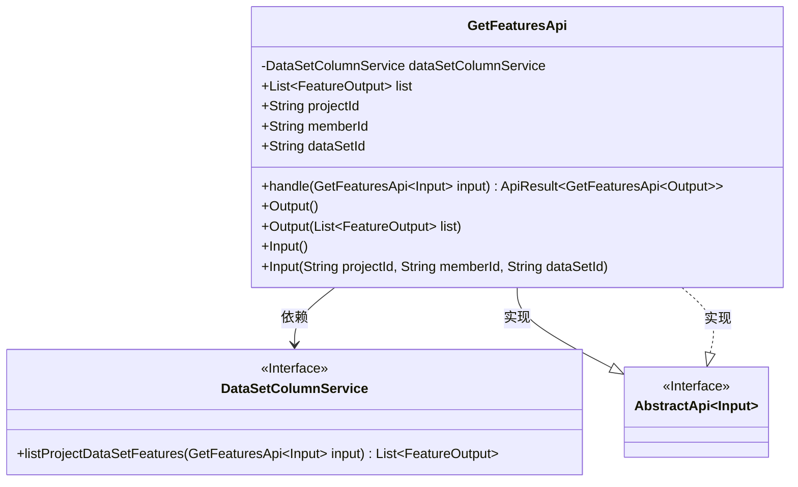
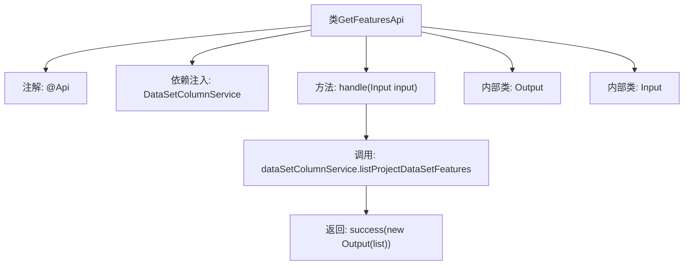

# 基础信息

|      |      |
|------|------|
| 名称 | GetFeaturesApi |
| 编码语言 | .java |
| 代码路径 | WeFe/board/board-service/src/main/java/com/welab/wefe/board/service/api/project/dataset/GetFeaturesApi.java |
| 包名 | com.welab.wefe.board.service.api.project.dataset |
| 依赖项 | ['com.welab.wefe.board.service.dto.vo.FeatureOutput', 'com.welab.wefe.board.service.service.DataSetColumnService', 'com.welab.wefe.common.fieldvalidate.annotation.Check', 'com.welab.wefe.common.web.api.base.AbstractApi', 'com.welab.wefe.common.web.api.base.Api', 'com.welab.wefe.common.web.dto.AbstractApiInput', 'com.welab.wefe.common.web.dto.ApiResult', 'org.springframework.beans.factory.annotation.Autowired', 'java.util.List'] |
| 概述说明 | 获取项目中数据集的特征列表，包含数据类型信息。需提供项目ID、成员ID和数据集ID。返回特征列表结果。 |

# 说明

该API用于获取项目中数据集的特征列表，包含特征的数据类型信息。路径为project/table_data_set/feature/list，允许带签名的访问。输入参数包括必填的projectId、memberId和dataSetId。输出为FeatureOutput列表，通过DataSetColumnService获取数据。该API继承自AbstractApi，实现了输入输出类的定义和请求处理逻辑。

# 类列表 Class Summary

| 名称   | 类型  | 说明 |
|-------|------|-------------|
| GetFeaturesApi | class | 获取项目中数据集的特征列表，包含数据类型，需提供项目ID、成员ID和数据集ID。 |

## 类 GetFeaturesApi

|      |      |
|------|------|
| 访问范围 | @Api(path = "project/table_data_set/feature/list",;        name = "获取项目中数据集的特征列表",;        desc = "这里返回的特征列表会包含特征的数据类型，这个信息在union中不存在，所以需要额外获取。",;        allowAccessWithSign = true;);public |
| 类型 | class |
| 名称 | GetFeaturesApi |
| 说明 | 获取项目中数据集的特征列表，包含数据类型，需提供项目ID、成员ID和数据集ID。 |

### UML类图

该类图展示了一个获取项目数据集特征列表的API结构。GetFeaturesApi继承自AbstractApi泛型类，包含Input和Output两个静态内部类。Input类继承自AbstractApiInput接口，包含三个必填字段；Output类包含特征列表集合。API通过依赖DataSetColumnService服务获取数据，整体设计符合分层架构原则，输入输出与业务逻辑分离清晰。

### 内部方法调用关系图

这段代码定义了一个名为GetFeaturesApi的API类，用于获取项目中数据集的特征列表。该类继承自AbstractApi，包含输入(Input)和输出(Output)两个内部类。主要流程是通过注入的DataSetColumnService调用listProjectDataSetFeatures方法获取特征列表，然后包装成Output对象返回。输入参数包含projectId、memberId和dataSetId三个必填字段。整个流程清晰展示了从请求处理到数据返回的完整链路。

### 字段列表 Field List

| 名称  | 类型  | 说明 |
|-------|-------|------|
| dataSetColumnService | DataSetColumnService | 自动注入数据集列服务实例。 |

### 方法列表

| 名称  | 类型  | 说明 |
|-------|-------|------|
| handle | ApiResult<GetFeaturesApi.Output> | 处理GetFeaturesApi请求，调用dataSetColumnService获取项目数据集特征列表，返回成功结果。 |

