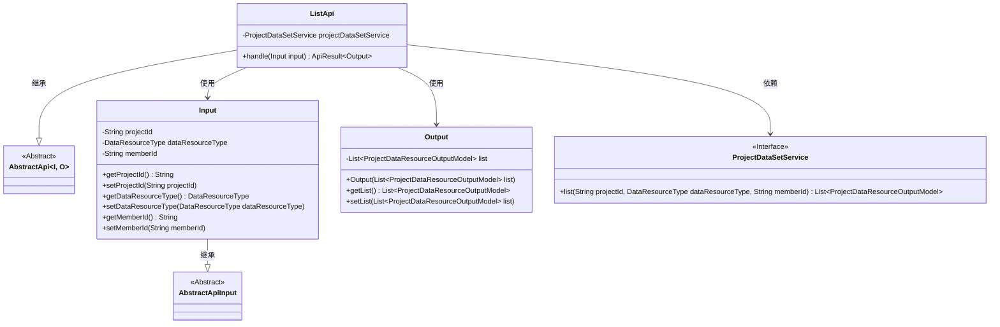

# 基础信息

|      |      |
|------|------|
| 名称 | ListApi |
| 编码语言 | .java |
| 代码路径 | WeFe/board/board-service/src/main/java/com/welab/wefe/board/service/api/project/dataset/ListApi.java |
| 包名 | com.welab.wefe.board.service.api.project.dataset |
| 依赖项 | ['com.welab.wefe.board.service.dto.entity.project.data_set.ProjectDataResourceOutputModel', 'com.welab.wefe.board.service.service.ProjectDataSetService', 'com.welab.wefe.common.exception.StatusCodeWithException', 'com.welab.wefe.common.fieldvalidate.annotation.Check', 'com.welab.wefe.common.web.api.base.AbstractApi', 'com.welab.wefe.common.web.api.base.Api', 'com.welab.wefe.common.web.dto.AbstractApiInput', 'com.welab.wefe.common.web.dto.ApiResult', 'com.welab.wefe.common.wefe.enums.DataResourceType', 'org.springframework.beans.factory.annotation.Autowired', 'java.util.List'] |
| 概述说明 | ListApi类用于列出项目数据集，接收项目Id、数据集类型和成员Id参数，返回数据集列表。 |

# 说明

这是一个名为ListApi的Java类，用于列出项目数据集。它继承自AbstractApi，处理输入Input和输出Output。输入包含项目Id（必填）、数据集类型和成员Id（可选）。输出包含数据集列表。类中注入了ProjectDataSetService，通过list方法获取数据。输入参数有校验注解，确保必填项和描述清晰。getter和setter方法用于属性访问和修改。整体功能是查询并返回指定项目的数据集列表。

# 类列表 Class Summary

| 名称   | 类型  | 说明 |
|-------|------|-------------|
| ListApi | class | ListApi类用于列出项目数据集，接收项目ID、数据集类型和成员ID参数，返回数据集列表。 |

## 类 ListApi

|      |      |
|------|------|
| 访问范围 | @Api(path = "project/data_resource/list", name = "list all of the project data sets");public |
| 类型 | class |
| 名称 | ListApi |
| 说明 | ListApi类用于列出项目数据集，接收项目ID、数据集类型和成员ID参数，返回数据集列表。 |

### UML类图

这段代码展示了一个项目数据集列表查询API的实现结构。ListApi继承自泛型抽象类AbstractApi，定义了输入类型Input和输出类型Output。Input类包含项目ID、数据集类型和成员ID等查询参数，Output类封装了返回的数据集列表。ListApi通过依赖注入的ProjectDataSetService接口实现数据查询功能，整体采用分层设计模式，输入输出与业务逻辑分离，符合RESTful API的设计规范。

### 内部方法调用关系图

```mermaid
graph TD
    A["类ListApi"]
    B["注解: @Api"]
    C["继承: AbstractApi<Input, Output>"]
    D["依赖注入: @Autowired ProjectDataSetService"]
    E["重写方法: handle(Input input)"]
    F["内部类: Input"]
    G["内部类: Output"]
    H["Input属性: String projectId"]
    I["Input属性: DataResourceType dataResourceType"]
    J["Input属性: String memberId"]
    K["Input方法: getter/setter"]
    L["Output属性: List<ProjectDataResourceOutputModel> list"]
    M["Output方法: 构造方法/getter/setter"]
    N["调用: projectDataSetService.list()"]
    O["返回: ApiResult<Output>"]

    A --> B
    A --> C
    A --> D
    A --> E
    A --> F
    A --> G
    F --> H
    F --> I
    F --> J
    F --> K
    G --> L
    G --> M
    E --> N
    N --> O
```

这段代码是一个基于Spring框架的API实现类，主要用于列出项目数据集。流程图展示了类结构关系，包括主类ListApi继承自AbstractApi，包含两个内部类Input和Output用于处理输入输出数据。核心处理逻辑在handle方法中，通过projectDataSetService获取数据列表并包装返回。Input类包含三个带校验注解的字段和对应的getter/setter方法，Output类则封装了返回的数据列表。整个流程清晰展示了从请求处理到结果返回的数据流转过程。

### 字段列表 Field List

| 名称  | 类型  | 说明 |
|-------|-------|------|
| projectDataSetService | ProjectDataSetService | 自动注入ProjectDataSetService实例。 |

### 方法列表

| 名称  | 类型  | 说明 |
|-------|-------|------|
| handle | ApiResult<Output> | 该方法重写父类逻辑，根据输入参数查询项目数据资源列表并返回成功结果。输入包括项目ID、资源类型和成员ID，输出为查询结果列表。 |

