# 基础信息

|      |      |
|------|------|
| 名称 | QueryDerivedDataSetApi |
| 编码语言 | .java |
| 代码路径 | WeFe/board/board-service/src/main/java/com/welab/wefe/board/service/api/project/dataset/QueryDerivedDataSetApi.java |
| 包名 | com.welab.wefe.board.service.api.project.dataset |
| 依赖项 | ['com.welab.wefe.board.service.dto.base.PagingInput', 'com.welab.wefe.board.service.dto.base.PagingOutput', 'com.welab.wefe.board.service.dto.entity.project.data_set.DerivedProjectDataSetOutputModel', 'com.welab.wefe.board.service.service.ProjectDataSetService', 'com.welab.wefe.common.exception.StatusCodeWithException', 'com.welab.wefe.common.fieldvalidate.annotation.Check', 'com.welab.wefe.common.web.api.base.AbstractApi', 'com.welab.wefe.common.web.api.base.Api', 'com.welab.wefe.common.web.dto.ApiResult', 'com.welab.wefe.common.wefe.enums.ComponentType', 'com.welab.wefe.common.wefe.enums.DataResourceType', 'org.springframework.beans.factory.annotation.Autowired'] |
| 概述说明 | 查询项目派生数据集的API，需提供项目ID和数据集类型，可选来源类型、流程ID、任务ID和数据集ID，返回分页结果。 |

# 说明

该代码定义了一个名为QueryDerivedDataSetApi的API类，用于查询项目中派生数据集的列表。API路径为"project/derived_data_set/query"。它继承自AbstractApi，输入类型为内部类Input，输出为分页的DerivedProjectDataSetOutputModel。Input类包含项目ID、数据集类型、来源类型、来源流程ID、来源任务ID和数据集ID等字段，均带有校验注解。处理逻辑通过ProjectDataSetService的queryDerivedDataSet方法实现，返回分页结果。所有字段都有对应的getter和setter方法。

# 类列表 Class Summary

| 名称   | 类型  | 说明 |
|-------|------|-------------|
| QueryDerivedDataSetApi | class | 查询项目中派生数据集的API，需提供项目ID和数据集类型，可选来源类型、流程ID、任务ID和数据集ID，返回分页结果。 |


## 类 QueryDerivedDataSetApi

|      |      |
|------|------|
| 访问范围 | @Api(path = "project/derived_data_set/query", name = "get a list of derived data sets in the project");public |
| 类型 | class |
| 名称 | QueryDerivedDataSetApi |
| 说明 | 查询项目中派生数据集的API，需提供项目ID和数据集类型，可选来源类型、流程ID、任务ID和数据集ID，返回分页结果。 |


### UML类图

```mermaid
classDiagram
    class QueryDerivedDataSetApi {
        -ProjectDataSetService projectDataSetService
        +handle(Input input) ApiResult~PagingOutput~DerivedProjectDataSetOutputModel~~
    }
    
    class PagingInput {
        <<abstract>>
    }
    
    class Input {
        -String projectId
        -DataResourceType dataResourceType
        -ComponentType sourceType
        -String sourceFlowId
        -String sourceJobId
        -String dataSetId
        +getProjectId() String
        +setProjectId(String projectId)
        +getDataResourceType() DataResourceType
        +setDataResourceType(DataResourceType dataResourceType)
        +getSourceType() ComponentType
        +setSourceType(ComponentType sourceType)
        +getSourceFlowId() String
        +setSourceFlowId(String sourceFlowId)
        +getSourceJobId() String
        +setSourceJobId(String sourceJobId)
        +getDataSetId() String
        +setDataSetId(String dataSetId)
    }
    
    class AbstractApi~T, R~ {
        <<abstract>>
        +handle(T input) ApiResult~R~
    }
    
    class ProjectDataSetService {
        <<Interface>>
        +queryDerivedDataSet(Input input) PagingOutput~DerivedProjectDataSetOutputModel~
    }
    
    class PagingOutput~T~ {
    }
    
    class DerivedProjectDataSetOutputModel {
    }
    
    class DataResourceType {
    }
    
    class ComponentType {
    }
    
    class ApiResult~T~ {
    }
    
    QueryDerivedDataSetApi --> AbstractApi~Input, PagingOutput~DerivedProjectDataSetOutputModel~~ : 继承
    Input --|> PagingInput : 继承
    QueryDerivedDataSetApi --> ProjectDataSetService : 依赖
    ProjectDataSetService --> Input : 使用
    ProjectDataSetService --> PagingOutput~DerivedProjectDataSetOutputModel~ : 返回
    AbstractApi~T, R~ --> ApiResult~R~ : 返回
    Input --> DataResourceType : 包含
    Input --> ComponentType : 包含
```

这段代码定义了一个查询派生数据集的API接口，继承自抽象类AbstractApi，使用ProjectDataSetService服务来处理查询请求。Input类作为输入参数，包含项目ID、数据集类型等字段，继承自PagingInput用于分页查询。该API返回分页的派生数据集输出模型，通过handle方法调用服务层逻辑，整体设计符合分层架构原则，各组件职责明确。


### 内部方法调用关系图

```mermaid
graph TD
    A["类QueryDerivedDataSetApi"]
    B["注解: @Api"]
    C["继承: AbstractApi<Input, PagingOutput<DerivedProjectDataSetOutputModel>>"]
    D["依赖注入: @Autowired ProjectDataSetService"]
    E["重写方法: handle(Input input)"]
    F["内部类: Input"]
    G["继承: PagingInput"]
    H["校验字段: @Check projectId"]
    I["校验字段: @Check dataResourceType"]
    J["校验字段: @Check sourceType"]
    K["校验字段: @Check sourceFlowId"]
    L["校验字段: @Check sourceJobId"]
    M["校验字段: @Check dataSetId"]
    N["getter/setter方法组"]

    A --> B
    A --> C
    A --> D
    A --> E
    A --> F
    F --> G
    F --> H
    F --> I
    F --> J
    F --> K
    F --> L
    F --> M
    F --> N
    E --> D
```



该流程图展示了QueryDerivedDataSetApi类的完整结构，包含API注解、父类继承关系、服务依赖注入和核心处理方法。重点描述了内部类Input的结构，包括其继承的PagingInput父类、6个带校验注解的字段及其getter/setter方法。handle方法通过依赖的ProjectDataSetService完成业务逻辑，最终返回分页查询结果。整个设计体现了清晰的层级关系和职责划分。

### 字段列表 Field List

| 名称  | 类型  | 说明 |
|-------|-------|------|
| projectDataSetService | ProjectDataSetService | 自动注入ProjectDataSetService实例。 |

### 方法列表

| 名称  | 类型  | 说明 |
|-------|-------|------|
| handle | ApiResult<PagingOutput<DerivedProjectDataSetOutputModel>> | 重写方法处理输入，调用服务查询派生数据集并返回分页结果。 |


