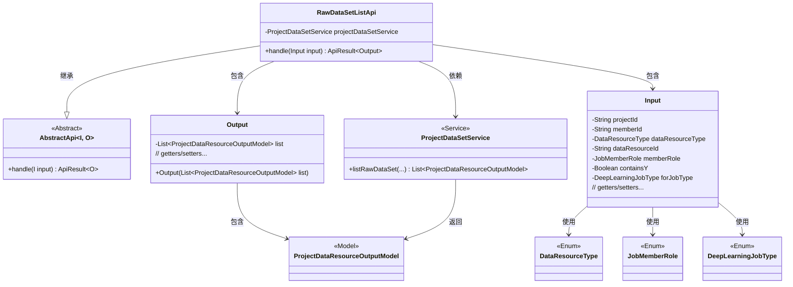

# 基础信息

|      |      |
|------|------|
| 名称 | RawDataSetListApi |
| 编码语言 | .java |
| 代码路径 | WeFe/board/board-service/src/main/java/com/welab/wefe/board/service/api/project/dataset/RawDataSetListApi.java |
| 包名 | com.welab.wefe.board.service.api.project.dataset |
| 依赖项 | ['com.welab.wefe.board.service.dto.entity.project.data_set.ProjectDataResourceOutputModel', 'com.welab.wefe.board.service.service.ProjectDataSetService', 'com.welab.wefe.common.exception.StatusCodeWithException', 'com.welab.wefe.common.fieldvalidate.annotation.Check', 'com.welab.wefe.common.web.api.base.AbstractApi', 'com.welab.wefe.common.web.api.base.Api', 'com.welab.wefe.common.web.dto.AbstractApiInput', 'com.welab.wefe.common.web.dto.ApiResult', 'com.welab.wefe.common.wefe.enums.DataResourceType', 'com.welab.wefe.common.wefe.enums.DeepLearningJobType', 'com.welab.wefe.common.wefe.enums.JobMemberRole', 'org.springframework.beans.factory.annotation.Autowired', 'java.util.List'] |
| 概述说明 | 获取项目中原始数据集列表的API，需提供项目ID、成员ID、数据集类型等参数，返回数据集列表。 |

# 说明

该代码定义了一个名为RawDataSetListApi的API类，用于获取项目中原始数据集的列表。API路径为project/raw_data_set/list，继承自AbstractApi类，输入为Input类，输出为Output类。Input类包含项目ID、成员ID、数据集类型、数据资源ID、成员角色、是否包含Y以及目标任务类型等必填和可选字段。Output类包含一个数据集列表。处理逻辑通过projectDataSetService的listRawDataSet方法获取数据，并返回成功结果。所有输入字段均有校验注解和getter/setter方法。

# 类列表 Class Summary

| 名称   | 类型  | 说明 |
|-------|------|-------------|
| RawDataSetListApi | class | 获取项目中原始数据集列表的API，需提供项目ID、成员ID、数据集类型等参数，返回数据集列表。 |

## 类 RawDataSetListApi

|      |      |
|------|------|
| 访问范围 | @Api(path = "project/raw_data_set/list", name = "Get the list of raw data sets in the project");public |
| 类型 | class |
| 名称 | RawDataSetListApi |
| 说明 | 获取项目中原始数据集列表的API，需提供项目ID、成员ID、数据集类型等参数，返回数据集列表。 |

### UML类图

这段代码描述了一个用于获取项目中原始数据集列表的API类`RawDataSetListApi`。该类继承自泛型抽象类`AbstractApi`，定义了输入参数类`Input`和输出结果类`Output`。`Input`包含多个带校验注解的字段，`Output`封装了数据集列表。API通过`ProjectDataSetService`服务获取数据，涉及多个枚举类型和模型类。类图清晰地展示了类之间的继承、依赖和包含关系。

### 内部方法调用关系图

```mermaid
graph TD
    A["类RawDataSetListApi"]
    B["继承: AbstractApi<Input, Output>"]
    C["依赖: ProjectDataSetService"]
    D["方法: handle(Input input)"]
    E["调用: projectDataSetService.listRawDataSet"]
    F["返回: ApiResult<Output>"]
    G["内部类Input"]
    H["属性: projectId, memberId等7个字段"]
    I["内部类Output"]
    J["属性: List<ProjectDataResourceOutputModel> list"]

    A --> B
    A --> C
    A --> D
    D --> E
    E --> F
    A --> G
    G --> H
    A --> I
    I --> J
```

这段代码定义了一个名为RawDataSetListApi的API类，用于获取项目中原始数据集的列表。该类继承自AbstractApi并实现了handle方法，通过调用ProjectDataSetService的listRawDataSet方法获取数据。包含两个静态内部类Input和Output，Input定义了7个带校验注解的请求参数，Output封装了返回的数据列表。流程图展示了类继承关系、方法调用链和内部类结构。

### 字段列表 Field List

| 名称  | 类型  | 说明 |
|-------|-------|------|
| projectDataSetService | ProjectDataSetService | 自动注入ProjectDataSetService实例。 |

### 方法列表

| 名称  | 类型  | 说明 |
|-------|-------|------|
| handle | ApiResult<Output> | 该方法处理输入参数，调用服务获取项目数据资源列表，并返回成功结果及列表数据。 |

