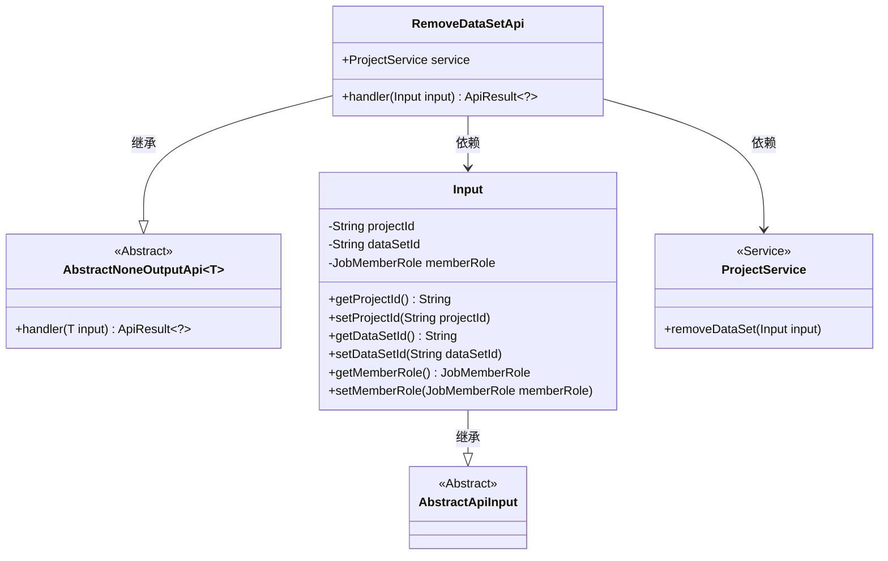

# 基础信息

|      |      |
|------|------|
| 名称 | RemoveDataSetApi |
| 编码语言 | .java |
| 代码路径 | WeFe/board/board-service/src/main/java/com/welab/wefe/board/service/api/project/dataset/RemoveDataSetApi.java |
| 包名 | com.welab.wefe.board.service.api.project.dataset |
| 依赖项 | ['com.welab.wefe.board.service.service.ProjectService', 'com.welab.wefe.common.fieldvalidate.annotation.Check', 'com.welab.wefe.common.web.api.base.AbstractNoneOutputApi', 'com.welab.wefe.common.web.api.base.Api', 'com.welab.wefe.common.web.dto.AbstractApiInput', 'com.welab.wefe.common.web.dto.ApiResult', 'com.welab.wefe.common.wefe.enums.JobMemberRole', 'org.springframework.beans.factory.annotation.Autowired'] |
| 概述说明 | 删除项目中数据集的API接口，需提供项目ID、数据集ID和成员角色（原始数据集需要）。 |

# 说明

这是一个用于删除项目中数据集的API类，路径为"project/data_resource/remove"。它继承自AbstractNoneOutputApi，输入参数为内部类Input。Input包含三个字段：必填的项目ID、必填的数据集ID，以及可选的成员角色（仅在删除原始数据集时需要）。API通过ProjectService的removeDataSet方法处理删除请求，成功后返回空结果。

# 类列表 Class Summary

| 名称   | 类型  | 说明 |
|-------|------|-------------|
| RemoveDataSetApi | class | 删除项目中数据集的API，需提供项目ID、数据集ID和成员角色（仅删除原始数据集时）。调用ProjectService完成操作。 |

## 类 RemoveDataSetApi

|      |      |
|------|------|
| 访问范围 | @Api(path = "project/data_resource/remove", name = "Delete the data set in the project");public |
| 类型 | class |
| 名称 | RemoveDataSetApi |
| 说明 | 删除项目中数据集的API，需提供项目ID、数据集ID和成员角色（仅删除原始数据集时）。调用ProjectService完成操作。 |

### UML类图

该代码展示了一个删除项目中数据集的API实现。RemoveDataSetApi继承自AbstractNoneOutputApi，处理Input类型的参数，并通过ProjectService执行实际删除操作。Input类包含项目ID、数据集ID和成员角色等字段，继承自AbstractApiInput。ProjectService提供removeDataSet方法执行删除逻辑。整体结构体现了清晰的层级关系和依赖关系，符合API设计的封装性和单一职责原则。

### 内部方法调用关系图

```mermaid
graph TD
    A["类RemoveDataSetApi"]
    B["继承: AbstractNoneOutputApi<Input>"]
    C["注解: @Api(path='project/data_resource/remove', name='Delete the data set in the project')"]
    D["依赖注入: @Autowired ProjectService service"]
    E["重写方法: handler(Input input)"]
    F["内部类: Input"]
    G["属性: String projectId @Check(name='项目ID', require=true)"]
    H["属性: String dataSetId @Check(name='数据集ID', require=true)"]
    I["属性: JobMemberRole memberRole @Check(name='成员角色', desc='删除原始数据集时需要角色')"]
    J["方法: getter/setter"]

    A --> B
    A --> C
    A --> D
    A --> E
    A --> F
    F --> G
    F --> H
    F --> I
    F --> J
    E --> D
    E --> K["调用: service.removeDataSet(input)"]
    E --> L["返回: success()"]
```

这段代码描述了一个删除项目中数据集的API类RemoveDataSetApi，继承自AbstractNoneOutputApi并指定了输入参数类型Input。类中包含一个通过@Autowired注入的ProjectService，重写了handler方法处理删除逻辑。Input内部类定义了三个带校验注解的字段（项目ID、数据集ID、成员角色）及其getter/setter方法。流程图清晰展示了类结构、继承关系、依赖注入和核心方法调用链路。

### 字段列表 Field List

| 名称  | 类型  | 说明 |
|-------|-------|------|
| service | ProjectService | 自动注入ProjectService实例。 |

### 方法列表

| 名称  | 类型  | 说明 |
|-------|-------|------|
| handler | ApiResult<?> | 方法重写，调用服务移除数据集，输入参数为input，成功返回结果。 |

