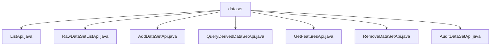

# 基础信息

|      |      |
|------|------|
| 名称 | dataset |
| 编码语言 | .java |
| 代码路径 | WeFe/board/board-service/src/main/java/com/welab/wefe/board/service/api/project/dataset |
| 包名 | docs.board.board-service.src.main.java.com.welab.wefe.board.service.api.project.dataset |
| 概述说明 | ListApi列出项目数据集，RawDataSetListApi获取原始数据集列表，AddDataSetApi添加数据集，QueryDerivedDataSetApi查询派生数据集，GetFeaturesApi获取特征列表，RemoveDataSetApi删除数据集，AuditDataSetApi审核数据集授权。 |

# 说明

## 概述  
该模块核心职责是管理项目数据集的全生命周期，包括列表查询、添加、删除、审核及特征获取等操作，类似数据集的CRUD管理中心。接口规范统一继承AbstractApi或其变体，输入输出均采用内部类封装，必填字段通过校验注解保障，例如项目ID(projectId)普遍作为必填项。  

关键数据结构包括Input类（含项目ID、数据集ID等字段）、Output类（含数据集列表或分页结果）及派生数据集模型(DerivedProjectDataSetOutputModel)。外部依赖集中在ProjectDataSetService、ProjectService等后端服务，通过Autowired注入实现业务逻辑。例如ProjectDataSetService提供listRawDataSet等方法。  

## 主要业务场景  
业务流程覆盖数据集从创建到清理的全过程：通过AddDataSetApi添加资源（例如dataResourceList字段），ListApi/RawDataSetListApi分类型查询，QueryDerivedDataSetApi支持派生数据集分页检索，GetFeaturesApi获取特征元数据，RemoveDataSetApi清理资源，AuditDataSetApi处理授权审核。  

交互模式统一采用服务层调用，例如ProjectService.removeDataSet处理删除。典型应用包括成员协作（依赖memberId字段）、数据溯源（通过来源流程ID追踪）等。API类型涵盖查询类（如ListApi）、变更类（如AddDataSetApi）和审核类，集成案例例如特征列表查询需同时校验projectId和dataSetId。

### 包内部结构视图

该流程图展示了项目数据集API的层级结构，根节点为dataset文件夹，包含7个Java API文件：ListApi、RawDataSetListApi、AddDataSetApi等。这些API文件均位于同一层级，没有嵌套关系，共同构成了数据集操作的功能集合，包括列表查询、数据添加、特征获取等核心功能模块。

# 文件列表

| 名称   | 类型  | 说明 |
|-------|------|-------------|
| [ListApi.java](ListApi.md) | file | ListApi类用于列出项目数据集，接收项目Id、数据集类型和成员Id参数，返回数据集列表。 |
| [RawDataSetListApi.java](RawDataSetListApi.md) | file | 获取项目中原始数据集列表的API，需提供项目ID、成员ID、数据集类型等参数，返回数据集列表。 |
| [AddDataSetApi.java](AddDataSetApi.md) | file | 这是一个用于向项目添加数据集的API类，包含项目ID和数据集列表作为输入参数，调用ProjectService的addProjectDataSet方法处理请求。 |
| [QueryDerivedDataSetApi.java](QueryDerivedDataSetApi.md) | file | 查询项目派生数据集的API，需提供项目ID和数据集类型，可选来源类型、流程ID、任务ID和数据集ID，返回分页结果。 |
| [GetFeaturesApi.java](GetFeaturesApi.md) | file | 获取项目中数据集的特征列表，包含数据类型信息。需提供项目ID、成员ID和数据集ID。返回特征列表结果。 |
| [RemoveDataSetApi.java](RemoveDataSetApi.md) | file | 删除项目中数据集的API接口，需提供项目ID、数据集ID和成员角色（原始数据集需要）。 |
| [AuditDataSetApi.java](AuditDataSetApi.md) | file | 这是一个审核项目数据集授权的API类，包含项目ID、数据集ID、审核状态和意见等必填字段，拒绝时需填写原因。 |

