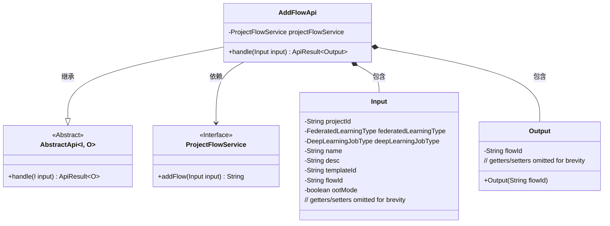

# 基础信息

|      |      |
|------|------|
| 名称 | AddFlowApi |
| 编码语言 | .java |
| 代码路径 | WeFe/board/board-service/src/main/java/com/welab/wefe/board/service/api/project/flow/AddFlowApi.java |
| 包名 | com.welab.wefe.board.service.api.project.flow |
| 依赖项 | ['com.welab.wefe.board.service.service.ProjectFlowService', 'com.welab.wefe.common.exception.StatusCodeWithException', 'com.welab.wefe.common.fieldvalidate.annotation.Check', 'com.welab.wefe.common.web.api.base.AbstractApi', 'com.welab.wefe.common.web.api.base.Api', 'com.welab.wefe.common.web.dto.AbstractApiInput', 'com.welab.wefe.common.web.dto.ApiResult', 'com.welab.wefe.common.wefe.enums.DeepLearningJobType', 'com.welab.wefe.common.wefe.enums.FederatedLearningType', 'org.springframework.beans.factory.annotation.Autowired'] |
| 概述说明 | AddFlowApi类用于新增项目流程，接收项目ID、联邦类型、任务类型等输入，调用ProjectFlowService生成流程ID并返回。输入包含必填项和可选参数，输出为流程ID。 |

# 说明

该代码定义了一个名为AddFlowApi的API类，用于处理新增项目流程的请求。API路径为project/flow/add，名称是New project flow。它继承自AbstractApi，输入类型为Input，输出类型为Output。Input类包含多个必填和选填字段，如项目ID、联邦学习类型、深度学习任务类型、流程名、描述、模板ID等，并提供了相应的getter和setter方法。Output类仅包含一个流程ID字段。API处理逻辑通过调用ProjectFlowService的addFlow方法实现，成功时返回包含流程ID的Output对象。

# 类列表 Class Summary

| 名称   | 类型  | 说明 |
|-------|------|-------------|
| AddFlowApi | class | AddFlowApi类用于新增项目流程，接收项目ID、联邦类型、任务类型等输入，调用projectFlowService.addFlow生成流程ID并返回。输入包含必填项和可选参数，输出为流程ID。 |

## 类 AddFlowApi

|      |      |
|------|------|
| 访问范围 | @Api(path = "project/flow/add", name = "New project flow");public |
| 类型 | class |
| 名称 | AddFlowApi |
| 说明 | AddFlowApi类用于新增项目流程，接收项目ID、联邦类型、任务类型等输入，调用projectFlowService.addFlow生成流程ID并返回。输入包含必填项和可选参数，输出为流程ID。 |

### UML类图

该类图展示了AddFlowApi的结构，它是一个处理新增项目流程的API类，继承自泛型抽象类AbstractApi。包含Input和Output两个内部类作为请求参数和响应数据结构，通过ProjectFlowService接口实现核心业务逻辑。图中清晰呈现了类之间的继承、依赖和组合关系，体现了API处理请求的完整流程。

### 内部方法调用关系图

```mermaid
graph TD
    A["类AddFlowApi"]
    B["注解: @Api(path='project/flow/add', name='New project flow')"]
    C["继承: AbstractApi<Input, Output>"]
    D["依赖注入: @Autowired ProjectFlowService"]
    E["重写方法: handle(Input input)"]
    F["调用: projectFlowService.addFlow(input)"]
    G["返回: success(new Output(flowId))"]
    H["嵌套类Input"]
    I["嵌套类Output"]
    J["Input属性: projectId, federatedLearningType等"]
    K["Input方法: getter/setter"]
    L["Output构造方法: Output(String flowId)"]
    M["Output方法: getFlowId/setFlowId"]

    A --> B
    A --> C
    A --> D
    A --> E
    E --> F
    F --> G
    A --> H
    A --> I
    H --> J
    H --> K
    I --> L
    I --> M
```

该流程图展示了AddFlowApi类的核心结构，包括类注解、继承关系、服务注入和主要方法调用链。重点描述了handle方法通过projectFlowService创建流程并返回结果的完整过程，同时清晰呈现了Input/Output两个嵌套类的属性与方法结构。输入参数经过严格校验后生成流程ID，最终封装为ApiResult返回。

### 字段列表 Field List

| 名称  | 类型  | 说明 |
|-------|-------|------|
| projectFlowService | ProjectFlowService | 自动注入ProjectFlowService服务实例。 |

### 方法列表

| 名称  | 类型  | 说明 |
|-------|-------|------|
| handle | ApiResult<Output> | 方法重写，处理输入并返回包含流程ID的输出结果。 |

