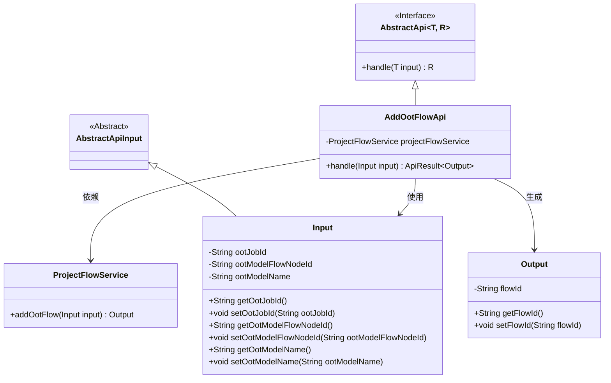
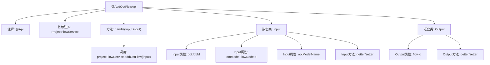

# 基础信息

|      |      |
|------|------|
| 名称 | AddOotFlowApi |
| 编码语言 | .java |
| 代码路径 | WeFe/board/board-service/src/main/java/com/welab/wefe/board/service/api/project/flow/AddOotFlowApi.java |
| 包名 | com.welab.wefe.board.service.api.project.flow |
| 依赖项 | ['com.welab.wefe.board.service.service.ProjectFlowService', 'com.welab.wefe.common.exception.StatusCodeWithException', 'com.welab.wefe.common.fieldvalidate.annotation.Check', 'com.welab.wefe.common.web.api.base.AbstractApi', 'com.welab.wefe.common.web.api.base.Api', 'com.welab.wefe.common.web.dto.AbstractApiInput', 'com.welab.wefe.common.web.dto.ApiResult', 'org.springframework.beans.factory.annotation.Autowired'] |
| 概述说明 | AddOotFlowApi类用于添加OOT流程，输入包括任务ID、模型节点ID和模型名称，输出为流程ID。 |

# 说明

该代码定义了一个名为AddOotFlowApi的API类，用于处理添加OOT流程的请求。API路径为project/flow/add_oot，通过ProjectFlowService的addOotFlow方法处理输入并返回结果。输入类Input包含三个字段：必填的ootJobId（任务ID）和ootModelFlowNodeId（模型节点ID），以及可选的ootModelName（模型名称）。输出类Output包含一个flowId字段，表示生成的流程ID。该API继承自AbstractApi，使用ApiResult包装返回结果。

# 类列表 Class Summary

| 名称   | 类型  | 说明 |
|-------|------|-------------|
| AddOotFlowApi | class | API类AddOotFlowApi用于添加OOT流程，输入包括任务ID、模型节点ID和模型名称，输出为流程ID。 |

## 类 AddOotFlowApi

|      |      |
|------|------|
| 访问范围 | @Api(path = "project/flow/add_oot", name = "Add OOT process");public |
| 类型 | class |
| 名称 | AddOotFlowApi |
| 说明 | API类AddOotFlowApi用于添加OOT流程，输入包括任务ID、模型节点ID和模型名称，输出为流程ID。 |

### UML类图

该代码展示了一个处理添加OOT流程的API类结构。AddOotFlowApi继承自泛型抽象类AbstractApi，使用ProjectFlowService处理业务逻辑。Input类继承AbstractApiInput，包含OOT任务和模型的相关ID字段；Output类则包含生成的流程ID。整体设计体现了清晰的依赖关系和分层架构。

### 内部方法调用关系图

这段代码展示了一个处理OOT(Out Of Time)流程添加的API类结构。类AddOotFlowApi继承自AbstractApi，包含输入输出嵌套类和核心业务逻辑。流程图清晰呈现了类的主要组成部分：API注解、服务注入、处理方法、输入输出数据结构及其属性方法，以及关键的业务服务调用关系。输入类包含三个带校验注解的字段，输出类则包含流程ID字段，核心处理逻辑委托给projectFlowService完成。

### 字段列表 Field List

| 名称  | 类型  | 说明 |
|-------|-------|------|
| projectFlowService | ProjectFlowService | 使用@Autowired自动注入ProjectFlowService实例。 |

### 方法列表

| 名称  | 类型  | 说明 |
|-------|-------|------|
| handle | ApiResult<Output> | 处理输入并调用服务添加流程，返回成功结果或异常。 |

