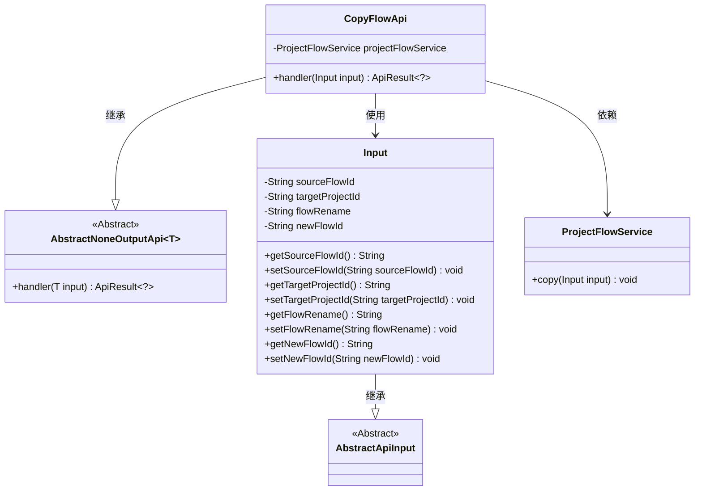

# 基础信息

|      |      |
|------|------|
| 名称 | CopyFlowApi |
| 编码语言 | .java |
| 代码路径 | WeFe/board/board-service/src/main/java/com/welab/wefe/board/service/api/project/flow/CopyFlowApi.java |
| 包名 | com.welab.wefe.board.service.api.project.flow |
| 依赖项 | ['com.welab.wefe.board.service.service.ProjectFlowService', 'com.welab.wefe.common.exception.StatusCodeWithException', 'com.welab.wefe.common.fieldvalidate.annotation.Check', 'com.welab.wefe.common.web.api.base.AbstractNoneOutputApi', 'com.welab.wefe.common.web.api.base.Api', 'com.welab.wefe.common.web.dto.AbstractApiInput', 'com.welab.wefe.common.web.dto.ApiResult', 'org.springframework.beans.factory.annotation.Autowired'] |
| 概述说明 | CopyFlowApi用于复制流程，需提供源流程ID和目标项目ID，可选新流程ID和重命名。调用ProjectFlowService执行复制操作。 |

# 说明

该代码定义了一个名为CopyFlowApi的API类，用于处理流程复制操作。API路径为project/flow/copy，继承自AbstractNoneOutputApi，输入类型为内部类Input。通过ProjectFlowService执行复制操作，输入参数包括必填的源流程ID和目标项目ID，以及可选的流程重命名和新流程ID。Input类包含四个字段及其getter/setter方法，字段均通过Check注解进行校验。

# 类列表 Class Summary

| 名称   | 类型  | 说明 |
|-------|------|-------------|
| CopyFlowApi | class | CopyFlowApi类用于复制流程，包含源流程ID、目标项目ID、流程重命名和新流程ID等输入参数，调用ProjectFlowService执行复制操作。 |

## 类 CopyFlowApi

|      |      |
|------|------|
| 访问范围 | @Api(path = "project/flow/copy", name = "copy flow");public |
| 类型 | class |
| 名称 | CopyFlowApi |
| 说明 | CopyFlowApi类用于复制流程，包含源流程ID、目标项目ID、流程重命名和新流程ID等输入参数，调用ProjectFlowService执行复制操作。 |

### UML类图

这段代码描述了一个流程复制API的实现结构。CopyFlowApi继承自泛型抽象类AbstractNoneOutputApi，专门处理Input类型的参数。Input类包含四个带校验注解的字段，用于存储源流程ID、目标项目ID、重命名和新流程ID。CopyFlowApi通过注入的ProjectFlowService完成核心复制逻辑，体现了清晰的层级结构和依赖关系，符合API接口与业务逻辑分离的设计原则。

### 内部方法调用关系图

```mermaid
graph TD
    A["类CopyFlowApi"]
    B["注解: @Api(path='project/flow/copy', name='copy flow')"]
    C["继承: AbstractNoneOutputApi<Input>"]
    D["依赖注入: @Autowired ProjectFlowService"]
    E["重写方法: handler(Input input)"]
    F["内部类: Input"]
    G["属性: String sourceFlowId"]
    H["属性: String targetProjectId"]
    I["属性: String flowRename"]
    J["属性: String newFlowId"]
    K["getter/setter方法"]

    A --> B
    A --> C
    A --> D
    A --> E
    A --> F
    F --> G
    F --> H
    F --> I
    F --> J
    F --> K
    E --> D
    E -->|调用| F
```

这段代码定义了一个用于复制流程的API类CopyFlowApi，它继承自AbstractNoneOutputApi并包含一个Input内部类。主要功能是通过ProjectFlowService.copy()方法实现流程复制，Input类封装了源流程ID、目标项目ID等必要参数。流程图展示了类结构、注解、继承关系、依赖注入和内部类组成，其中handler方法是核心处理逻辑，会调用ProjectFlowService并操作Input参数。

### 字段列表 Field List

| 名称  | 类型  | 说明 |
|-------|-------|------|
| projectFlowService | ProjectFlowService | 自动注入ProjectFlowService实例。 |

### 方法列表

| 名称  | 类型  | 说明 |
|-------|-------|------|
| handler | ApiResult<?> | 代码重写handler方法，调用projectFlowService.copy处理输入，成功返回ApiResult。异常时抛出StatusCodeWithException。 |

