# 基础信息

|      |      |
|------|------|
| 名称 | DeleteApi |
| 编码语言 | .java |
| 代码路径 | WeFe/board/board-service/src/main/java/com/welab/wefe/board/service/api/project/flow/DeleteApi.java |
| 包名 | com.welab.wefe.board.service.api.project.flow |
| 依赖项 | ['com.welab.wefe.board.service.dto.base.PagingInput', 'com.welab.wefe.board.service.dto.base.PagingOutput', 'com.welab.wefe.board.service.dto.entity.project.ProjectFlowListOutputModel', 'com.welab.wefe.board.service.service.ProjectFlowService', 'com.welab.wefe.common.exception.StatusCodeWithException', 'com.welab.wefe.common.fieldvalidate.annotation.Check', 'com.welab.wefe.common.web.api.base.AbstractApi', 'com.welab.wefe.common.web.api.base.Api', 'com.welab.wefe.common.web.dto.ApiResult', 'org.springframework.beans.factory.annotation.Autowired'] |
| 概述说明 | DeleteApi类用于删除项目流程，接收流程ID参数，调用flowService执行删除操作，返回成功结果。 |

# 说明

该代码定义了一个名为DeleteApi的API类，用于处理删除项目流程的请求。类路径为project/flow/delete，继承自AbstractApi，输入类型为DeleteApi.Input，输出类型为PagingOutput<ProjectFlowListOutputModel>。通过注入ProjectFlowService调用delete方法执行删除操作。输入类Input继承PagingInput，包含一个必填字段flowId表示流程ID，并提供了相应的getter和setter方法。处理成功后返回ApiResult封装的成功响应。

# 类列表 Class Summary

| 名称   | 类型  | 说明 |
|-------|------|-------------|
| DeleteApi | class | 这是一个删除项目流程的API类，路径为"project/flow/delete"，使用ProjectFlowService处理删除请求，输入参数为flowId，返回分页结果。 |


## 类 DeleteApi

|      |      |
|------|------|
| 访问范围 | @Api(path = "project/flow/delete", name = "delete flow");public |
| 类型 | class |
| 名称 | DeleteApi |
| 说明 | 这是一个删除项目流程的API类，路径为"project/flow/delete"，使用ProjectFlowService处理删除请求，输入参数为flowId，返回分页结果。 |


### UML类图

```mermaid
classDiagram
    class DeleteApi {
        -ProjectFlowService flowService
        +handle(Input input) ApiResult~PagingOutput~ProjectFlowListOutputModel~~
    }
    class Input {
        -String flowId
        +String getFlowId()
        +void setFlowId(String flowId)
    }
    class PagingInput {
        <<Abstract>>
    }
    class PagingOutput~T~ {
        <<Generic>>
    }
    class ProjectFlowListOutputModel {
    }
    class ApiResult~T~ {
        <<Generic>>
    }
    class StatusCodeWithException {
        <<Exception>>
    }
    class ProjectFlowService {
        <<Service>>
        +delete(Input input) void
    }

    DeleteApi --> ProjectFlowService : 依赖
    DeleteApi --> Input : 使用
    Input --|> PagingInput : 继承
    DeleteApi ..|> AbstractApi~Input, PagingOutput~ProjectFlowListOutputModel~~ : 实现
    PagingOutput~ProjectFlowListOutputModel~~ --> ProjectFlowListOutputModel : 包含
    DeleteApi ..> ApiResult~PagingOutput~ProjectFlowListOutputModel~~ : 返回
    DeleteApi ..> StatusCodeWithException : 抛出
```

这段代码展示了一个删除API的实现，DeleteApi类继承自AbstractApi泛型类，处理删除流程的请求。它依赖ProjectFlowService执行实际删除操作，使用内部类Input作为请求参数，继承自PagingInput。API返回封装在ApiResult中的分页输出结果，可能抛出StatusCodeWithException异常。类图清晰地展示了各组件间的继承、依赖和关联关系。


### 内部方法调用关系图

```mermaid
graph TD
    A["类DeleteApi"]
    B["注解: @Api(path='project/flow/delete', name='delete flow')"]
    C["继承: AbstractApi<Input, PagingOutput<ProjectFlowListOutputModel>>"]
    D["依赖注入: @Autowired ProjectFlowService flowService"]
    E["重写方法: handle(Input input)"]
    F["内部类: Input"]
    G["属性: @Check(name='流程Id') String flowId"]
    H["getter/setter: getFlowId()/setFlowId()"]
    I["方法调用: flowService.delete(input)"]
    J["返回结果: success()"]

    A --> B
    A --> C
    A --> D
    A --> E
    E --> I
    E --> J
    A --> F
    F --> G
    F --> H
```



这段代码展示了一个基于Spring框架的API类DeleteApi，用于处理删除项目流程的请求。该类继承自抽象模板类AbstractApi，通过@Autowired注入ProjectFlowService服务，重写handle方法实现具体业务逻辑。内部类Input定义了请求参数结构，包含流程ID字段及其校验注解。流程图清晰呈现了类结构、依赖关系和方法调用链，体现了从请求处理到服务调用的完整流程。

### 字段列表 Field List

| 名称  | 类型  | 说明 |
|-------|-------|------|
| flowService | ProjectFlowService | 自动注入ProjectFlowService实例flowService。 |

### 方法列表

| 名称  | 类型  | 说明 |
|-------|-------|------|
| handle | ApiResult<PagingOutput<ProjectFlowListOutputModel>> | 处理输入并删除流程，返回成功结果。 |


