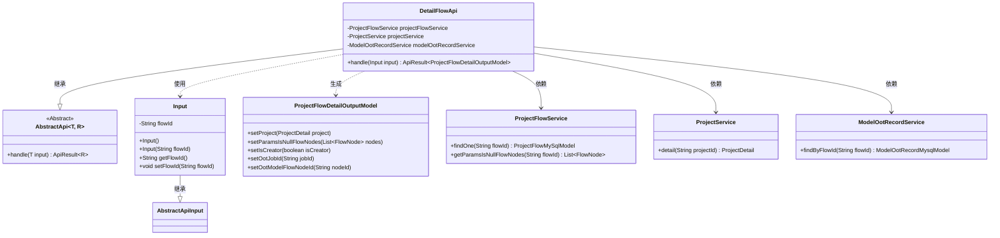
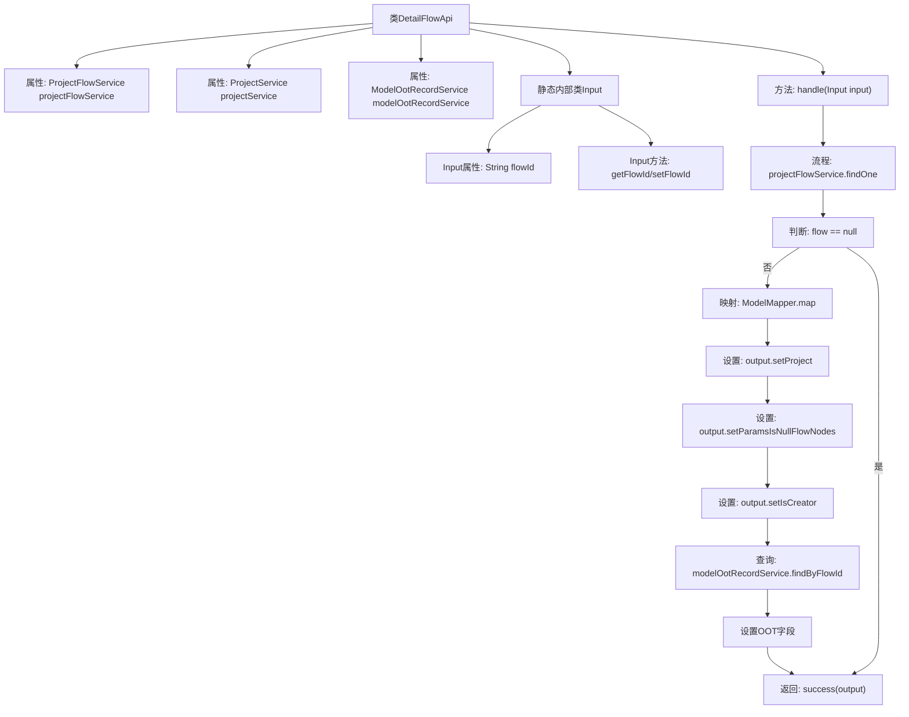

# 基础信息

|      |      |
|------|------|
| 名称 | DetailFlowApi |
| 编码语言 | .java |
| 代码路径 | WeFe/board/board-service/src/main/java/com/welab/wefe/board/service/api/project/flow/DetailFlowApi.java |
| 包名 | com.welab.wefe.board.service.api.project.flow |
| 依赖项 | ['com.welab.wefe.board.service.database.entity.job.ModelOotRecordMysqlModel', 'com.welab.wefe.board.service.database.entity.job.ProjectFlowMySqlModel', 'com.welab.wefe.board.service.dto.entity.project.ProjectFlowDetailOutputModel', 'com.welab.wefe.board.service.service.CacheObjects', 'com.welab.wefe.board.service.service.ModelOotRecordService', 'com.welab.wefe.board.service.service.ProjectFlowService', 'com.welab.wefe.board.service.service.ProjectService', 'com.welab.wefe.common.exception.StatusCodeWithException', 'com.welab.wefe.common.fieldvalidate.annotation.Check', 'com.welab.wefe.common.web.api.base.AbstractApi', 'com.welab.wefe.common.web.api.base.Api', 'com.welab.wefe.common.web.dto.AbstractApiInput', 'com.welab.wefe.common.web.dto.ApiResult', 'com.welab.wefe.common.web.util.ModelMapper', 'org.springframework.beans.factory.annotation.Autowired'] |
| 概述说明 | DetailFlowApi类处理获取流程详情的请求，通过flowId查询流程信息，包括项目详情、参数为空的节点、创建者标识及OOT模型记录，返回ProjectFlowDetailOutputModel结果。 |

# 说明

DetailFlowApi是一个用于获取流程详情的API类，继承自AbstractApi，输入为Input类，输出为ProjectFlowDetailOutputModel。通过注入ProjectFlowService、ProjectService和ModelOotRecordService来处理请求。主要逻辑包括根据flowId查询流程信息，若存在则映射为输出模型，并设置项目详情、参数为空的流程节点、创建者标识以及OOT模型相关信息。Input类包含必填的flowId字段及其getter和setter方法。

# 类列表 Class Summary

| 名称   | 类型  | 说明 |
|-------|------|-------------|
| DetailFlowApi | class | DetailFlowApi类处理获取流程详情的请求，通过flowId查询流程信息，补充项目详情、参数为空节点及创建者标识，并检查OOT模型记录，返回流程详情输出模型。 |

## 类 DetailFlowApi

|      |      |
|------|------|
| 访问范围 | @Api(path = "project/flow/detail", name = "get flow detail");public |
| 类型 | class |
| 名称 | DetailFlowApi |
| 说明 | DetailFlowApi类处理获取流程详情的请求，通过flowId查询流程信息，补充项目详情、参数为空节点及创建者标识，并检查OOT模型记录，返回流程详情输出模型。 |

### UML类图

该代码实现了一个获取流程详情的API接口，继承自抽象类AbstractApi。主要功能是通过flowId查询流程信息，并组装包含项目详情、参数空节点标记、创建者标识和OOT模型信息的输出对象。类图展示了核心类之间的关系：DetailFlowApi依赖三个服务类进行数据查询，使用Input作为输入参数，生成ProjectFlowDetailOutputModel作为响应结果。整个设计符合分层架构，通过服务类隔离数据访问逻辑。

### 内部方法调用关系图

这段代码是DetailFlowApi类的实现，主要用于获取项目流程详情。流程图展示了从输入参数处理开始，通过projectFlowService查询流程数据，进行空值判断后，映射输出模型并设置相关属性，包括项目详情、参数为空的流程节点、创建者标识以及OOT模型信息，最后返回处理结果。整个过程包含了数据查询、模型转换、条件判断和结果组装等关键步骤。

### 字段列表 Field List

| 名称  | 类型  | 说明 |
|-------|-------|------|
| projectFlowService | ProjectFlowService | 代码片段使用@Autowired注解自动注入ProjectFlowService实例。 |
| projectService | ProjectService | 使用@Autowired自动注入ProjectService实例。 |
| modelOotRecordService | ModelOotRecordService | 使用@Autowired自动注入ModelOotRecordService实例。 |

### 方法列表

| 名称  | 类型  | 说明 |
|-------|-------|------|
| handle | ApiResult<ProjectFlowDetailOutputModel> | 处理项目流详情请求，查询流信息并映射输出模型，补充项目详情、参数空节点和创建者标识，若存在OOT模型记录则添加相关ID，最后返回结果。 |

