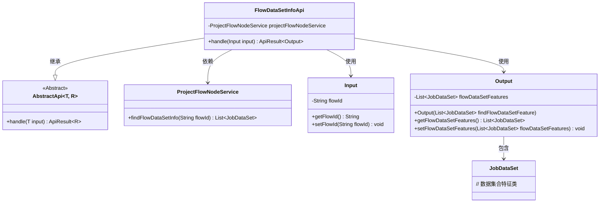

# 基础信息

|      |      |
|------|------|
| 名称 | FlowDataSetInfoApi |
| 编码语言 | .java |
| 代码路径 | WeFe/board/board-service/src/main/java/com/welab/wefe/board/service/api/project/flow/FlowDataSetInfoApi.java |
| 包名 | com.welab.wefe.board.service.api.project.flow |
| 依赖项 | ['com.welab.wefe.board.service.dto.kernel.machine_learning.JobDataSet', 'com.welab.wefe.board.service.service.ProjectFlowNodeService', 'com.welab.wefe.common.exception.StatusCodeWithException', 'com.welab.wefe.common.fieldvalidate.annotation.Check', 'com.welab.wefe.common.web.api.base.AbstractApi', 'com.welab.wefe.common.web.api.base.Api', 'com.welab.wefe.common.web.dto.AbstractApiInput', 'com.welab.wefe.common.web.dto.ApiResult', 'org.springframework.beans.factory.annotation.Autowired', 'java.util.List'] |
| 概述说明 | FlowDataSetInfoApi类通过flowId获取数据集信息，输入需验证flowId，输出包含JobDataSet列表。 |

# 说明

该代码定义了一个名为FlowDataSetInfoApi的API类，用于获取流程数据集信息。API路径为flow/dataset/info，继承自AbstractApi类，使用泛型指定输入输出类型。输入类Input包含必填字段flowId，输出类Output包含流程数据集特征列表flowDataSetFeatures。处理逻辑通过projectFlowNodeService查询流程数据集信息并返回结果。整个API实现了标准的请求响应模式，输入参数校验和结果封装功能。

# 类列表 Class Summary

| 名称   | 类型  | 说明 |
|-------|------|-------------|
| FlowDataSetInfoApi | class | FlowDataSetInfoApi类通过flowId获取数据集信息，输入需包含flowId，输出返回JobDataSet列表。 |

## 类 FlowDataSetInfoApi

|      |      |
|------|------|
| 访问范围 | @Api(path = "flow/dataset/info", name = "Get information about the flow data set");public |
| 类型 | class |
| 名称 | FlowDataSetInfoApi |
| 说明 | FlowDataSetInfoApi类通过flowId获取数据集信息，输入需包含flowId，输出返回JobDataSet列表。 |

### UML类图

该类图展示了FlowDataSetInfoApi的结构及其关联关系。FlowDataSetInfoApi继承自泛型抽象类AbstractApi，处理输入输出类型分别为Input和Output。通过依赖ProjectFlowNodeService获取流程数据集信息，其中Output类包含JobDataSet列表。Input类封装流程ID校验逻辑，整体构成一个完整的API处理流程。

### 内部方法调用关系图

```mermaid
graph TD
    A["类FlowDataSetInfoApi"]
    B["继承: AbstractApi<Input,Output>"]
    C["注解: @Api(path='flow/dataset/info', name='Get information about the flow data set')"]
    D["依赖注入: @Autowired ProjectFlowNodeService"]
    E["重写方法: handle(Input input)"]
    F["内部类: Input"]
    G["内部类: Output"]
    H["Input属性: String flowId"]
    I["Input方法: getFlowId/setFlowId"]
    J["Output属性: List<JobDataSet> flowDataSetFeatures"]
    K["Output方法: getFlowDataSetFeatures/setFlowDataSetFeatures"]
    L["流程: handle调用projectFlowNodeService.findFlowDataSetInfo"]
    M["返回: success(new Output(...))"]

    A --> B
    A --> C
    A --> D
    A --> E
    A --> F
    A --> G
    F --> H
    F --> I
    G --> J
    G --> K
    E --> L
    L --> M
```

这段代码展示了一个基于Spring框架的API类，用于获取流程数据集信息。流程图清晰地呈现了类结构关系，包括继承AbstractApi、依赖注入服务、内部输入输出类的定义，以及核心处理方法handle的调用链。该API通过projectFlowNodeService查询流程数据，并将结果封装在Output对象中返回，体现了典型的控制器层设计模式。

### 字段列表 Field List

| 名称  | 类型  | 说明 |
|-------|-------|------|
| projectFlowNodeService | ProjectFlowNodeService | 代码片段使用@Autowired自动注入ProjectFlowNodeService实例。 |

### 方法列表

| 名称  | 类型  | 说明 |
|-------|-------|------|
| handle | ApiResult<Output> | 该方法重写父类处理逻辑，接收Input参数，调用服务查询流程数据集信息，封装为Output对象后返回成功结果。可能抛出StatusCodeWithException异常。 |

