# 基础信息

|      |      |
|------|------|
| 名称 | FlowQueryApi |
| 编码语言 | .java |
| 代码路径 | WeFe/board/board-service/src/main/java/com/welab/wefe/board/service/api/project/flow/FlowQueryApi.java |
| 包名 | com.welab.wefe.board.service.api.project.flow |
| 依赖项 | ['com.welab.wefe.board.service.dto.base.PagingInput', 'com.welab.wefe.board.service.dto.base.PagingOutput', 'com.welab.wefe.board.service.dto.entity.project.ProjectFlowListOutputModel', 'com.welab.wefe.board.service.service.ProjectFlowService', 'com.welab.wefe.common.exception.StatusCodeWithException', 'com.welab.wefe.common.fieldvalidate.annotation.Check', 'com.welab.wefe.common.web.api.base.AbstractApi', 'com.welab.wefe.common.web.api.base.Api', 'com.welab.wefe.common.web.dto.ApiResult', 'com.welab.wefe.common.wefe.enums.FederatedLearningType', 'com.welab.wefe.common.wefe.enums.ProjectFlowStatisticsStatus', 'org.springframework.beans.factory.annotation.Autowired', 'java.util.List'] |
| 概述说明 | 这是一个查询项目流程列表的API类，接收分页参数、项目ID、流程ID列表等输入，返回分页的流程列表数据。 |

# 说明

这是一个名为FlowQueryApi的API类，用于查询项目流程列表。它继承自AbstractApi，接受Input类作为输入参数，返回分页的ProjectFlowListOutputModel结果。Input类包含分页参数和多个查询条件字段，如是否删除、项目ID、流程ID列表、联邦学习类型、状态和创建者等。API通过注入的ProjectFlowService处理查询请求，并返回成功结果。所有输入字段都有对应的校验注释说明其用途。

# 类列表 Class Summary

| 名称   | 类型  | 说明 |
|-------|------|-------------|
| FlowQueryApi | class | FlowQueryApi用于分页查询项目流程列表，接收包含删除状态、项目ID、流程ID列表等参数的Input，返回分页结果。通过flowService处理查询逻辑。 |


## 类 FlowQueryApi

|      |      |
|------|------|
| 访问范围 | @Api(path = "project/flow/query", name = "query flow list");public |
| 类型 | class |
| 名称 | FlowQueryApi |
| 说明 | FlowQueryApi用于分页查询项目流程列表，接收包含删除状态、项目ID、流程ID列表等参数的Input，返回分页结果。通过flowService处理查询逻辑。 |


### UML类图

```mermaid
classDiagram
    class FlowQueryApi {
        -ProjectFlowService flowService
        +handle(Input input) ApiResult~PagingOutput~ProjectFlowListOutputModel~~
    }
    
    class AbstractApi~T, R~ {
        <<Abstract>>
        +handle(T input) ApiResult~R~
    }
    
    class Input {
        -boolean deleted
        -String projectId
        -List~String~ flowIdList
        -FederatedLearningType federatedLearningType
        -ProjectFlowStatisticsStatus status
        -String creator
    }
    
    class PagingInput {
        <<Abstract>>
    }
    
    class PagingOutput~T~ {
        <<Interface>>
    }
    
    class ProjectFlowListOutputModel {
    }
    
    class ProjectFlowService {
        <<Interface>>
        +query(Input input) PagingOutput~ProjectFlowListOutputModel~
    }
    
    AbstractApi~Input, PagingOutput~ProjectFlowListOutputModel~~ <|-- FlowQueryApi
    Input --|> PagingInput
    FlowQueryApi --> ProjectFlowService : 依赖
    FlowQueryApi --> Input : 使用
    ProjectFlowService ..> PagingOutput~ProjectFlowListOutputModel~ : 返回
```

这段代码描述了一个流程查询API的实现结构。FlowQueryApi继承自泛型抽象类AbstractApi，处理Input参数并返回分页的ProjectFlowListOutputModel结果。Input类继承自PagingInput，包含多个查询条件字段。ProjectFlowService接口提供查询功能，返回分页输出结果。整体架构采用分层设计，通过泛型和继承实现类型安全的数据处理，符合企业级API开发规范。


### 内部方法调用关系图

```mermaid
graph TD
    A["类FlowQueryApi"]
    B["继承: AbstractApi<Input, PagingOutput<ProjectFlowListOutputModel>>"]
    C["依赖注入: @Autowired ProjectFlowService"]
    D["重写方法: handle(Input input)"]
    E["内部类: Input"]
    F["属性: boolean deleted"]
    G["属性: String projectId"]
    H["属性: List<String> flowIdList"]
    I["属性: FederatedLearningType federatedLearningType"]
    J["属性: ProjectFlowStatisticsStatus status"]
    K["属性: String creator"]
    L["继承: PagingInput"]

    A --> B
    A --> C
    A --> D
    A --> E
    E --> L
    E --> F
    E --> G
    E --> H
    E --> I
    E --> J
    E --> K
    D --> C
```



这段代码展示了一个基于Spring框架的API类FlowQueryApi，它继承自AbstractApi并处理分页查询流程列表的请求。类中包含一个内部类Input用于封装查询参数，这些参数包括删除状态、项目ID、流程ID列表等，并通过@Autowired注入的ProjectFlowService执行实际查询。流程图清晰地呈现了类继承关系、依赖注入和内部类的属性结构，体现了请求处理的完整链路。

### 字段列表 Field List

| 名称  | 类型  | 说明 |
|-------|-------|------|
| flowService | ProjectFlowService | 使用@Autowired自动注入ProjectFlowService实例flowService。 |

### 方法列表

| 名称  | 类型  | 说明 |
|-------|-------|------|
| handle | ApiResult<PagingOutput<ProjectFlowListOutputModel>> | 处理输入并返回项目流程列表的分页查询结果。 |


