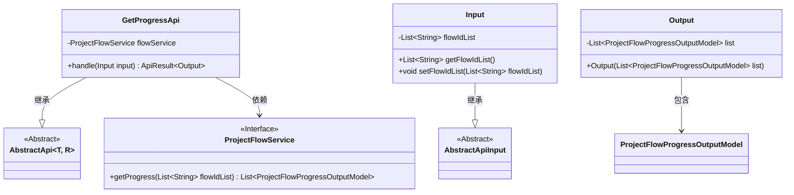

# 基础信息

|      |      |
|------|------|
| 名称 | GetProgressApi |
| 编码语言 | .java |
| 代码路径 | WeFe/board/board-service/src/main/java/com/welab/wefe/board/service/api/project/flow/GetProgressApi.java |
| 包名 | com.welab.wefe.board.service.api.project.flow |
| 依赖项 | ['com.welab.wefe.board.service.dto.entity.project.ProjectFlowProgressOutputModel', 'com.welab.wefe.board.service.service.ProjectFlowService', 'com.welab.wefe.common.exception.StatusCodeWithException', 'com.welab.wefe.common.fieldvalidate.annotation.Check', 'com.welab.wefe.common.web.api.base.AbstractApi', 'com.welab.wefe.common.web.api.base.Api', 'com.welab.wefe.common.web.dto.AbstractApiInput', 'com.welab.wefe.common.web.dto.ApiResult', 'org.springframework.beans.factory.annotation.Autowired', 'java.util.List'] |
| 概述说明 | 获取指定流程最新进度的API，输入为流程ID列表，输出为进度数据列表。 |

# 说明

这是一个名为GetProgressApi的API类，用于获取指定流程的最新进度。它继承自AbstractApi，接受Input参数并返回Output结果。Input包含一个必填的流程ID列表flowIdList。API通过注入的ProjectFlowService调用getProgress方法获取进度数据，并将结果封装在Output中返回。Output包含一个ProjectFlowProgressOutputModel列表。该API路径为project/flow/get_progress，功能明确且结构清晰。

# 类列表 Class Summary

| 名称   | 类型  | 说明 |
|-------|------|-------------|
| GetProgressApi | class | 获取指定流程最新进度的API，输入为流程ID列表，输出为进度信息列表。 |

## 类 GetProgressApi

|      |      |
|------|------|
| 访问范围 | @Api(path = "project/flow/get_progress", name = "Get the latest progress of the specified flow");public |
| 类型 | class |
| 名称 | GetProgressApi |
| 说明 | 获取指定流程最新进度的API，输入为流程ID列表，输出为进度信息列表。 |

### UML类图

这段代码描述了一个获取指定流程最新进度的API类`GetProgressApi`，它继承自泛型抽象类`AbstractApi`，使用`ProjectFlowService`服务获取流程进度数据。输入类`Input`包含流程ID列表并继承`AbstractApiInput`，输出类`Output`包装了进度数据列表。整体结构展示了典型的API层实现模式，包含请求处理、服务调用和数据封装三个主要部分，通过依赖注入和服务接口实现松耦合。

### 内部方法调用关系图

该流程图展示了GetProgressApi类的结构及其内部关系。主类包含API注解、服务注入和核心处理方法，其中handle方法调用flowService获取进度数据并返回封装结果。两个嵌套类Input和Output分别处理输入参数和输出数据，Input包含流程ID列表及其getter/setter，Output则封装进度结果列表。整体呈现了从请求处理到数据返回的完整调用链。

### 字段列表 Field List

| 名称  | 类型  | 说明 |
|-------|-------|------|
| flowService | ProjectFlowService | 使用@Autowired自动注入ProjectFlowService实例flowService。 |

### 方法列表

| 名称  | 类型  | 说明 |
|-------|-------|------|
| handle | ApiResult<Output> | 处理输入并返回流程进度列表。调用flowService获取进度，封装为Output后返回成功结果。 |

