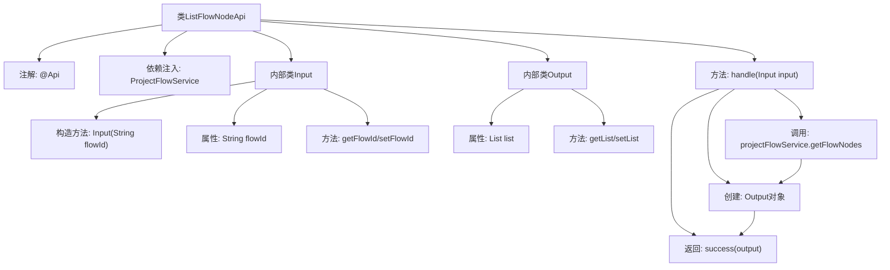

# 基础信息

|      |      |
|------|------|
| 名称 | ListFlowNodeApi |
| 编码语言 | .java |
| 代码路径 | WeFe/board/board-service/src/main/java/com/welab/wefe/board/service/api/project/flow/ListFlowNodeApi.java |
| 包名 | com.welab.wefe.board.service.api.project.flow |
| 依赖项 | ['com.welab.wefe.board.service.dto.entity.job.ProjectFlowNodeOutputModel', 'com.welab.wefe.board.service.service.ProjectFlowService', 'com.welab.wefe.common.exception.StatusCodeWithException', 'com.welab.wefe.common.fieldvalidate.annotation.Check', 'com.welab.wefe.common.web.api.base.AbstractApi', 'com.welab.wefe.common.web.api.base.Api', 'com.welab.wefe.common.web.dto.AbstractApiInput', 'com.welab.wefe.common.web.dto.AbstractApiOutput', 'com.welab.wefe.common.web.dto.ApiResult', 'org.springframework.beans.factory.annotation.Autowired', 'java.io.IOException', 'java.util.List'] |
| 概述说明 | 该API通过流程ID查询流程节点列表，输入需包含流程ID，输出返回节点列表。 |

# 说明

该代码定义了一个名为ListFlowNodeApi的API类，用于通过流程ID查询流程节点列表。API路径为project/flow_node/list，依赖ProjectFlowService服务获取数据。输入类Input包含必填字段flowId，输出类Output包含一个ProjectFlowNodeOutputModel列表。处理逻辑通过getFlowNodes方法获取节点列表并封装输出。整个API继承自AbstractApi，实现了标准的输入输出处理流程。

# 类列表 Class Summary

| 名称   | 类型  | 说明 |
|-------|------|-------------|
| ListFlowNodeApi | class | 这是一个查询流程节点列表的API类，通过流程ID获取节点列表。输入为流程ID，输出为节点列表。使用ProjectFlowService处理请求，返回ApiResult封装的结果。 |


## 类 ListFlowNodeApi

|      |      |
|------|------|
| 访问范围 | @Api(path = "project/flow_node/list", name = "query flow node list by flow id");public |
| 类型 | class |
| 名称 | ListFlowNodeApi |
| 说明 | 这是一个查询流程节点列表的API类，通过流程ID获取节点列表。输入为流程ID，输出为节点列表。使用ProjectFlowService处理请求，返回ApiResult封装的结果。 |


### UML类图

```mermaid
classDiagram
    class ListFlowNodeApi {
        -ProjectFlowService projectFlowService
        +handle(Input input) ApiResult~Output~
    }
    <<Interface>> AbstractApi~Input,Output~
    ListFlowNodeApi --|> AbstractApi~Input,Output~ : 继承
    ListFlowNodeApi --> ProjectFlowService : 依赖

    class Input {
        -String flowId
        +Input(String flowId)
        +String getFlowId()
        +void setFlowId(String flowId)
    }
    Input --|> AbstractApiInput : 继承

    class Output {
        -List~ProjectFlowNodeOutputModel~ list
        +List~ProjectFlowNodeOutputModel~ getList()
        +void setList(List~ProjectFlowNodeOutputModel~ list)
    }
    Output --|> AbstractApiOutput : 继承

    class ProjectFlowService {
        +getFlowNodes(String flowId) List~ProjectFlowNodeOutputModel~
    }
    class ProjectFlowNodeOutputModel
```

这段代码展示了一个基于抽象API框架的流程节点查询功能。ListFlowNodeApi类继承自泛型AbstractApi，处理Input/Output参数类型，通过ProjectFlowService获取流程节点数据。Input类包含必填的flowId字段并继承AbstractApiInput，Output类封装节点列表结果并继承AbstractApiOutput。整体结构体现了清晰的层级关系和依赖调用，符合API接口开发的常见模式。


### 内部方法调用关系图



这段代码是一个基于Spring框架的API类，用于通过流程ID查询流程节点列表。流程图展示了主类结构及其内部类关系，核心处理流程为：通过ProjectFlowService获取节点数据，封装Output对象后返回成功结果。Input类负责验证流程ID参数，Output类包装返回的节点列表数据。整个设计符合分层架构思想，职责划分清晰。

### 字段列表 Field List

| 名称  | 类型  | 说明 |
|-------|-------|------|
| projectFlowService | ProjectFlowService | 使用@Autowired自动注入ProjectFlowService实例。 |

### 方法列表

| 名称  | 类型  | 说明 |
|-------|-------|------|
| handle | ApiResult<Output> | 处理输入并返回流程节点列表。成功时返回包含列表的输出结果，失败时抛出异常。 |


