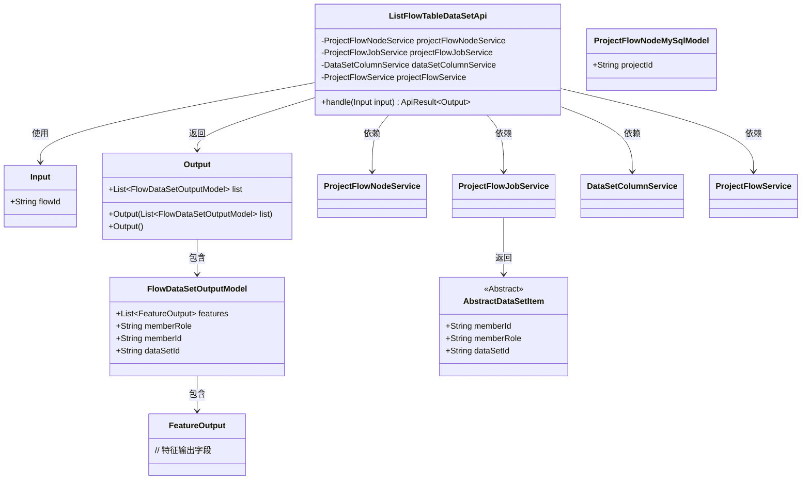
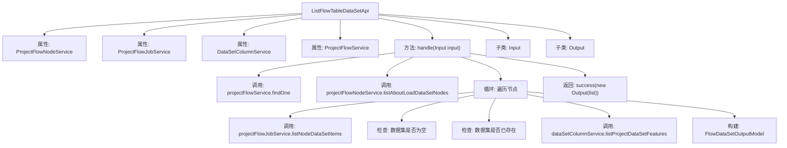

# 基础信息

|      |      |
|------|------|
| 名称 | ListFlowTableDataSetApi |
| 编码语言 | .java |
| 代码路径 | WeFe/board/board-service/src/main/java/com/welab/wefe/board/service/api/project/flow/ListFlowTableDataSetApi.java |
| 包名 | com.welab.wefe.board.service.api.project.flow |
| 依赖项 | ['com.welab.wefe.board.service.api.project.dataset.GetFeaturesApi', 'com.welab.wefe.board.service.component.base.dto.AbstractDataSetItem', 'com.welab.wefe.board.service.database.entity.job.ProjectFlowMySqlModel', 'com.welab.wefe.board.service.database.entity.job.ProjectFlowNodeMySqlModel', 'com.welab.wefe.board.service.dto.vo.FeatureOutput', 'com.welab.wefe.board.service.dto.vo.FlowDataSetOutputModel', 'com.welab.wefe.board.service.service.DataSetColumnService', 'com.welab.wefe.board.service.service.ProjectFlowJobService', 'com.welab.wefe.board.service.service.ProjectFlowNodeService', 'com.welab.wefe.board.service.service.ProjectFlowService', 'com.welab.wefe.common.exception.StatusCodeWithException', 'com.welab.wefe.common.fieldvalidate.annotation.Check', 'com.welab.wefe.common.web.api.base.AbstractApi', 'com.welab.wefe.common.web.api.base.Api', 'com.welab.wefe.common.web.dto.AbstractApiInput', 'com.welab.wefe.common.web.dto.AbstractApiOutput', 'com.welab.wefe.common.web.dto.ApiResult', 'org.apache.commons.collections4.CollectionUtils', 'org.springframework.beans.factory.annotation.Autowired', 'java.io.IOException', 'java.util.ArrayList', 'java.util.List'] |
| 概述说明 | 获取流程数据集列表API，通过流程ID查询相关节点数据集，组装数据集信息并返回。 |

# 说明

该API类用于获取当前流程使用的数据集列表，路径为"project/flow/table_data_set/list"。它继承自AbstractApi，处理输入输出类型为内部定义的Input和Output。主要逻辑包括：通过flowId查找流程，获取所有类似DataIO的节点，遍历节点并收集数据集信息，检查数据集是否已存在，若不存在则创建数据集模型并填充特征信息。输入参数为必填的flowId，输出包含数据集列表。

# 类列表 Class Summary

| 名称   | 类型  | 说明 |
|-------|------|-------------|
| ListFlowTableDataSetApi | class | 该API用于获取流程中使用的数据集列表，通过遍历流程节点收集数据集信息并返回。输入为流程ID，输出为数据集列表。 |

## 类 ListFlowTableDataSetApi

|      |      |
|------|------|
| 访问范围 | @Api(path = "project/flow/table_data_set/list", name = "获取当前流程使用到的数据集列表");public |
| 类型 | class |
| 名称 | ListFlowTableDataSetApi |
| 说明 | 该API用于获取流程中使用的数据集列表，通过遍历流程节点收集数据集信息并返回。输入为流程ID，输出为数据集列表。 |

### UML类图

这段代码是一个API类，用于获取流程中使用的数据集列表。主要功能包括：通过flowId查询流程信息，查找所有数据加载节点，遍历节点获取数据集信息，并组装成输出结果。类图中展示了核心类及其关系，包括输入输出参数、服务依赖和数据模型。该API通过多个服务协作完成数据集信息的收集和整理，最终返回包含数据集特征信息的列表。

### 内部方法调用关系图

该流程图展示了`ListFlowTableDataSetApi`类的核心处理逻辑。首先通过`projectFlowService`获取流程信息，然后通过`projectFlowNodeService`查找相关节点，遍历节点时使用`projectFlowJobService`获取数据集条目，检查数据有效性后通过`dataSetColumnService`获取特征数据，最终构建输出模型并返回结果。整个过程包含多层服务调用和数据验证，确保返回当前流程使用的数据集列表。

### 字段列表 Field List

| 名称  | 类型  | 说明 |
|-------|-------|------|
| dataSetColumnService | DataSetColumnService | 自动注入数据集列服务实例。 |
| projectFlowJobService | ProjectFlowJobService | 使用@Autowired自动注入ProjectFlowJobService实例。 |
| projectFlowNodeService | ProjectFlowNodeService | 使用@Autowired自动注入ProjectFlowNodeService实例。 |
| projectFlowService | ProjectFlowService | 使用@Autowired自动注入ProjectFlowService实例。 |

### 方法列表

| 名称  | 类型  | 说明 |
|-------|-------|------|
| handle | ApiResult<Output> | 处理输入流，查找数据加载节点，组装数据集信息，排除重复项后返回结果。 |

