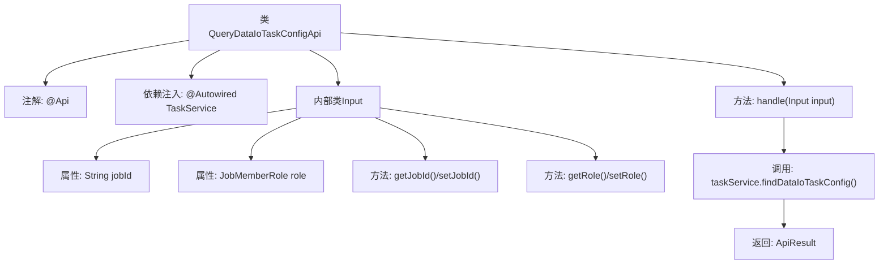

# 基础信息

|      |      |
|------|------|
| 名称 | QueryDataIoTaskConfigApi |
| 编码语言 | .java |
| 代码路径 | WeFe/board/board-service/src/main/java/com/welab/wefe/board/service/api/project/flow/QueryDataIoTaskConfigApi.java |
| 包名 | com.welab.wefe.board.service.api.project.flow |
| 依赖项 | ['com.welab.wefe.board.service.service.TaskService', 'com.welab.wefe.common.exception.StatusCodeWithException', 'com.welab.wefe.common.fieldvalidate.annotation.Check', 'com.welab.wefe.common.util.JObject', 'com.welab.wefe.common.web.api.base.AbstractApi', 'com.welab.wefe.common.web.api.base.Api', 'com.welab.wefe.common.web.dto.AbstractApiInput', 'com.welab.wefe.common.web.dto.ApiResult', 'com.welab.wefe.common.wefe.enums.JobMemberRole', 'org.springframework.beans.factory.annotation.Autowired', 'java.io.IOException'] |
| 概述说明 | QueryDataIoTaskConfigApi类用于查询数据IO组件输入参数，需提供jobId和role参数，调用taskService.findDataIoTaskConfig方法返回配置信息。 |

# 说明

该代码定义了一个名为QueryDataIoTaskConfigApi的API类，用于查询数据IO组件的输入参数配置。API路径为project/flow/query/data_io_task_config，接受包含jobId和role两个必填参数的输入对象Input，其中role为JobMemberRole类型。通过注入的TaskService服务调用findDataIoTaskConfig方法处理请求，返回JObject格式的结果。输入参数通过getter和setter方法进行访问和修改。

# 类列表 Class Summary

| 名称   | 类型  | 说明 |
|-------|------|-------------|
| QueryDataIoTaskConfigApi | class | 查询数据IO任务配置的API接口，需提供任务ID和角色参数，返回任务配置信息。 |


## 类 QueryDataIoTaskConfigApi

|      |      |
|------|------|
| 访问范围 | @Api(path = "project/flow/query/data_io_task_config", name = "Query input parameters of dataio component");public |
| 类型 | class |
| 名称 | QueryDataIoTaskConfigApi |
| 说明 | 查询数据IO任务配置的API接口，需提供任务ID和角色参数，返回任务配置信息。 |


### UML类图

```mermaid
classDiagram
    class QueryDataIoTaskConfigApi {
        -TaskService taskService
        +handle(Input input) ApiResult~JObject~
    }
    QueryDataIoTaskConfigApi --> TaskService : 依赖
    QueryDataIoTaskConfigApi --> AbstractApi~Input, JObject~ : 继承
    QueryDataIoTaskConfigApi ..|> <<Interface>> Api : 实现

    class AbstractApi~Input, JObject~ {
        <<Abstract>>
        +handle(Input input) ApiResult~JObject~
    }

    class Input {
        -String jobId
        -JobMemberRole role
        +String getJobId()
        +void setJobId(String jobId)
        +JobMemberRole getRole()
        +void setRole(JobMemberRole role)
    }
    Input --> AbstractApiInput : 继承

    class AbstractApiInput {
        <<Abstract>>
    }

    class TaskService {
        +findDataIoTaskConfig(Input input) JObject
    }

    class JobMemberRole {
        <<Enumeration>>
    }

    class ApiResult~JObject~ {
    }

    class JObject {
    }

    <<Interface>> Api {
        <<Interface>>
    }
```

这段代码展示了一个查询数据IO任务配置的API类结构。QueryDataIoTaskConfigApi继承自泛型抽象类AbstractApi，并实现了Api接口，通过TaskService获取任务配置。内部类Input继承自AbstractApiInput，包含jobId和role两个字段及其访问方法。整体设计采用分层架构，通过依赖注入TaskService实现业务逻辑，输入参数通过嵌套类进行封装验证。


### 内部方法调用关系图



该流程图展示了QueryDataIoTaskConfigApi类的结构，包含API注解、依赖注入的TaskService、核心处理方法handle以及嵌套的Input参数类。处理流程从handle方法开始，调用taskService查询配置后返回封装结果，Input类包含带校验注解的字段和对应的getter/setter方法。类关系清晰呈现了Spring Boot API的典型结构。

### 字段列表 Field List

| 名称  | 类型  | 说明 |
|-------|-------|------|
| taskService | TaskService | 使用@Autowired自动注入TaskService实例。 |

### 方法列表

| 名称  | 类型  | 说明 |
|-------|-------|------|
| handle | ApiResult<JObject> | 处理输入并返回任务配置数据，成功时包含结果，失败抛出异常。 |


