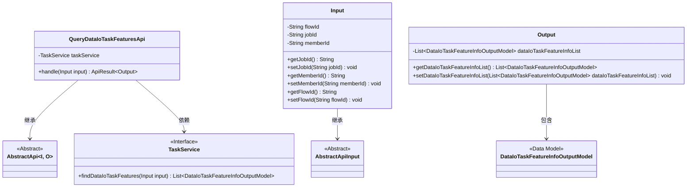
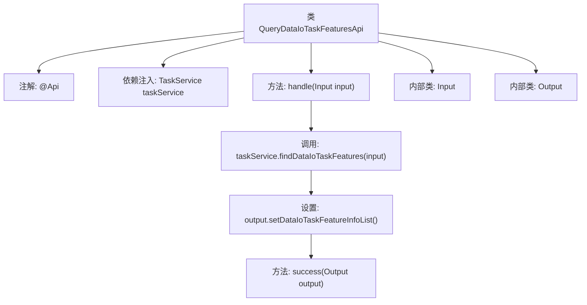

# 基础信息

|      |      |
|------|------|
| 名称 | QueryDataIoTaskFeaturesApi |
| 编码语言 | .java |
| 代码路径 | WeFe/board/board-service/src/main/java/com/welab/wefe/board/service/api/project/flow/QueryDataIoTaskFeaturesApi.java |
| 包名 | com.welab.wefe.board.service.api.project.flow |
| 依赖项 | ['com.welab.wefe.board.service.dto.entity.DataIoTaskFeatureInfoOutputModel', 'com.welab.wefe.board.service.service.TaskService', 'com.welab.wefe.common.exception.StatusCodeWithException', 'com.welab.wefe.common.fieldvalidate.annotation.Check', 'com.welab.wefe.common.web.api.base.AbstractApi', 'com.welab.wefe.common.web.api.base.Api', 'com.welab.wefe.common.web.dto.AbstractApiInput', 'com.welab.wefe.common.web.dto.ApiResult', 'org.springframework.beans.factory.annotation.Autowired', 'java.io.IOException', 'java.util.List'] |
| 概述说明 | 查询数据IO任务特征列的API，根据jobid和memberId获取特征信息，支持非OOT模式的flowId查询。输入含flowId、jobId和memberId，输出为特征列表。 |

# 说明

该API用于根据jobid查询成员数据IO任务的特征列。路径为"project/flow/query/data_io_task_features"。继承自AbstractApi，输入为Input类，输出为Output类。Input包含flowId、jobId和memberId三个字段，分别表示流程ID、任务ID和成员ID。Output包含一个dataIoTaskFeatureInfoList列表，存储查询结果。通过TaskService的findDataIoTaskFeatures方法获取数据，并封装到Output中返回。若memberId为空，则查询该jobid下所有成员的数据。

# 类列表 Class Summary

| 名称   | 类型  | 说明 |
|-------|------|-------------|
| QueryDataIoTaskFeaturesApi | class | 该API根据jobid查询成员数据任务的建模特征列，输入含flowId、jobId和memberId，输出为特征列列表。 |

## 类 QueryDataIoTaskFeaturesApi

|      |      |
|------|------|
| 访问范围 | @Api(path = "project/flow/query/data_io_task_features", name = "Query the modeling feature column of the dataio task of the member according to jobid");public |
| 类型 | class |
| 名称 | QueryDataIoTaskFeaturesApi |
| 说明 | 该API根据jobid查询成员数据任务的建模特征列，输入含flowId、jobId和memberId，输出为特征列列表。 |

### UML类图

这段代码描述了一个查询数据IO任务特征的API实现。QueryDataIoTaskFeaturesApi继承自泛型抽象类AbstractApi，处理Input输入参数并返回Output结果。通过依赖TaskService服务获取数据特征列表，Input类包含流程ID、任务ID和成员ID等查询参数，Output类封装了特征信息列表。整体采用分层设计，Input/Output作为数据传输对象，与抽象基类形成继承关系，核心业务逻辑通过接口调用实现。

### 内部方法调用关系图

这段代码流程图展示了QueryDataIoTaskFeaturesApi类的核心结构和执行流程。该类是一个API实现，通过@Api注解定义接口路径和名称，继承AbstractApi并指定输入输出类型。主要流程从handle方法开始，调用taskService查询数据IO任务特征，将结果设置到Output对象后返回成功响应。Input和Output作为内部类分别处理请求参数和响应数据，其中Input包含流程ID、任务ID和成员ID等校验字段，Output则封装了特征信息列表。整个流程清晰展现了从请求处理到服务调用的数据流转路径。

### 字段列表 Field List

| 名称  | 类型  | 说明 |
|-------|-------|------|
| taskService | TaskService | 使用@Autowired自动注入TaskService实例。 |

### 方法列表

| 名称  | 类型  | 说明 |
|-------|-------|------|
| handle | ApiResult<Output> | Java方法重写，处理输入并返回包含任务特性的输出结果，可能抛出异常或IO错误。 |

