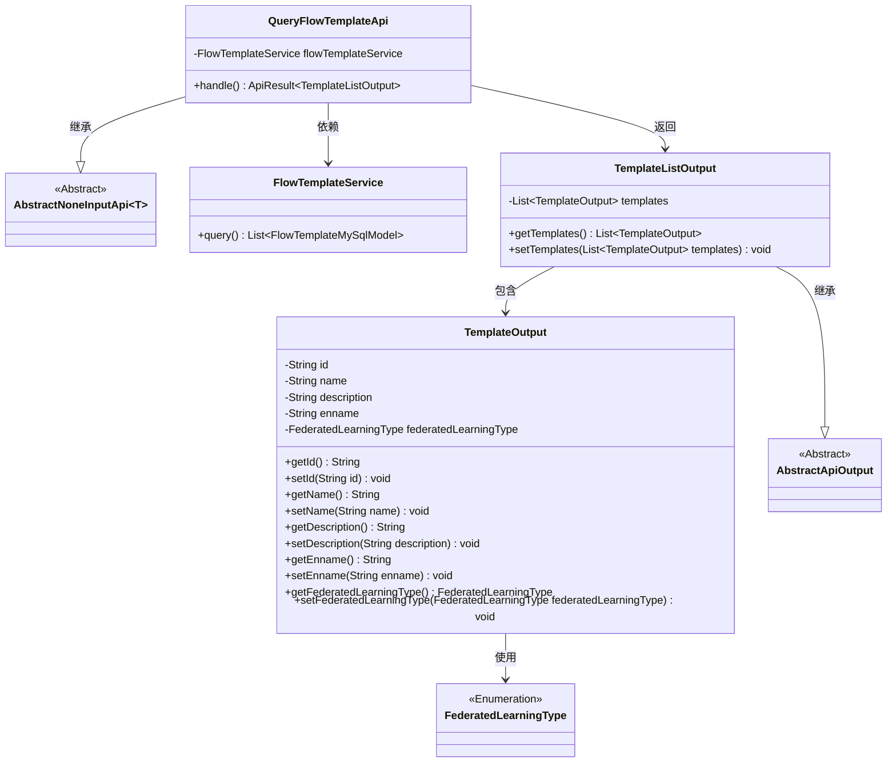
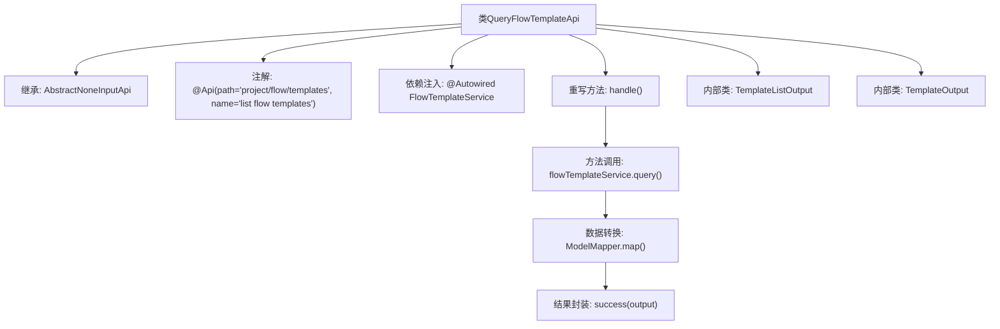

# 基础信息

|      |      |
|------|------|
| 名称 | QueryFlowTemplateApi |
| 编码语言 | .java |
| 代码路径 | WeFe/board/board-service/src/main/java/com/welab/wefe/board/service/api/project/flow/QueryFlowTemplateApi.java |
| 包名 | com.welab.wefe.board.service.api.project.flow |
| 依赖项 | ['com.welab.wefe.board.service.api.project.flow.QueryFlowTemplateApi.TemplateListOutput', 'com.welab.wefe.board.service.database.entity.flow.FlowTemplateMySqlModel', 'com.welab.wefe.board.service.service.FlowTemplateService', 'com.welab.wefe.common.exception.StatusCodeWithException', 'com.welab.wefe.common.fieldvalidate.annotation.Check', 'com.welab.wefe.common.web.api.base.AbstractNoneInputApi', 'com.welab.wefe.common.web.api.base.Api', 'com.welab.wefe.common.web.dto.AbstractApiOutput', 'com.welab.wefe.common.web.dto.ApiResult', 'com.welab.wefe.common.web.util.ModelMapper', 'com.welab.wefe.common.wefe.enums.FederatedLearningType', 'org.springframework.beans.factory.annotation.Autowired', 'javax.persistence.EnumType', 'javax.persistence.Enumerated', 'java.util.List', 'java.util.stream.Collectors'] |
| 概述说明 | QueryFlowTemplateApi类用于查询流程模板列表，通过flowTemplateService获取数据并转换为TemplateOutput格式返回，包含模板ID、名称、描述、英文名和联邦学习类型等字段。 |

# 说明

该代码定义了一个查询流程模板的API类QueryFlowTemplateApi，继承自AbstractNoneInputApi，返回TemplateListOutput类型。API路径为project/flow/templates，名称为list flow templates。通过FlowTemplateService查询模板数据，将FlowTemplateMySqlModel转换为TemplateOutput并封装到TemplateListOutput中返回。TemplateOutput包含id、名称、描述、英文名称和联邦学习类型等字段，TemplateListOutput包含模板列表。

# 类列表 Class Summary

| 名称   | 类型  | 说明 |
|-------|------|-------------|
| QueryFlowTemplateApi | class | QueryFlowTemplateApi类通过flowTemplateService查询流程模板列表，返回包含id、名称、描述和联邦学习类型的模板输出列表。 |

## 类 QueryFlowTemplateApi

|      |      |
|------|------|
| 访问范围 | @Api(path = "project/flow/templates", name = "list flow templates");public |
| 类型 | class |
| 名称 | QueryFlowTemplateApi |
| 说明 | QueryFlowTemplateApi类通过flowTemplateService查询流程模板列表，返回包含id、名称、描述和联邦学习类型的模板输出列表。 |

### UML类图

这段代码展示了一个查询流程模板的API实现，核心类QueryFlowTemplateApi继承自AbstractNoneInputApi，通过FlowTemplateService获取数据后转换为TemplateListOutput输出。TemplateListOutput包含多个TemplateOutput对象，每个TemplateOutput存储模板的ID、名称、描述等属性，并使用FederatedLearningType枚举类型。整体结构体现了分层设计和数据转换逻辑。

### 内部方法调用关系图

这段代码流程图展示了QueryFlowTemplateApi类的结构和执行流程。该类是一个API控制器，通过继承AbstractNoneInputApi并重写handle方法来实现业务逻辑。流程从handle方法开始，调用flowTemplateService获取数据，通过ModelMapper进行模型转换，最终封装成TemplateListOutput返回。内部类TemplateListOutput和TemplateOutput分别用于定义返回数据结构及其包含的模板信息。整个过程体现了从数据查询到结果返回的完整处理链。

### 字段列表 Field List

| 名称  | 类型  | 说明 |
|-------|-------|------|
| flowTemplateService | FlowTemplateService | 使用@Autowired自动注入FlowTemplateService实例。 |

### 方法列表

| 名称  | 类型  | 说明 |
|-------|-------|------|
| handle | ApiResult<TemplateListOutput> | 该方法查询流程模板列表，将结果映射为输出对象并返回成功响应。 |

