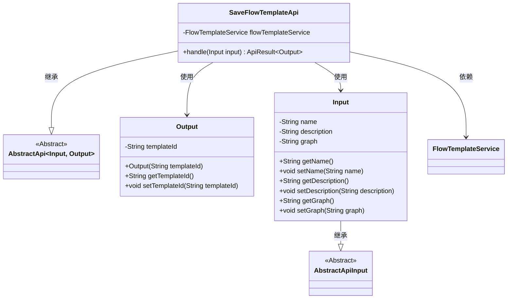
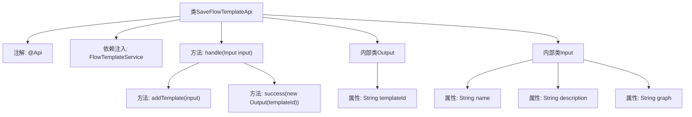

# 基础信息

|      |      |
|------|------|
| 名称 | SaveFlowTemplateApi |
| 编码语言 | .java |
| 代码路径 | WeFe/board/board-service/src/main/java/com/welab/wefe/board/service/api/project/flow/SaveFlowTemplateApi.java |
| 包名 | com.welab.wefe.board.service.api.project.flow |
| 依赖项 | ['com.welab.wefe.board.service.service.FlowTemplateService', 'com.welab.wefe.common.exception.StatusCodeWithException', 'com.welab.wefe.common.fieldvalidate.annotation.Check', 'com.welab.wefe.common.web.api.base.AbstractApi', 'com.welab.wefe.common.web.api.base.Api', 'com.welab.wefe.common.web.dto.AbstractApiInput', 'com.welab.wefe.common.web.dto.ApiResult', 'org.springframework.beans.factory.annotation.Autowired'] |
| 概述说明 | 保存流程模板API，接收名称、描述和流程图输入，调用服务生成模板ID并返回。包含输入输出类定义和核心处理逻辑。 |

# 说明

这是一个名为SaveFlowTemplateApi的API类，用于保存流程模板。API路径为project/flow/template/save。它继承自AbstractApi类，使用FlowTemplateService处理业务逻辑。输入参数Input包含模板名称、描述和流程图，均带有校验注解。输出参数Output包含生成的模板ID。处理逻辑是通过flowTemplateService.addTemplate方法添加模板，并返回包含模板ID的成功结果。

# 类列表 Class Summary

| 名称   | 类型  | 说明 |
|-------|------|-------------|
| SaveFlowTemplateApi | class | 保存流程模板API，接收名称、描述和流程图输入，调用服务生成模板ID并返回。 |

## 类 SaveFlowTemplateApi

|      |      |
|------|------|
| 访问范围 | @Api(path = "project/flow/template/save", name = "save flow template");public |
| 类型 | class |
| 名称 | SaveFlowTemplateApi |
| 说明 | 保存流程模板API，接收名称、描述和流程图输入，调用服务生成模板ID并返回。 |

### UML类图

这段代码展示了一个保存流程模板的API类结构。SaveFlowTemplateApi继承自泛型抽象类AbstractApi，定义了Input和Output两个嵌套类作为输入输出参数。Input类继承自AbstractApiInput，包含模板名称、描述和流程图等字段；Output类包含生成的模板ID。API通过注入的FlowTemplateService处理业务逻辑，将输入转换为输出结果。整体设计体现了清晰的职责分离和分层架构。

### 内部方法调用关系图

该流程图展示了SaveFlowTemplateApi类的结构，包含主类、注解、依赖注入的服务、核心处理方法handle以及两个内部类Output和Input。handle方法通过flowTemplateService.addTemplate处理输入，并返回包含模板ID的成功结果。Input类包含模板名称、描述和流程图三个校验属性，Output类则封装了生成的模板ID。整个流程清晰地反映了API请求处理的数据流转路径。

### 字段列表 Field List

| 名称  | 类型  | 说明 |
|-------|-------|------|
| flowTemplateService | FlowTemplateService | 自动注入流程模板服务实例。 |

### 方法列表

| 名称  | 类型  | 说明 |
|-------|-------|------|
| handle | ApiResult<Output> | 该方法处理输入并调用服务添加模板，返回包含模板ID的成功结果。 |

