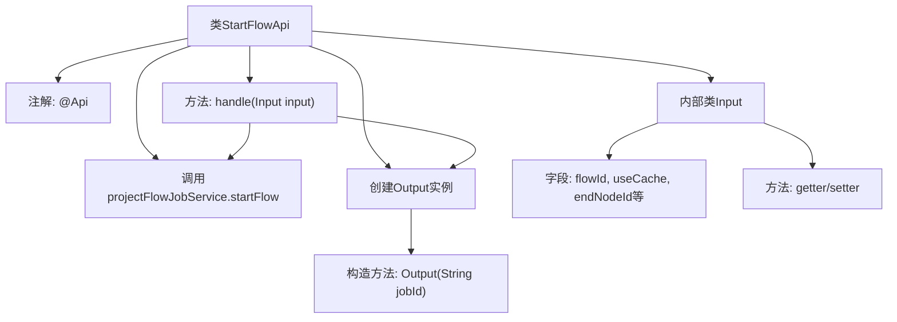

# 基础信息

|      |      |
|------|------|
| 名称 | StartFlowApi |
| 编码语言 | .java |
| 代码路径 | WeFe/board/board-service/src/main/java/com/welab/wefe/board/service/api/project/flow/StartFlowApi.java |
| 包名 | com.welab.wefe.board.service.api.project.flow |
| 依赖项 | ['com.welab.wefe.board.service.service.ProjectFlowJobService', 'com.welab.wefe.common.exception.StatusCodeWithException', 'com.welab.wefe.common.fieldvalidate.annotation.Check', 'com.welab.wefe.common.web.api.base.AbstractApi', 'com.welab.wefe.common.web.api.base.Api', 'com.welab.wefe.common.web.dto.AbstractApiInput', 'com.welab.wefe.common.web.dto.ApiResult', 'org.springframework.beans.factory.annotation.Autowired'] |
| 概述说明 | StartFlowApi用于启动流程并创建执行任务，输入包含流程ID、缓存使用标志等参数，输出返回任务ID。 |

# 说明

StartFlowApi是一个用于启动流程、创建并执行任务的API类，继承自AbstractApi。它接收Input参数，包含流程ID、是否使用缓存、终止节点ID、任务ID、仲裁成员ID、OOT任务ID和备注等信息。处理逻辑通过projectFlowJobService.startFlow方法启动流程并返回任务ID。Output类仅包含任务ID字段。所有输入字段均通过校验注解进行约束，部分字段为必填或隐藏。

# 类列表 Class Summary

| 名称   | 类型  | 说明 |
|-------|------|-------------|
| StartFlowApi | class | StartFlowApi用于启动流程并创建执行任务，输入包含流程ID、缓存使用等参数，输出返回任务ID。 |


## 类 StartFlowApi

|      |      |
|------|------|
| 访问范围 | @Api(path = "flow/start", name = "start flow, create a job and execute it.");public |
| 类型 | class |
| 名称 | StartFlowApi |
| 说明 | StartFlowApi用于启动流程并创建执行任务，输入包含流程ID、缓存使用等参数，输出返回任务ID。 |


### UML类图

```mermaid
classDiagram
    class StartFlowApi {
        -ProjectFlowJobService projectFlowJobService
        +handle(Input input) ApiResult~Output~
    }
    
    class AbstractApi~T, R~ {
        <<Abstract>>
    }
    
    class AbstractApiInput {
        <<Abstract>>
    }
    
    class ProjectFlowJobService {
        <<Interface>>
        +startFlow(StartFlowApi$Input input) String
    }
    
    class ApiResult~T~ {
        <<Generic>>
    }
    
    class StatusCodeWithException {
        <<Exception>>
    }
    
    class StartFlowApi$Input {
        -String flowId
        -boolean useCache
        -String endNodeId
        -String jobId
        -String arbiterMemberId
        -String ootJobId
        -String remark
        +getFlowId() String
        +setFlowId(String flowId) void
        +isUseCache() boolean
        +setUseCache(boolean useCache) void
        +getJobId() String
        +setJobId(String jobId) void
        +getEndNodeId() String
        +setEndNodeId(String endNodeId) void
        +getArbiterMemberId() String
        +setArbiterMemberId(String arbiterMemberId) void
        +getOotJobId() String
        +setOotJobId(String ootJobId) void
        +getRemark() String
        +setRemark(String remark) void
    }
    
    class StartFlowApi$Output {
        -String jobId
        +Output(String jobId)
        +getJobId() String
        +setJobId(String jobId) void
    }
    
    StartFlowApi --> AbstractApi : 继承
    StartFlowApi --> ProjectFlowJobService : 依赖
    StartFlowApi ..> StartFlowApi$Input : 使用
    StartFlowApi ..> StartFlowApi$Output : 使用
    StartFlowApi$Input --> AbstractApiInput : 继承
    StartFlowApi --> ApiResult : 返回
    StartFlowApi ..> StatusCodeWithException : 抛出
```

该代码实现了一个启动流程的API接口，包含输入参数校验、流程执行和结果返回功能。StartFlowApi继承自泛型抽象类AbstractApi，通过ProjectFlowJobService服务执行具体流程，Input类继承AbstractApiInput并包含多个带校验注解的字段，Output类封装返回的jobId。类图展示了核心类之间的继承、依赖和使用关系，体现了API接口的典型分层设计模式。


### 内部方法调用关系图



这段代码定义了一个StartFlowApi类，用于启动流程并创建执行任务。该类继承自AbstractApi，包含Input和Output两个内部类用于处理输入输出数据。主要逻辑在handle方法中，通过projectFlowJobService.startFlow启动流程并返回包含jobId的Output对象。Input类包含多个带校验注解的字段，用于接收流程参数；Output类则简单封装了jobId。整体设计符合API层的数据封装和业务调用分离原则。

### 字段列表 Field List

| 名称  | 类型  | 说明 |
|-------|-------|------|
| projectFlowJobService | ProjectFlowJobService | 自动注入ProjectFlowJobService服务实例。 |

### 方法列表

| 名称  | 类型  | 说明 |
|-------|-------|------|
| handle | ApiResult<Output> | 重写方法处理输入，调用服务启动流程并返回包含任务ID的成功结果。 |


