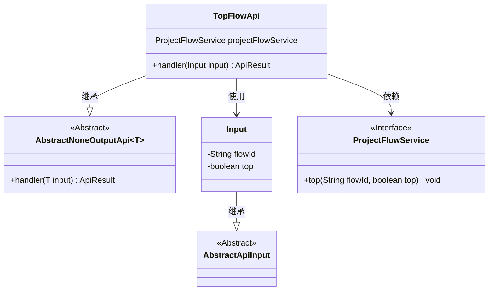
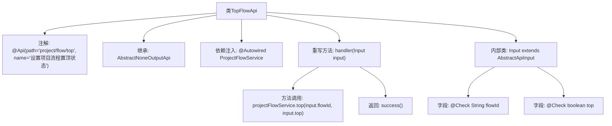

# 基础信息

|      |      |
|------|------|
| 名称 | TopFlowApi |
| 编码语言 | .java |
| 代码路径 | WeFe/board/board-service/src/main/java/com/welab/wefe/board/service/api/project/flow/TopFlowApi.java |
| 包名 | com.welab.wefe.board.service.api.project.flow |
| 依赖项 | ['com.welab.wefe.board.service.service.ProjectFlowService', 'com.welab.wefe.common.exception.StatusCodeWithException', 'com.welab.wefe.common.fieldvalidate.annotation.Check', 'com.welab.wefe.common.web.api.base.AbstractNoneOutputApi', 'com.welab.wefe.common.web.api.base.Api', 'com.welab.wefe.common.web.dto.AbstractApiInput', 'com.welab.wefe.common.web.dto.ApiResult', 'org.springframework.beans.factory.annotation.Autowired'] |
| 概述说明 | TopFlowApi类用于设置项目流程置顶状态，接收flowId和top参数，调用projectFlowService.top方法处理，返回成功结果。 |

# 说明

该代码定义了一个名为TopFlowApi的API类，用于设置项目流程的置顶状态。API路径为"project/flow/top"，名称为"设置项目流程置顶状态"。该类继承自AbstractNoneOutputApi，使用泛型Input作为输入参数类型。通过注入ProjectFlowService服务来处理业务逻辑，handler方法调用service的top方法实现置顶功能。输入参数Input继承自AbstractApiInput，包含两个必填字段：flowId（训练Id）和top（是否置顶）。执行成功返回空结果。

# 类列表 Class Summary

| 名称   | 类型  | 说明 |
|-------|------|-------------|
| TopFlowApi | class | TopFlowApi类用于设置项目流程置顶状态，接收flowId和top参数，调用projectFlowService.top方法处理，返回成功结果。 |

## 类 TopFlowApi

|      |      |
|------|------|
| 访问范围 | @Api(path = "project/flow/top", name = "设置项目流程置顶状态");public |
| 类型 | class |
| 名称 | TopFlowApi |
| 说明 | TopFlowApi类用于设置项目流程置顶状态，接收flowId和top参数，调用projectFlowService.top方法处理，返回成功结果。 |

### UML类图

类图描述：
TopFlowApi类继承自泛型类AbstractNoneOutputApi<Input>，实现了置顶项目流程的功能。它依赖ProjectFlowService接口来执行置顶操作，并使用内部静态类Input作为输入参数。Input类继承自AbstractApiInput，包含flowId和top两个字段。ProjectFlowService是一个接口，定义了置顶方法。整个结构展示了API层与业务服务的协作关系。

### 内部方法调用关系图

这段代码定义了一个名为TopFlowApi的API类，用于处理项目流程置顶状态的设置。该类继承自AbstractNoneOutputApi，并包含一个内部输入类Input。流程图中展示了类结构、注解、依赖注入、方法重写以及内部类的字段定义。handler方法调用ProjectFlowService的top方法进行置顶操作，最后返回成功结果。整个流程清晰地展示了从API接收到业务处理的完整调用链。

### 字段列表 Field List

| 名称  | 类型  | 说明 |
|-------|-------|------|
| projectFlowService | ProjectFlowService | 自动注入ProjectFlowService服务实例。 |

### 方法列表

| 名称  | 类型  | 说明 |
|-------|-------|------|
| handler | ApiResult | 方法重写处理输入，调用服务置顶流程，返回成功结果。 |

