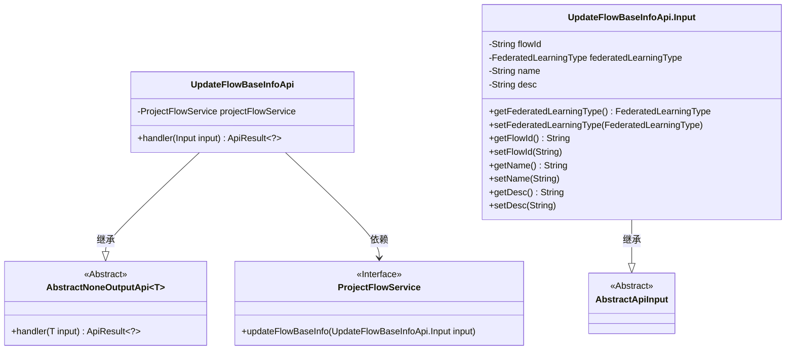

# 基础信息

|      |      |
|------|------|
| 名称 | UpdateFlowBaseInfoApi |
| 编码语言 | .java |
| 代码路径 | WeFe/board/board-service/src/main/java/com/welab/wefe/board/service/api/project/flow/UpdateFlowBaseInfoApi.java |
| 包名 | com.welab.wefe.board.service.api.project.flow |
| 依赖项 | ['com.welab.wefe.board.service.service.ProjectFlowService', 'com.welab.wefe.common.exception.StatusCodeWithException', 'com.welab.wefe.common.fieldvalidate.annotation.Check', 'com.welab.wefe.common.web.api.base.AbstractNoneOutputApi', 'com.welab.wefe.common.web.api.base.Api', 'com.welab.wefe.common.web.dto.AbstractApiInput', 'com.welab.wefe.common.web.dto.ApiResult', 'com.welab.wefe.common.wefe.enums.FederatedLearningType', 'org.springframework.beans.factory.annotation.Autowired'] |
| 概述说明 | 更新流程基础信息的API类，包含流程ID、联邦学习类型、流程名和描述等输入参数，调用ProjectFlowService更新流程信息。 |

# 说明

该代码定义了一个名为UpdateFlowBaseInfoApi的API类，用于更新流程基本信息。API路径为project/flow/update/base_info，继承自AbstractNoneOutputApi，输入参数为内部类Input。Input包含流程ID、联邦学习类型（必填）、流程名（必填）和流程描述等字段，并提供了相应的getter和setter方法。处理逻辑通过ProjectFlowService的updateFlowBaseInfo方法实现，成功时返回空结果。

# 类列表 Class Summary

| 名称   | 类型  | 说明 |
|-------|------|-------------|
| UpdateFlowBaseInfoApi | class | 更新流程基础信息的API类，包含流程ID、联邦学习类型、流程名和描述等输入参数，调用ProjectFlowService进行更新操作。 |

## 类 UpdateFlowBaseInfoApi

|      |      |
|------|------|
| 访问范围 | @Api(path = "project/flow/update/base_info", name = "update flow base info");public |
| 类型 | class |
| 名称 | UpdateFlowBaseInfoApi |
| 说明 | 更新流程基础信息的API类，包含流程ID、联邦学习类型、流程名和描述等输入参数，调用ProjectFlowService进行更新操作。 |

### UML类图

这段代码展示了一个更新流程基础信息的API实现，包含核心类UpdateFlowBaseInfoApi及其嵌套输入类Input。UpdateFlowBaseInfoApi继承自泛型抽象类AbstractNoneOutputApi，通过ProjectFlowService接口实现业务逻辑，Input类继承自AbstractApiInput并包含流程ID、联邦学习类型等字段。类图清晰地呈现了继承关系和依赖关系，体现了Spring依赖注入和API处理的设计模式。

### 内部方法调用关系图

```mermaid
graph TD
    A["类UpdateFlowBaseInfoApi"]
    B["注解: @Api(path='project/flow/update/base_info', name='update flow base info')"]
    C["继承: AbstractNoneOutputApi<Input>"]
    D["依赖注入: @Autowired ProjectFlowService"]
    E["重写方法: handler(Input input)"]
    F["内部类: Input"]
    G["属性: String flowId"]
    H["属性: FederatedLearningType federatedLearningType"]
    I["属性: String name"]
    J["属性: String desc"]
    K["getter/setter方法"]
    L["方法调用: projectFlowService.updateFlowBaseInfo(input)"]
    M["返回结果: success()"]

    A --> B
    A --> C
    A --> D
    A --> E
    E --> L
    E --> M
    A --> F
    F --> G
    F --> H
    F --> I
    F --> J
    F --> K
```

这段代码描述了一个用于更新流程基础信息的API类UpdateFlowBaseInfoApi，它继承自抽象类AbstractNoneOutputApi并包含输入参数内部类Input。流程图展示了类结构、注解、继承关系、依赖注入的服务、核心handler方法实现以及Input类的字段和访问方法。核心业务逻辑是通过projectFlowService更新流程基础信息，最后返回成功结果。整个设计采用分层结构，符合标准的API开发模式。

### 字段列表 Field List

| 名称  | 类型  | 说明 |
|-------|-------|------|
| projectFlowService | ProjectFlowService | 使用@Autowired自动注入ProjectFlowService实例。 |

### 方法列表

| 名称  | 类型  | 说明 |
|-------|-------|------|
| handler | ApiResult<?> | 该方法重写父类handler，调用projectFlowService更新流程基础信息，输入为input，成功返回空结果，异常抛出StatusCodeWithException。 |

