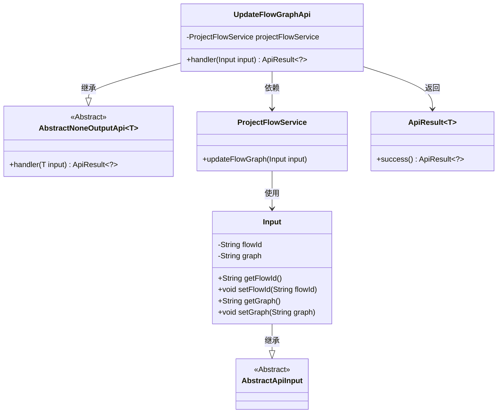
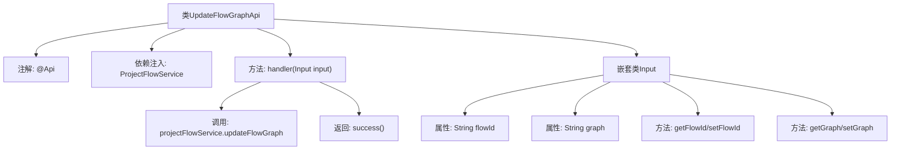

# 基础信息

|      |      |
|------|------|
| 名称 | UpdateFlowGraphApi |
| 编码语言 | .java |
| 代码路径 | WeFe/board/board-service/src/main/java/com/welab/wefe/board/service/api/project/flow/UpdateFlowGraphApi.java |
| 包名 | com.welab.wefe.board.service.api.project.flow |
| 依赖项 | ['com.welab.wefe.board.service.service.ProjectFlowService', 'com.welab.wefe.common.exception.StatusCodeWithException', 'com.welab.wefe.common.fieldvalidate.annotation.Check', 'com.welab.wefe.common.web.api.base.AbstractNoneOutputApi', 'com.welab.wefe.common.web.api.base.Api', 'com.welab.wefe.common.web.dto.AbstractApiInput', 'com.welab.wefe.common.web.dto.ApiResult', 'org.springframework.beans.factory.annotation.Autowired'] |
| 概述说明 | 更新流程图API，路径为project/flow/update/graph，接收流程ID和流程图数据，调用ProjectFlowService更新流程图。 |

# 说明

这是一个用于更新流程图的API类，路径为"project/flow/update/graph"，名称为"update flow graph"。它继承自AbstractNoneOutputApi，接受Input类作为输入参数。Input类包含两个必填字段：flowId（流程ID）和graph（流程图）。API通过注入的ProjectFlowService调用updateFlowGraph方法处理输入，成功后返回空结果。所有字段都有对应的getter和setter方法。

# 类列表 Class Summary

| 名称   | 类型  | 说明 |
|-------|------|-------------|
| UpdateFlowGraphApi | class | UpdateFlowGraphApi类用于更新流程图，接收流程ID和流程图数据，调用ProjectFlowService处理。输入参数flowId和graph必填。 |

## 类 UpdateFlowGraphApi

|      |      |
|------|------|
| 访问范围 | @Api(path = "project/flow/update/graph", name = "update flow graph");public |
| 类型 | class |
| 名称 | UpdateFlowGraphApi |
| 说明 | UpdateFlowGraphApi类用于更新流程图，接收流程ID和流程图数据，调用ProjectFlowService处理。输入参数flowId和graph必填。 |

### UML类图

类图描述：该图展示了UpdateFlowGraphApi及其相关类的结构。UpdateFlowGraphApi继承自泛型类AbstractNoneOutputApi<Input>，包含一个ProjectFlowService依赖项。Input类继承自AbstractApiInput，包含flowId和graph两个私有字段及其getter/setter方法。ProjectFlowService提供updateFlowGraph方法，接受Input参数。ApiResult是一个泛型类，用于封装API返回结果。

### 内部方法调用关系图

这段代码描述了一个基于Spring框架的API控制器类UpdateFlowGraphApi，主要用于更新流程图数据。该API继承自AbstractNoneOutputApi，通过ProjectFlowService服务层实现核心业务逻辑。嵌套类Input定义了必需的请求参数flowId和graph，包含参数校验注解和getter/setter方法。handler方法处理请求时会调用服务层更新操作，最后返回成功响应。整体结构体现了清晰的层次划分和职责分离。

### 字段列表 Field List

| 名称  | 类型  | 说明 |
|-------|-------|------|
| projectFlowService | ProjectFlowService | 自动注入ProjectFlowService服务实例。 |

### 方法列表

| 名称  | 类型  | 说明 |
|-------|-------|------|
| handler | ApiResult<?> | 覆盖方法处理输入，调用服务更新流程图，成功返回结果。 |

