# 基础信息

|      |      |
|------|------|
| 名称 | flow |
| 编码语言 | .java |
| 代码路径 | WeFe/board/board-service/src/main/java/com/welab/wefe/board/service/api/project/flow |
| 包名 | docs.board.board-service.src.main.java.com.welab.wefe.board.service.api.project.flow |
| 概述说明 | ListFlowNodeApi查询流程节点列表。AddFlowApi新增项目流程。UpdateFlowBaseInfoApi更新流程信息。QueryFlowTemplateApi查询流程模板。StartFlowApi启动流程。QueryDataIoTaskConfigApi查询数据IO配置。GetProgressApi获取流程进度。DeleteApi删除流程。SaveFlowTemplateApi保存模板。QueryDataIoTaskFeaturesApi查询特征列。UpdateFlowGraphApi更新流程图。DetailFlowApi获取流程详情。FlowQueryApi查询流程列表。AddOotFlowApi添加OOT流程。CopyFlowApi复制流程。TopFlowApi置顶流程。FlowDataSetInfoApi获取数据集信息。ListFlowTableDataSetApi获取数据集列表。 |

# 说明

## 概述  
该模块核心职责是管理联邦学习项目中的流程生命周期，包括流程的增删改查、模板管理、任务执行与数据查询等。类似工作流引擎，通过统一API规范实现流程编排与状态控制。  

接口规范遵循RESTful风格，路径以`project/flow`为前缀，继承`AbstractApi`基类实现标准化输入输出。例如`ListFlowNodeApi`查询节点列表，`AddFlowApi`创建新流程。关键数据结构包括`ProjectFlowNodeOutputModel`（节点信息）、`TemplateOutput`（模板详情）和`ProjectFlowDetailOutputModel`（流程详情）。  

外部依赖包括`ProjectFlowService`（流程核心服务）、`FlowTemplateService`（模板管理）和`TaskService`（任务配置）。例如`StartFlowApi`依赖`projectFlowJobService`启动任务。实现案例丰富，如`QueryDataIoTaskConfigApi`查询数据IO配置返回JObject格式结果。  

## 主要业务场景  
业务流程覆盖全生命周期：创建（如`AddFlowApi`）、配置（如`UpdateFlowBaseInfoApi`）、执行（如`StartFlowApi`）到监控（如`GetProgressApi`）。交互模式以服务调用为主，例如`ProjectFlowService`提供流程CRUD操作。  

典型应用包括模板化创建（`SaveFlowTemplateApi`）、流程复制（`CopyFlowApi`）和OOT流程扩展（`AddOotFlowApi`）。API类型涵盖查询类（如`FlowQueryApi`分页列表）、操作类（如`DeleteApi`）和配置类（如`UpdateFlowGraphApi`更新流程图）。  

数据交互场景突出，例如`ListFlowTableDataSetApi`收集流程数据集特征，`QueryDataIoTaskFeaturesApi`按任务ID查询特征列。完整性体现在状态闭环管理，从`TopFlowApi`置顶操作到`DetailFlowApi`详情查询形成完整视图。

### 包内部结构视图

```mermaid
graph TD
    flow --> ListFlowNodeApi.java
    flow --> AddFlowApi.java
    flow --> UpdateFlowBaseInfoApi.java
    flow --> QueryFlowTemplateApi.java
    flow --> StartFlowApi.java
    flow --> QueryDataIoTaskConfigApi.java
    flow --> GetProgressApi.java
    flow --> DeleteApi.java
    flow --> SaveFlowTemplateApi.java
    flow --> QueryDataIoTaskFeaturesApi.java
    flow --> UpdateFlowGraphApi.java
    flow --> DetailFlowApi.java
    flow --> FlowQueryApi.java
    flow --> AddOotFlowApi.java
    flow --> CopyFlowApi.java
    flow --> TopFlowApi.java
    flow --> FlowDataSetInfoApi.java
    flow --> ListFlowTableDataSetApi.java
```

该流程图展示了WeFe项目中flow目录下的所有API文件结构。根节点为flow文件夹，直接包含18个不同的Java API文件，涵盖流程管理、数据查询、模板操作等功能模块。每个文件代表一个独立的API接口实现，共同构成完整的项目流程服务功能集。

# 文件列表

| 名称   | 类型  | 说明 |
|-------|------|-------------|
| [ListFlowNodeApi.java](ListFlowNodeApi.md) | file | 该API通过流程ID查询流程节点列表，输入需包含流程ID，输出返回节点列表。 |
| [AddFlowApi.java](AddFlowApi.md) | file | AddFlowApi类用于新增项目流程，接收项目ID、联邦类型、任务类型等输入，调用ProjectFlowService生成流程ID并返回。输入包含必填项和可选参数，输出为流程ID。 |
| [UpdateFlowBaseInfoApi.java](UpdateFlowBaseInfoApi.md) | file | 更新流程基础信息的API类，包含流程ID、联邦学习类型、流程名和描述等输入参数，调用ProjectFlowService更新流程信息。 |
| [QueryFlowTemplateApi.java](QueryFlowTemplateApi.md) | file | QueryFlowTemplateApi类用于查询流程模板列表，通过flowTemplateService获取数据并转换为TemplateOutput格式返回，包含模板ID、名称、描述、英文名和联邦学习类型等字段。 |
| [StartFlowApi.java](StartFlowApi.md) | file | StartFlowApi用于启动流程并创建执行任务，输入包含流程ID、缓存使用标志等参数，输出返回任务ID。 |
| [QueryDataIoTaskConfigApi.java](QueryDataIoTaskConfigApi.md) | file | QueryDataIoTaskConfigApi类用于查询数据IO组件输入参数，需提供jobId和role参数，调用taskService.findDataIoTaskConfig方法返回配置信息。 |
| [GetProgressApi.java](GetProgressApi.md) | file | 获取指定流程最新进度的API，输入为流程ID列表，输出为进度数据列表。 |
| [DeleteApi.java](DeleteApi.md) | file | DeleteApi类用于删除项目流程，接收流程ID参数，调用flowService执行删除操作，返回成功结果。 |
| [SaveFlowTemplateApi.java](SaveFlowTemplateApi.md) | file | 保存流程模板API，接收名称、描述和流程图输入，调用服务生成模板ID并返回。包含输入输出类定义和核心处理逻辑。 |
| [QueryDataIoTaskFeaturesApi.java](QueryDataIoTaskFeaturesApi.md) | file | 查询数据IO任务特征列的API，根据jobid和memberId获取特征信息，支持非OOT模式的flowId查询。输入含flowId、jobId和memberId，输出为特征列表。 |
| [UpdateFlowGraphApi.java](UpdateFlowGraphApi.md) | file | 更新流程图API，路径为project/flow/update/graph，接收流程ID和流程图数据，调用ProjectFlowService更新流程图。 |
| [DetailFlowApi.java](DetailFlowApi.md) | file | DetailFlowApi类处理获取流程详情的请求，通过flowId查询流程信息，包括项目详情、参数为空的节点、创建者标识及OOT模型记录，返回ProjectFlowDetailOutputModel结果。 |
| [FlowQueryApi.java](FlowQueryApi.md) | file | 这是一个查询项目流程列表的API类，接收分页参数、项目ID、流程ID列表等输入，返回分页的流程列表数据。 |
| [AddOotFlowApi.java](AddOotFlowApi.md) | file | AddOotFlowApi类用于添加OOT流程，输入包括任务ID、模型节点ID和模型名称，输出为流程ID。 |
| [CopyFlowApi.java](CopyFlowApi.md) | file | CopyFlowApi用于复制流程，需提供源流程ID和目标项目ID，可选新流程ID和重命名。调用ProjectFlowService执行复制操作。 |
| [TopFlowApi.java](TopFlowApi.md) | file | TopFlowApi类用于设置项目流程置顶状态，接收flowId和top参数，调用projectFlowService.top方法处理，返回成功结果。 |
| [FlowDataSetInfoApi.java](FlowDataSetInfoApi.md) | file | FlowDataSetInfoApi类通过flowId获取数据集信息，输入需验证flowId，输出包含JobDataSet列表。 |
| [ListFlowTableDataSetApi.java](ListFlowTableDataSetApi.md) | file | 获取流程数据集列表API，通过流程ID查询相关节点数据集，组装数据集信息并返回。 |

