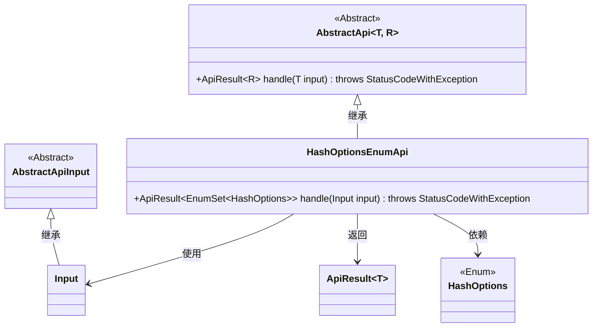

# 基础信息

|      |      |
|------|------|
| 名称 | HashOptionsEnumApi |
| 编码语言 | .java |
| 代码路径 | WeFe/board/board-service/src/main/java/com/welab/wefe/board/service/api/project/fusion/HashOptionsEnumApi.java |
| 包名 | com.welab.wefe.board.service.api.project.fusion |
| 依赖项 | ['com.welab.wefe.common.exception.StatusCodeWithException', 'com.welab.wefe.common.web.api.base.AbstractApi', 'com.welab.wefe.common.web.api.base.Api', 'com.welab.wefe.common.web.dto.AbstractApiInput', 'com.welab.wefe.common.web.dto.ApiResult', 'com.welab.wefe.common.wefe.enums.HashOptions', 'java.util.EnumSet'] |
| 概述说明 | HashOptionsEnumApi接口提供获取HashOptions枚举所有值的功能，输入为空，返回枚举集合。 |

# 说明

该代码定义了一个名为HashOptionsEnumApi的API类，继承自AbstractApi基类。API路径为fusion/hash_options_enum，名称为"任务状态"，描述为"任务状态"。它处理Input类型的输入参数，返回EnumSet<HashOptions>类型的结果。handle方法实现获取所有HashOptions枚举值并封装为成功结果返回。Input是一个空的静态内部类，继承自AbstractApiInput。该API主要用于获取HashOptions枚举的所有可能值集合。

# 类列表 Class Summary

| 名称   | 类型  | 说明 |
|-------|------|-------------|
| HashOptionsEnumApi | class | Java类HashOptionsEnumApi提供获取HashOptions枚举所有值的API，路径为fusion/hash_options_enum，输入无参数，返回枚举集合。 |

## 类 HashOptionsEnumApi

|      |      |
|------|------|
| 访问范围 | @Api(path = "fusion/hash_options_enum", name = "任务状态", desc = "任务状态");public |
| 类型 | class |
| 名称 | HashOptionsEnumApi |
| 说明 | Java类HashOptionsEnumApi提供获取HashOptions枚举所有值的API，路径为fusion/hash_options_enum，输入无参数，返回枚举集合。 |

### UML类图

类图描述：该图展示了HashOptionsEnumApi类继承自泛型抽象类AbstractApi，并实现了其handle方法。Input作为静态内部类继承自AbstractApiInput。HashOptionsEnumApi通过handle方法返回包含HashOptions枚举集的ApiResult对象，体现了对枚举类型和API结果封装的依赖关系。整体结构清晰展示了API实现层与基础抽象类之间的层级关系。

### 内部方法调用关系图

```mermaid
graph TD
    A["类HashOptionsEnumApi"]
    B["注解: @Api"]
    C["父类: AbstractApi<Input, EnumSet<HashOptions>>"]
    D["方法: handle(Input input)"]
    E["内部类: Input"]
    F["调用: EnumSet.allOf(HashOptions.class)"]
    G["返回: success(hashOptions)"]

    A --> B
    A --> C
    A --> D
    A --> E
    D --> F
    F --> G
```

该流程图展示了HashOptionsEnumApi类的结构及其核心逻辑。该类继承自AbstractApi，通过@Api注解定义API元信息，核心方法handle()调用EnumSet.allOf()获取所有枚举值并封装为成功结果返回。内部类Input用于接收请求参数，整体设计简洁且职责明确，符合枚举查询API的典型实现模式。

### 字段列表 Field List

| 名称  | 类型  | 说明 |
|-------|-------|------|

### 方法列表

| 名称  | 类型  | 说明 |
|-------|-------|------|
| handle | ApiResult<EnumSet<HashOptions>> | 重写方法返回所有HashOptions枚举值，封装为ApiResult成功结果。 |

