# 基础信息

|      |      |
|------|------|
| 名称 | fusion |
| 编码语言 | .java |
| 代码路径 | WeFe/board/board-service/src/main/java/com/welab/wefe/board/service/api/project/fusion |
| 包名 | docs.board.board-service.src.main.java.com.welab.wefe.board.service.api.project.fusion |
| 概述说明 | 模块1：数据融合结果管理，提供预览、导出及进度查询功能，采用RESTful接口，依赖FusionResultService和存储服务。模块2：PSI协议API，管理布隆过滤器下载、状态同步和结果接收，依赖ActuatorManager。模块3：联邦学习对齐任务管理，支持任务创建、查询和审核，路径前缀为fusion/task/。模块4：查询项目提供者列表API，路径为fusion/query/providers。模块5：获取HashOptions枚举值的API，路径为fusion/hash_options_enum。 |

# 说明

## 概述  
该模块核心职责是提供联邦学习中对齐任务、数据融合结果及PSI协议的全生命周期管理，类似分布式工作流引擎。接口规范统一采用RESTful风格，路径前缀为`fusion/`，继承AbstractApi基类，支持签名访问和参数校验。关键数据结构包括带业务标识的Input类（如projectId/businessId）、分页/详情输出结构（如FusionTaskOutput）及状态枚举（如PSIActuatorStatus）。外部依赖项包括各业务Service（如FusionResultService）、执行器管理组件（ActuatorManager）和基础设施（JdbcClient）。例如ResultExportApi实现数据导出，PsiCryptoApi处理加密转换，QueryProvidersApi获取项目成员列表。

## 主要业务场景  
模块支持三类核心流程：1)数据融合结果处理（预览-导出-进度查询），2)PSI协议执行（状态同步-加密-结果聚合），3)联邦学习对齐任务（创建-审核-状态跟踪）。交互模式类似链式事务，通过businessId串联多阶段API调用（如ServerSynStatusApi轮询状态后触发ReceiveResultApi）。功能完整性体现在全链路覆盖，例如TaskStatusApi监控进度、AuditCallbackApi处理审核回调、HashOptionsEnumApi提供枚举选项。典型集成案例包括带签名的异步任务（ExportManager管理）和分页查询（组合projectId/status条件）。

### 包内部结构视图

```mermaid
graph TD
    fusion --> result
    fusion --> actuator
    fusion --> task
    fusion --> member
    fusion --> HashOptionsEnumApi.java
    result --> ResultExportApi.java
    result --> ResultPreviewApi.java
    result --> TestDBConnectApi.java
    result --> ResultExportProgressApi.java
    actuator --> psi
    psi --> DownloadBFApi.java
    psi --> ReceiveResultApi.java
    psi --> ServerSynStatusApi.java
    psi --> ServerCloseApi.java
    psi --> PsiCryptoApi.java
    task --> ReceiveApi.java
    task --> InfoApi.java
    task --> PagingApi.java
    task --> UpdateApi.java
    task --> RestartApi.java
    task --> DeleteApi.java
    task --> AddApi.java
    task --> DeleteCallbackApi.java
    task --> AuditCallbackApi.java
    task --> DetailApi.java
    task --> AuditApi.java
    task --> TaskStatusApi.java
    member --> QueryProvidersApi.java
```

该流程图展示了项目融合模块的API结构，包含5个主要分支：结果处理(result)、执行器(actuator)、任务管理(task)、成员管理(member)和枚举接口。其中执行器下包含PSI加密相关子模块，任务管理包含12个具体API接口，整体结构清晰展现了功能模块的层级关系。

# 文件列表

| 名称   | 类型  | 说明 |
|-------|------|-------------|
| [member](member/_module.md) | package | 查询项目成员列表的API接口，通过项目ID获取正式项目成员信息并返回输出模型列表。 |
| [HashOptionsEnumApi.java](HashOptionsEnumApi.md) | file | HashOptionsEnumApi接口提供获取HashOptions枚举所有值的功能，输入为空，返回枚举集合。 |
| [task](task/_module.md) | package | ReceiveApi处理对齐请求，InfoApi查询任务进度，PagingApi分页查询任务，UpdateApi修改任务，RestartApi重跑任务，DeleteApi删除任务，AddApi添加任务，DeleteCallbackApi处理删除回调，AuditCallbackApi处理审核回调，DetailApi查询任务详情，AuditApi处理任务审核，TaskStatusApi获取任务状态枚举。 |
| [actuator](actuator/_module.md) | package | DownloadBFApi类处理布隆过滤器下载，路径fusion/psi/download_bloom_filter。ReceiveResultApi类接收结果，路径fusion/receive/result。ServerSynStatusApi类查询服务器状态，路径fusion/psi/server_is_ready。ServerCloseApi类处理服务器关闭，路径fusion/server/close。PsiCryptoApi类处理PSI加密，路径fusion/psi/crypto。均需签名访问，使用businessId标识业务。 |
| [result](result/_module.md) | package | ResultExportApi处理结果导出，路径fusion/result/export，输入含必填项businessId等。ResultPreviewApi处理预览，路径fusion/result/preview，返回表头和数据。TestDBConnectApi测试数据库连接，路径fusion/test_db_connect。ResultExportProgressApi查询导出进度，路径fusion/result/export_progress。 |

