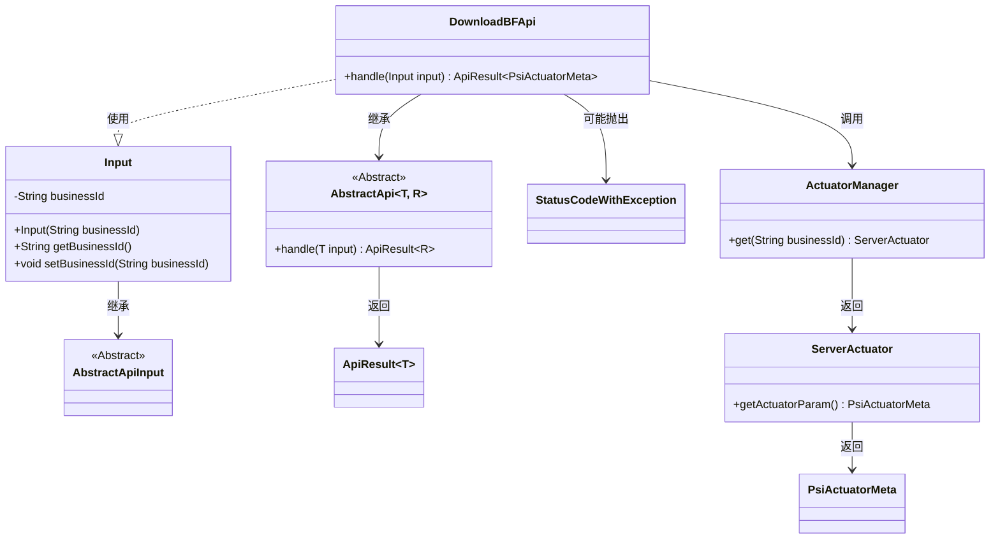

# 基础信息

|      |      |
|------|------|
| 名称 | DownloadBFApi |
| 编码语言 | .java |
| 代码路径 | WeFe/board/board-service/src/main/java/com/welab/wefe/board/service/api/project/fusion/actuator/psi/DownloadBFApi.java |
| 包名 | com.welab.wefe.board.service.api.project.fusion.actuator.psi |
| 依赖项 | ['com.welab.wefe.board.service.fusion.actuator.psi.ServerActuator', 'com.welab.wefe.board.service.fusion.manager.ActuatorManager', 'com.welab.wefe.common.StatusCode', 'com.welab.wefe.common.exception.StatusCodeWithException', 'com.welab.wefe.common.fieldvalidate.annotation.Check', 'com.welab.wefe.common.web.api.base.AbstractApi', 'com.welab.wefe.common.web.api.base.Api', 'com.welab.wefe.common.web.dto.AbstractApiInput', 'com.welab.wefe.common.web.dto.ApiResult', 'com.welab.wefe.fusion.core.dto.PsiActuatorMeta', 'java.io.IOException'] |
| 概述说明 | 该API用于下载布隆过滤器，需提供有效的businessId参数。若找不到对应执行器则报错，成功时返回执行器参数。 |

# 说明

该代码定义了一个名为DownloadBFApi的API类，用于下载布隆过滤器数据。API路径为fusion/psi/download_bloom_filter，允许带签名访问。类继承自AbstractApi，输入类型为内部类Input，输出类型为PsiActuatorMeta。主要逻辑在handle方法中，通过businessId获取对应的ServerActuator实例，若不存在则抛出异常，否则返回执行器参数。Input类包含必填字段businessId及其getter和setter方法。

# 类列表 Class Summary

| 名称   | 类型  | 说明 |
|-------|------|-------------|
| DownloadBFApi | class | 下载布隆过滤器的API，需传入业务ID，验证存在后返回执行器参数。 |

## 类 DownloadBFApi

|      |      |
|------|------|
| 访问范围 | @Api(path = "fusion/psi/download_bloom_filter",;        name = "download bloomfilter",;        desc = "download bloomfilter",;        allowAccessWithSign = true;);public |
| 类型 | class |
| 名称 | DownloadBFApi |
| 说明 | 下载布隆过滤器的API，需传入业务ID，验证存在后返回执行器参数。 |

### UML类图

类图描述：该图展示了DownloadBFApi类继承自泛型抽象类AbstractApi，并处理Input参数类。Input继承自AbstractApiInput，包含businessId字段及访问方法。DownloadBFApi通过ActuatorManager获取ServerActuator实例，可能抛出StatusCodeWithException异常，最终返回包含PsiActuatorMeta的ApiResult结果对象。各组件通过清晰的依赖关系形成完整的API处理流程。

### 内部方法调用关系图

```mermaid
graph TD
    A["类DownloadBFApi"]
    B["注解: @Api"]
    C["父类: AbstractApi<Input, PsiActuatorMeta>"]
    D["方法: handle(Input input)"]
    E["获取执行器: ActuatorManager.get(businessId)"]
    F["检查执行器存在性: actuator == null"]
    G["抛出异常: throw StatusCodeWithException"]
    H["返回成功结果: success(actuatorParam)"]
    I["嵌套类Input"]
    J["属性: String businessId"]
    K["构造方法: Input(String businessId)"]
    L["getter/setter方法"]

    A --> B
    A --> C
    A --> D
    D --> E
    D --> F
    F -->|是| G
    F -->|否| H
    A --> I
    I --> J
    I --> K
    I --> L
```

这段代码流程图展示了DownloadBFApi类的结构和主要执行流程。该类是一个带有@Api注解的API实现，继承自AbstractApi，核心方法是handle()，负责处理业务请求。流程从获取执行器开始，检查执行器是否存在，不存在则抛出异常，存在则返回执行器参数。嵌套类Input包含业务ID属性和相关方法。整个流程清晰地展现了API请求处理逻辑和异常处理路径。

### 字段列表 Field List

| 名称  | 类型  | 说明 |
|-------|-------|------|

### 方法列表

| 名称  | 类型  | 说明 |
|-------|-------|------|
| handle | ApiResult<PsiActuatorMeta> | 该方法处理输入并返回执行器参数。若执行器不存在，记录错误并抛出异常。成功时返回执行器参数。 |

