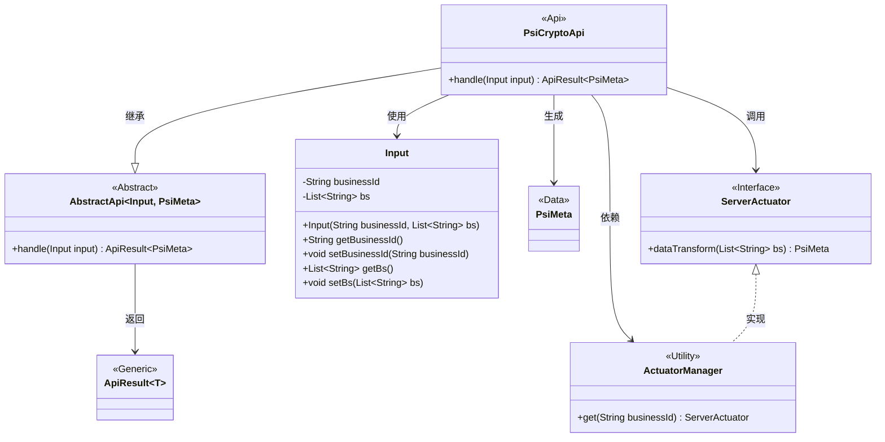

# 基础信息

|      |      |
|------|------|
| 名称 | PsiCryptoApi |
| 编码语言 | .java |
| 代码路径 | WeFe/board/board-service/src/main/java/com/welab/wefe/board/service/api/project/fusion/actuator/psi/PsiCryptoApi.java |
| 包名 | com.welab.wefe.board.service.api.project.fusion.actuator.psi |
| 依赖项 | ['java.io.IOException', 'java.util.List', 'com.welab.wefe.board.service.dto.fusion.PsiMeta', 'com.welab.wefe.board.service.fusion.actuator.psi.ServerActuator', 'com.welab.wefe.board.service.fusion.manager.ActuatorManager', 'com.welab.wefe.common.StatusCode', 'com.welab.wefe.common.exception.StatusCodeWithException', 'com.welab.wefe.common.fieldvalidate.annotation.Check', 'com.welab.wefe.common.web.api.base.AbstractApi', 'com.welab.wefe.common.web.api.base.Api', 'com.welab.wefe.common.web.dto.AbstractApiInput', 'com.welab.wefe.common.web.dto.ApiResult'] |
| 概述说明 | PsiCryptoApi类处理加密数据，通过businessId获取执行器并转换数据，输入包含businessId和bs列表，验证后返回PsiMeta结果。 |

# 说明

这是一个名为PsiCryptoApi的API类，继承自AbstractApi，处理PSI加密相关请求。API路径为fusion/psi/crypto，允许签名访问。类中包含一个内部类Input作为输入参数，包含必填字段businessId和可选字段bs（字符串列表）。主要逻辑在handle方法中，通过businessId获取ServerActuator实例，若不存在则报错，存在则调用dataTransform方法处理bs数据并返回PsiMeta结果。输入参数有校验注解，确保businessId必填。

# 类列表 Class Summary

| 名称   | 类型  | 说明 |
|-------|------|-------------|
| PsiCryptoApi | class | PsiCryptoApi类处理加密数据转换，需输入businessId和bs列表，验证后通过执行器转换数据返回结果。 |

## 类 PsiCryptoApi

|      |      |
|------|------|
| 访问范围 | @Api(;        path = "fusion/psi/crypto",;        name = "psi crypto",;        desc = "psi crypto",;        allowAccessWithSign = true;);public |
| 类型 | class |
| 名称 | PsiCryptoApi |
| 说明 | PsiCryptoApi类处理加密数据转换，需输入businessId和bs列表，验证后通过执行器转换数据返回结果。 |

### UML类图

这段代码展示了一个PSI加密API的实现结构。PsiCryptoApi继承自泛型抽象类AbstractApi，处理Input输入并返回包含PsiMeta的ApiResult。核心流程通过ActuatorManager获取ServerActuator实例，调用其dataTransform方法完成数据转换。Input类封装了业务ID和待处理字符串列表，包含参数校验注解。整体设计体现了依赖注入和模板方法模式，通过抽象层隔离具体实现，支持可扩展的加密处理逻辑。

### 内部方法调用关系图

```mermaid
graph TD
    A["类PsiCryptoApi"]
    B["父类: AbstractApi<Input, PsiMeta>"]
    C["注解: @Api"]
    D["方法: handle(Input input)"]
    E["内部类: Input"]
    F["属性: String businessId"]
    G["属性: List<String> bs"]
    H["构造方法: Input(String businessId, List<String> bs)"]
    I["getter/setter方法"]
    J["ServerActuator actuator = ActuatorManager.get()"]
    K["检查actuator是否为null"]
    L["抛出异常: StatusCodeWithException"]
    M["返回结果: success(PsiMeta.of())"]

    A --> B
    A --> C
    A --> D
    A --> E
    E --> F
    E --> G
    E --> H
    E --> I
    D --> J
    J --> K
    K --"是"--> L
    K --"否"--> M
```

这段代码展示了一个名为PsiCryptoApi的API类，继承自AbstractApi，主要用于处理加密相关的PSI（Private Set Intersection）操作。类中包含一个handle方法用于业务逻辑处理，以及一个静态内部类Input用于封装输入参数。流程图清晰地展示了类结构关系和方法调用流程，包括参数验证、执行器获取、异常处理和结果返回等关键步骤，体现了完整的API请求处理生命周期。

### 字段列表 Field List

| 名称  | 类型  | 说明 |
|-------|-------|------|

### 方法列表

| 名称  | 类型  | 说明 |
|-------|-------|------|
| handle | ApiResult<PsiMeta> | 处理输入并返回PSI元数据。若执行器未找到则报错，否则转换数据后返回成功结果。 |

