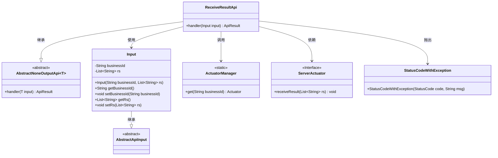
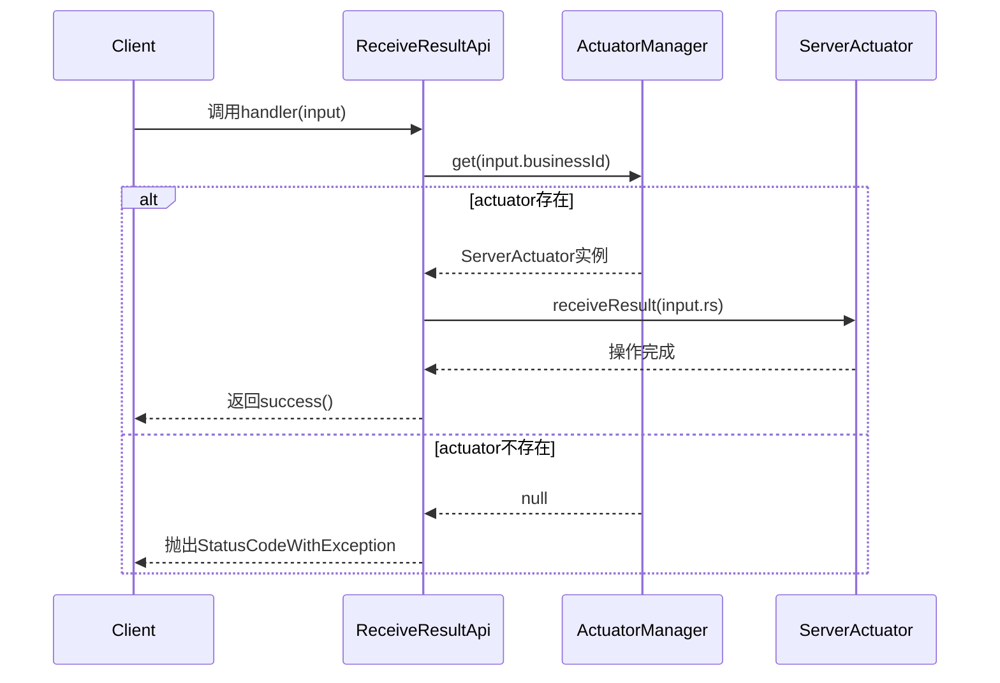

# 基础信息

|      |      |
|------|------|
| 名称 | ReceiveResultApi |
| 编码语言 | .java |
| 代码路径 | WeFe/board/board-service/src/main/java/com/welab/wefe/board/service/api/project/fusion/actuator/psi/ReceiveResultApi.java |
| 包名 | com.welab.wefe.board.service.api.project.fusion.actuator.psi |
| 依赖项 | ['com.welab.wefe.board.service.fusion.actuator.psi.ServerActuator', 'com.welab.wefe.board.service.fusion.manager.ActuatorManager', 'com.welab.wefe.common.StatusCode', 'com.welab.wefe.common.exception.StatusCodeWithException', 'com.welab.wefe.common.fieldvalidate.annotation.Check', 'com.welab.wefe.common.web.api.base.AbstractNoneOutputApi', 'com.welab.wefe.common.web.api.base.Api', 'com.welab.wefe.common.web.dto.AbstractApiInput', 'com.welab.wefe.common.web.dto.ApiResult', 'java.util.List'] |
| 概述说明 | 接收处理结果的API类，路径为fusion/receive/result，需签名访问。输入包含businessId和rs列表，验证businessId存在后处理结果。 |

# 说明

这是一个名为ReceiveResultApi的API类，用于接收处理结果。API路径为fusion/receive/result，允许带签名访问。该类继承自AbstractNoneOutputApi，使用Input作为输入参数。主要功能是通过businessId获取对应的ServerActuator实例，并将结果列表rs传递给该实例。若找不到对应实例，会抛出DATA_NOT_FOUND异常。Input类包含两个必填字段：businessId和结果列表rs，其中businessId会进行非空校验。处理成功后返回空结果。

# 类列表 Class Summary

| 名称   | 类型  | 说明 |
|-------|------|-------------|
| ReceiveResultApi | class | 接收处理结果的API，路径为fusion/receive/result，需签名访问。通过businessId获取执行器并处理结果rs，失败时抛出异常。输入包含必填businessId和结果列表rs。 |

## 类 ReceiveResultApi

|      |      |
|------|------|
| 访问范围 | @Api(;        path = "fusion/receive/result",;        name = "receive result",;        desc = "receive result",;        allowAccessWithSign = true;);public |
| 类型 | class |
| 名称 | ReceiveResultApi |
| 说明 | 接收处理结果的API，路径为fusion/receive/result，需签名访问。通过businessId获取执行器并处理结果rs，失败时抛出异常。输入包含必填businessId和结果列表rs。 |

### UML类图

类图描述：该图展示了ReceiveResultApi继承自泛型类AbstractNoneOutputApi，并包含嵌套类Input。ReceiveResultApi通过ActuatorManager获取ServerActuator实例，调用其receiveResult方法处理结果。Input类继承AbstractApiInput，包含业务ID和结果列表字段。异常处理通过StatusCodeWithException实现，整体结构体现了API请求处理与执行器交互的流程。

### 内部方法调用关系图

```mermaid
graph TD
    A["类ReceiveResultApi"]
    B["注解: @Api"]
    C["父类: AbstractNoneOutputApi<Input>"]
    D["方法: handler(Input input)"]
    E["内部类: Input"]
    F["属性: String businessId"]
    G["属性: List<String> rs"]
    H["构造方法: Input(String, List<String>)"]
    I["getter/setter方法"]
    J["校验注解: @Check"]

    A --> B
    A --> C
    A --> D
    A --> E
    E --> F
    E --> G
    E --> H
    E --> I
    F --> J
    G --> J

    style D stroke:#f66,stroke-width:2px
    style H stroke:#090,stroke-width:2px
```

流程图描述了ReceiveResultApi类的结构组成，包含API注解、继承关系、核心handler方法及嵌套Input类的字段定义。时序图展示了handler方法的完整调用链：客户端请求触发执行器查找，根据是否存在执行器分别处理成功或异常路径，突出数据校验和异常处理的关键流程。

### 字段列表 Field List

| 名称  | 类型  | 说明 |
|-------|-------|------|

### 方法列表

| 名称  | 类型  | 说明 |
|-------|-------|------|
| handler | ApiResult | 方法重写handler，通过businessId获取ServerActuator，若不存在则记录错误并抛出异常，否则调用receiveResult处理输入结果后返回成功。 |

