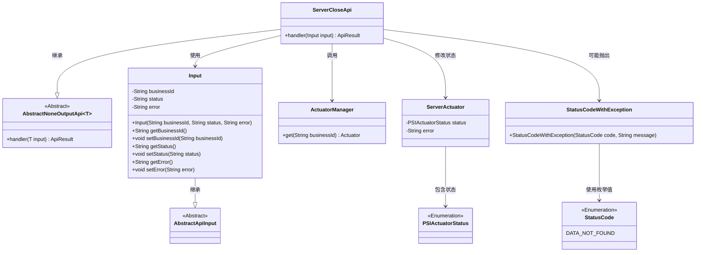
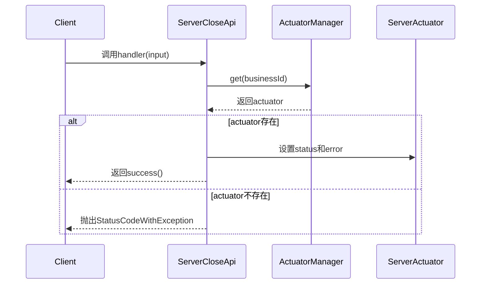

# 基础信息

|      |      |
|------|------|
| 名称 | ServerCloseApi |
| 编码语言 | .java |
| 代码路径 | WeFe/board/board-service/src/main/java/com/welab/wefe/board/service/api/project/fusion/actuator/psi/ServerCloseApi.java |
| 包名 | com.welab.wefe.board.service.api.project.fusion.actuator.psi |
| 依赖项 | ['com.welab.wefe.board.service.fusion.actuator.psi.ServerActuator', 'com.welab.wefe.board.service.fusion.manager.ActuatorManager', 'com.welab.wefe.common.StatusCode', 'com.welab.wefe.common.exception.StatusCodeWithException', 'com.welab.wefe.common.fieldvalidate.annotation.Check', 'com.welab.wefe.common.web.api.base.AbstractNoneOutputApi', 'com.welab.wefe.common.web.api.base.Api', 'com.welab.wefe.common.web.dto.AbstractApiInput', 'com.welab.wefe.common.web.dto.ApiResult', 'com.welab.wefe.fusion.core.enums.PSIActuatorStatus'] |
| 概述说明 | ServerCloseApi类用于关闭服务器，接收businessId、状态和错误信息，验证后更新执行器状态。若执行器不存在则报错。 |

# 说明

该代码定义了一个名为ServerCloseApi的API类，用于处理服务器关闭请求。API路径为"fusion/server/close"，允许带签名访问。该类继承自AbstractNoneOutputApi，接收Input类型的输入参数。Input类包含三个必填字段：businessId、status和可选的error。处理逻辑是通过businessId获取对应的ServerActuator实例，若不存在则抛出异常；存在则更新其状态和错误信息。状态更新使用PSIActuatorStatus枚举值。处理成功返回成功结果。

# 类列表 Class Summary

| 名称   | 类型  | 说明 |
|-------|------|-------------|
| ServerCloseApi | class | ServerCloseApi用于关闭服务器，接收businessId、状态和错误信息，验证后更新执行器状态。若执行器不存在则报错。 |

## 类 ServerCloseApi

|      |      |
|------|------|
| 访问范围 | @Api(;        path = "fusion/server/close",;        name = "server close",;        desc = "server close",;        allowAccessWithSign = true;);public |
| 类型 | class |
| 名称 | ServerCloseApi |
| 说明 | ServerCloseApi用于关闭服务器，接收businessId、状态和错误信息，验证后更新执行器状态。若执行器不存在则报错。 |

### UML类图

这段代码展示了一个服务器关闭API的实现架构。ServerCloseApi继承自AbstractNoneOutputApi，处理包含业务ID、状态和错误信息的输入参数。核心逻辑是通过ActuatorManager获取对应的ServerActuator实例，更新其状态和错误信息。当执行器不存在时会抛出StatusCodeWithException异常。类图清晰地展示了各组件间的继承、依赖和关联关系，包括输入参数处理、执行器状态管理和异常处理机制。

### 内部方法调用关系图

```mermaid
graph TD
    A["类ServerCloseApi"]
    B["注解: @Api"]
    C["父类: AbstractNoneOutputApi<Input>"]
    D["方法: handler(Input input)"]
    E["获取执行器: ActuatorManager.get"]
    F["判断执行器存在"]
    G["设置执行器状态和错误信息"]
    H["返回成功结果"]
    I["抛出异常: StatusCodeWithException"]
    J["内部类Input"]
    K["属性: String businessId"]
    L["属性: String status"]
    M["属性: String error"]
    N["构造方法: Input(String, String, String)"]
    O["Getter/Setter方法"]

    A --> B
    A --> C
    A --> D
    D --> E
    D --> F
    F -- 是 --> G
    F -- 否 --> I
    G --> H
    A --> J
    J --> K
    J --> L
    J --> M
    J --> N
    J --> O
```

这段代码实现了一个服务器关闭API，主要功能是处理服务器关闭请求。流程图展示了类结构和主要方法调用关系，时序图描述了API调用的完整流程。当接收到请求时，首先通过businessId获取执行器实例，如果存在则更新状态和错误信息，否则抛出异常。内部类Input定义了请求参数的结构和校验规则。

### 字段列表 Field List

| 名称  | 类型  | 说明 |
|-------|-------|------|

### 方法列表

| 名称  | 类型  | 说明 |
|-------|-------|------|
| handler | ApiResult | 处理服务器关闭请求，检查执行器是否存在，更新状态和错误信息，返回成功结果。 |

