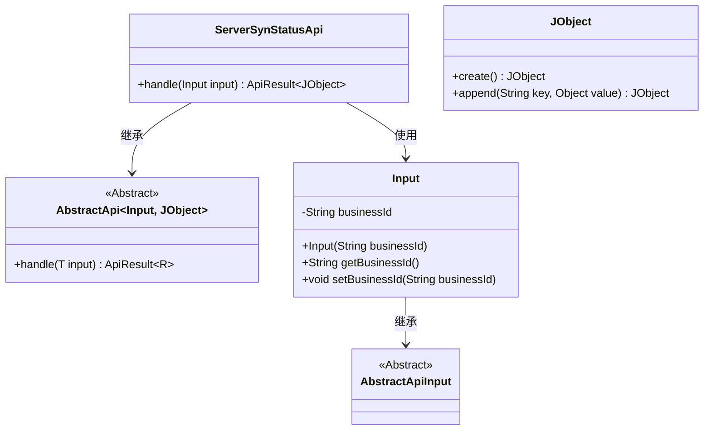

# 基础信息

|      |      |
|------|------|
| 名称 | ServerSynStatusApi |
| 编码语言 | .java |
| 代码路径 | WeFe/board/board-service/src/main/java/com/welab/wefe/board/service/api/project/fusion/actuator/psi/ServerSynStatusApi.java |
| 包名 | com.welab.wefe.board.service.api.project.fusion.actuator.psi |
| 依赖项 | ['com.welab.wefe.board.service.fusion.manager.ActuatorManager', 'com.welab.wefe.common.fieldvalidate.annotation.Check', 'com.welab.wefe.common.util.JObject', 'com.welab.wefe.common.web.api.base.AbstractApi', 'com.welab.wefe.common.web.api.base.Api', 'com.welab.wefe.common.web.dto.AbstractApiInput', 'com.welab.wefe.common.web.dto.ApiResult'] |
| 概述说明 | 查询服务器状态的API，路径为fusion/psi/server_is_ready，需传入businessId参数，返回服务器是否就绪的状态。 |

# 说明

该内容描述了一个名为ServerSynStatusApi的API类，用于查询服务器状态。API路径为fusion/psi/server_is_ready，允许带签名访问。输入参数Input包含必填字段businessId。处理逻辑通过ActuatorManager检查指定businessId的服务器是否就绪，返回包含ready状态的JSON对象。该API继承自AbstractApi，泛型指定输入类型为Input，输出类型为JObject。

# 类列表 Class Summary

| 名称   | 类型  | 说明 |
|-------|------|-------------|
| ServerSynStatusApi | class | 查询服务器状态的API，需传入businessId，返回是否就绪的布尔值。允许签名访问。 |

## 类 ServerSynStatusApi

|      |      |
|------|------|
| 访问范围 | @Api(path = "fusion/psi/server_is_ready",;        name = "query server status",;        desc = "query server status",;        allowAccessWithSign = true;);public |
| 类型 | class |
| 名称 | ServerSynStatusApi |
| 说明 | 查询服务器状态的API，需传入businessId，返回是否就绪的布尔值。允许签名访问。 |

### UML类图

这段代码描述了一个查询服务器状态的API类`ServerSynStatusApi`，它继承自泛型抽象类`AbstractApi`，处理输入类型为`Input`、返回类型为`JObject`的请求。`Input`类继承自`AbstractApiInput`，包含一个必需的`businessId`字段及其访问方法。`JObject`是用于构建JSON响应的工具类。整个结构展示了API请求处理流程中的核心类关系，通过继承和组合实现业务逻辑。

### 内部方法调用关系图

```mermaid
graph TD
    A["类ServerSynStatusApi"]
    B["继承: AbstractApi<Input, JObject>"]
    C["注解: @Api"]
    D["方法: handle(Input input)"]
    E["调用: ActuatorManager.isReady"]
    F["返回: success(JObject)"]
    G["内部类Input"]
    H["继承: AbstractApiInput"]
    I["属性: String businessId"]
    J["构造方法: Input(String businessId)"]
    K["方法: getBusinessId()"]
    L["方法: setBusinessId(String)"]
    M["注解: @Check"]

    A --> B
    A --> C
    A --> D
    D --> E
    D --> F
    A --> G
    G --> H
    G --> I
    G --> J
    G --> K
    G --> L
    I --> M
```

流程图描述：该流程图展示了ServerSynStatusApi类的结构，它继承自AbstractApi并带有@Api注解。核心方法是handle()，其中调用ActuatorManager.isReady()检查业务ID状态，并返回包含准备状态的JObject结果。内部类Input继承AbstractApiInput，包含businessId属性和相关方法，且该属性带有@Check验证注解。整体呈现了API请求处理的状态查询逻辑。

### 字段列表 Field List

| 名称  | 类型  | 说明 |
|-------|-------|------|

### 方法列表

| 名称  | 类型  | 说明 |
|-------|-------|------|
| handle | ApiResult<JObject> | 该方法检查指定业务ID是否准备就绪，返回包含准备状态的JSON结果。 |

