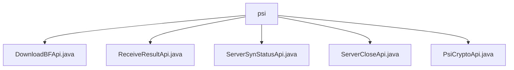

# 基础信息

|      |      |
|------|------|
| 名称 | psi |
| 编码语言 | .java |
| 代码路径 | WeFe/board/board-service/src/main/java/com/welab/wefe/board/service/api/project/fusion/actuator/psi |
| 包名 | docs.board.board-service.src.main.java.com.welab.wefe.board.service.api.project.fusion.actuator.psi |
| 概述说明 | DownloadBFApi类处理布隆过滤器下载，路径fusion/psi/download_bloom_filter。ReceiveResultApi类接收结果，路径fusion/receive/result。ServerSynStatusApi类查询服务器状态，路径fusion/psi/server_is_ready。ServerCloseApi类处理服务器关闭，路径fusion/server/close。PsiCryptoApi类处理PSI加密，路径fusion/psi/crypto。均需签名访问，使用businessId标识业务。 |

# 说明

## 概述  
该模块提供PSI（隐私集合求交）协议执行过程中的核心API，类似分布式任务协调器，统一管理布隆过滤器下载、状态同步、结果接收等流程。所有API均继承自AbstractApi基类，支持签名访问，通过businessId关联ServerActuator实例实现状态跟踪。关键数据结构包括PsiActuatorMeta（执行元数据）、JObject（状态响应）和PSIActuatorStatus（枚举）。依赖项为统一的ActuatorManager执行器管理组件。例如DownloadBFApi返回布隆过滤器参数，PsiCryptoApi处理加密数据转换。

## 主要业务场景  
模块支持端到端PSI协议执行，类似多阶段事务处理：先通过ServerSynStatusApi轮询服务状态，再经PsiCryptoApi完成数据加密，最终由ReceiveResultApi聚合结果。典型交互模式为客户端携带businessId发起链式调用，服务端通过ActuatorManager维持会话状态。API分为三类：数据操作型（如DownloadBFApi）、状态控制型（如ServerCloseApi）和结果处理型（如ReceiveResultApi）。例如关闭请求会更新PSIActuatorStatus，而结果接收API将数据透传给执行器实例。

### 包内部结构视图

该流程图展示了在`psi`目录下的5个Java接口文件。所有文件都直接隶属于`psi`节点，没有更深层级的子目录结构。这些接口文件包括下载、接收结果、服务器状态同步、服务器关闭和PSI加密等功能相关的API实现类。

# 文件列表

| 名称   | 类型  | 说明 |
|-------|------|-------------|
| [DownloadBFApi.java](DownloadBFApi.md) | file | 该API用于下载布隆过滤器，需提供有效的businessId参数。若找不到对应执行器则报错，成功时返回执行器参数。 |
| [ReceiveResultApi.java](ReceiveResultApi.md) | file | 接收处理结果的API类，路径为fusion/receive/result，需签名访问。输入包含businessId和rs列表，验证businessId存在后处理结果。 |
| [ServerSynStatusApi.java](ServerSynStatusApi.md) | file | 查询服务器状态的API，路径为fusion/psi/server_is_ready，需传入businessId参数，返回服务器是否就绪的状态。 |
| [ServerCloseApi.java](ServerCloseApi.md) | file | ServerCloseApi类用于关闭服务器，接收businessId、状态和错误信息，验证后更新执行器状态。若执行器不存在则报错。 |
| [PsiCryptoApi.java](PsiCryptoApi.md) | file | PsiCryptoApi类处理加密数据，通过businessId获取执行器并转换数据，输入包含businessId和bs列表，验证后返回PsiMeta结果。 |

