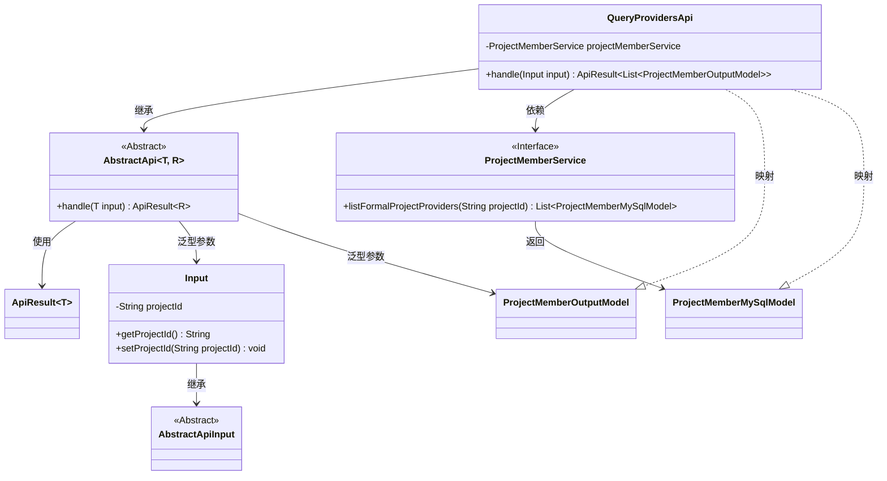

# 基础信息

|      |      |
|------|------|
| 名称 | QueryProvidersApi |
| 编码语言 | .java |
| 代码路径 | WeFe/board/board-service/src/main/java/com/welab/wefe/board/service/api/project/fusion/member/QueryProvidersApi.java |
| 包名 | com.welab.wefe.board.service.api.project.fusion.member |
| 依赖项 | ['com.welab.wefe.board.service.database.entity.job.ProjectMemberMySqlModel', 'com.welab.wefe.board.service.dto.entity.project.ProjectMemberOutputModel', 'com.welab.wefe.board.service.service.ProjectMemberService', 'com.welab.wefe.common.exception.StatusCodeWithException', 'com.welab.wefe.common.fieldvalidate.annotation.Check', 'com.welab.wefe.common.web.api.base.AbstractApi', 'com.welab.wefe.common.web.api.base.Api', 'com.welab.wefe.common.web.dto.AbstractApiInput', 'com.welab.wefe.common.web.dto.ApiResult', 'com.welab.wefe.common.web.util.ModelMapper', 'org.springframework.beans.factory.annotation.Autowired', 'java.io.IOException', 'java.util.List'] |
| 概述说明 | 查询项目成员列表的API接口，通过项目ID获取正式项目成员信息并返回输出模型列表。 |

# 说明

该代码定义了一个名为QueryProvidersApi的API类，用于查询项目提供者列表。API路径为fusion/query/providers，功能描述为查询提供者列表。该类继承自AbstractApi，输入类型为内部类Input，输出类型为ProjectMemberOutputModel的列表。通过ProjectMemberService获取正式项目提供者数据，并将结果映射为输出模型。Input类包含必填字段project_id及其getter和setter方法。处理逻辑封装在handle方法中，返回ApiResult格式的结果。

# 类列表 Class Summary

| 名称   | 类型  | 说明 |
|-------|------|-------------|
| QueryProvidersApi | class | 查询项目成员列表的API接口，通过项目ID获取正式项目成员信息，返回成员列表。 |

## 类 QueryProvidersApi

|      |      |
|------|------|
| 访问范围 | @Api(path = "fusion/query/providers",;        name = "query provider list",;        desc = "query provider list";);public |
| 类型 | class |
| 名称 | QueryProvidersApi |
| 说明 | 查询项目成员列表的API接口，通过项目ID获取正式项目成员信息，返回成员列表。 |

### UML类图

这段代码展示了一个查询提供者列表的API实现。QueryProvidersApi继承自AbstractApi，处理输入参数Input并返回ProjectMemberOutputModel列表。它依赖ProjectMemberService来获取项目成员数据，使用ModelMapper进行模型转换。Input类继承AbstractApiInput并包含项目ID字段。整个结构体现了清晰的层次关系和依赖，通过泛型实现了灵活的API处理框架。

### 内部方法调用关系图

```mermaid
graph TD
    A["类QueryProvidersApi"]
    B["注解: @Api"]
    C["继承: AbstractApi<Input, List<ProjectMemberOutputModel>>"]
    D["依赖注入: @Autowired ProjectMemberService"]
    E["重写方法: handle(Input input)"]
    F["内部类: Input"]
    G["属性: @Check String projectId"]
    H["方法: getProjectId()"]
    I["方法: setProjectId(String)"]
    J["调用: projectMemberService.listFormalProjectProviders"]
    K["返回: success(ModelMapper.maps(...))"]

    A --> B
    A --> C
    A --> D
    A --> E
    A --> F
    F --> G
    F --> H
    F --> I
    E --> J
    E --> K
```

这段代码展示了一个基于Spring框架的API类QueryProvidersApi，主要用于查询项目成员提供者列表。流程图清晰地呈现了类结构：通过@Api注解定义API元信息，继承AbstractApi基类并指定输入输出类型，使用@Autowired注入ProjectMemberService服务。核心处理逻辑在handle方法中，调用服务层获取数据后通过ModelMapper转换返回。内部类Input定义了带校验注解的请求参数projectId及其getter/setter方法。整个流程展现了从请求处理到数据返回的完整调用链。

### 字段列表 Field List

| 名称  | 类型  | 说明 |
|-------|-------|------|
| projectMemberService | ProjectMemberService | 自动注入项目成员服务实例。 |

### 方法列表

| 名称  | 类型  | 说明 |
|-------|-------|------|
| handle | ApiResult<List<ProjectMemberOutputModel>> | 该方法处理项目成员查询请求，通过输入的项目ID获取正式成员列表，并转换为输出模型返回成功结果。 |

