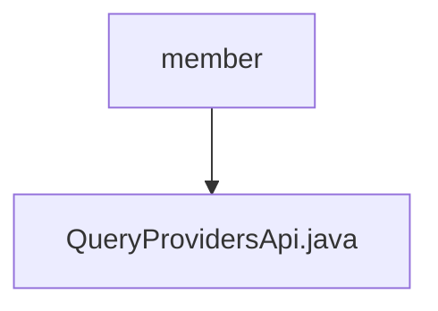

# 基础信息

|      |      |
|------|------|
| 名称 | member |
| 编码语言 | .java |
| 代码路径 | WeFe/board/board-service/src/main/java/com/welab/wefe/board/service/api/project/fusion/member |
| 包名 | docs.board.board-service.src.main.java.com.welab.wefe.board.service.api.project.fusion.member |
| 概述说明 | 查询项目成员列表的API接口，通过项目ID获取正式项目成员信息并返回输出模型列表。 |

# 说明

该代码定义了一个名为QueryProvidersApi的API类，用于查询项目提供者列表。API路径为fusion/query/providers，功能描述为查询提供者列表。该类继承自AbstractApi，输入类型为内部类Input，输出类型为ProjectMemberOutputModel的列表。通过ProjectMemberService获取正式项目提供者数据，并将结果映射为输出模型。Input类包含必填字段project_id及其getter和setter方法。处理逻辑封装在handle方法中，返回ApiResult格式的结果。

### 包内部结构视图

该流程图展示了项目路径中的层级关系，根节点为"member"文件夹，其下包含一个Java文件"QueryProvidersApi.java"。这是一个简单的单层结构，表示在member目录中只包含一个具体的API实现文件。

# 文件列表

| 名称   | 类型  | 说明 |
|-------|------|-------------|
| [QueryProvidersApi.java](QueryProvidersApi.md) | file | 查询项目成员列表的API接口，通过项目ID获取正式项目成员信息并返回输出模型列表。 |

