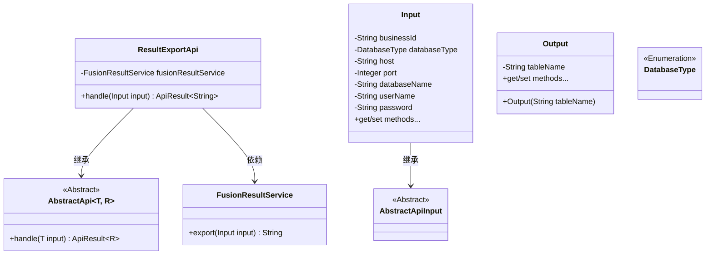

# 基础信息

|      |      |
|------|------|
| 名称 | ResultExportApi |
| 编码语言 | .java |
| 代码路径 | WeFe/board/board-service/src/main/java/com/welab/wefe/board/service/api/project/fusion/result/ResultExportApi.java |
| 包名 | com.welab.wefe.board.service.api.project.fusion.result |
| 依赖项 | ['com.welab.wefe.board.service.service.fusion.FusionResultService', 'com.welab.wefe.common.fieldvalidate.annotation.Check', 'com.welab.wefe.common.jdbc.base.DatabaseType', 'com.welab.wefe.common.web.api.base.AbstractApi', 'com.welab.wefe.common.web.api.base.Api', 'com.welab.wefe.common.web.dto.AbstractApiInput', 'com.welab.wefe.common.web.dto.ApiResult', 'org.springframework.beans.factory.annotation.Autowired'] |
| 概述说明 | 结果导出API类，继承AbstractApi，处理输入参数如businessId、数据库类型、主机、端口等，调用FusionResultService导出结果。输出包含表名。 |

# 说明

该代码定义了一个名为ResultExportApi的API类，用于处理结果导出功能。API路径为fusion/result/export，依赖FusionResultService实现导出逻辑。输入参数Input包含必填字段businessId、databaseType、host、port、databaseName，以及可选字段userName和password，所有字段均通过校验注解确保非空。输出为字符串类型，实际处理由handle方法调用fusionResultService.export完成。Output类仅包含一个tableName字段。整体结构遵循抽象API模板，实现了标准化的输入输出处理流程。

# 类列表 Class Summary

| 名称   | 类型  | 说明 |
|-------|------|-------------|
| ResultExportApi | class | 结果导出API类，处理数据库导出请求，需提供businessId、数据库类型、主机、端口、数据库名等必填参数，返回表名结果。 |

## 类 ResultExportApi

|      |      |
|------|------|
| 访问范围 | @Api(path = "fusion/result/export", name = "结果导出", desc = "结果导出");public |
| 类型 | class |
| 名称 | ResultExportApi |
| 说明 | 结果导出API类，处理数据库导出请求，需提供businessId、数据库类型、主机、端口、数据库名等必填参数，返回表名结果。 |

### UML类图

这段代码展示了一个结果导出API的实现结构。ResultExportApi继承自泛型抽象类AbstractApi，处理Input参数并返回字符串结果。Input类包含数据库连接相关字段和校验注解，Output类简单封装表名。FusionResultService提供核心导出功能，DatabaseType是枚举类型。整体设计体现了分层和依赖注入思想。

### 内部方法调用关系图

```mermaid
graph TD
    A["类ResultExportApi"]
    B["注解: @Api"]
    C["继承: AbstractApi<Input, String>"]
    D["依赖注入: @Autowired FusionResultService"]
    E["重写方法: handle(Input input)"]
    F["内部类Input"]
    G["属性: String businessId"]
    H["属性: DatabaseType databaseType"]
    I["属性: String host"]
    J["属性: Integer port"]
    K["属性: String databaseName"]
    L["属性: String userName"]
    M["属性: String password"]
    N["getter/setter方法"]
    O["内部类Output"]
    P["属性: String tableName"]
    Q["构造方法: Output(String tableName)"]
    R["getter/setter方法"]

    A --> B
    A --> C
    A --> D
    A --> E
    A --> F
    F --> G
    F --> H
    F --> I
    F --> J
    F --> K
    F --> L
    F --> M
    F --> N
    A --> O
    O --> P
    O --> Q
    O --> R
    E --> D
    E --> F
```

这段代码描述了一个结果导出API类ResultExportApi，继承自AbstractApi并实现了handle方法。该类包含两个内部类：Input用于封装输入参数（包含数据库连接信息和业务ID等字段）和Output用于封装输出结果（表名）。流程图展示了类结构、属性、方法调用关系和内部类组成，重点突出了输入参数校验和结果导出的处理流程。

### 字段列表 Field List

| 名称  | 类型  | 说明 |
|-------|-------|------|
| fusionResultService | FusionResultService | 自动注入FusionResultService服务实例。 |

### 方法列表

| 名称  | 类型  | 说明 |
|-------|-------|------|
| handle | ApiResult<String> | 处理输入并调用导出服务返回结果。 |

