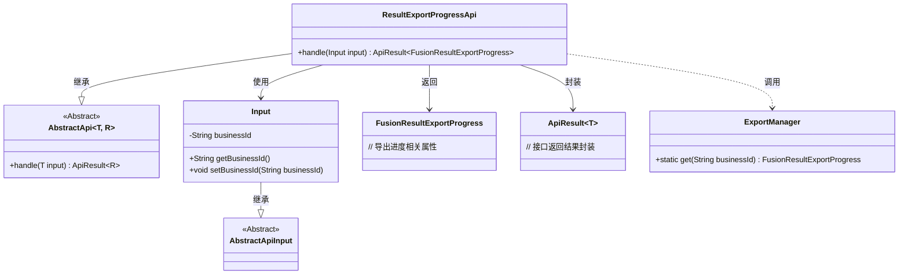

# 基础信息

|      |      |
|------|------|
| 名称 | ResultExportProgressApi |
| 编码语言 | .java |
| 代码路径 | WeFe/board/board-service/src/main/java/com/welab/wefe/board/service/api/project/fusion/result/ResultExportProgressApi.java |
| 包名 | com.welab.wefe.board.service.api.project.fusion.result |
| 依赖项 | ['com.welab.wefe.board.service.dto.fusion.FusionResultExportProgress', 'com.welab.wefe.board.service.fusion.manager.ExportManager', 'com.welab.wefe.common.fieldvalidate.annotation.Check', 'com.welab.wefe.common.web.api.base.AbstractApi', 'com.welab.wefe.common.web.api.base.Api', 'com.welab.wefe.common.web.dto.AbstractApiInput', 'com.welab.wefe.common.web.dto.ApiResult'] |
| 概述说明 | Java类ResultExportProgressApi用于处理结果导出进度查询，接收businessId参数并返回导出进度信息。 |

# 说明

该代码定义了一个名为ResultExportProgressApi的API类，用于处理结果导出进度查询。API路径为fusion/result/export_progress，名称为"结果导出"。该类继承自AbstractApi，接受Input类型的输入参数，返回FusionResultExportProgress类型的结果。Input类包含一个必填字段businessId，用于指定操作的业务ID。处理逻辑通过调用ExportManager.get方法，根据输入的businessId获取导出进度信息并返回成功结果。

# 类列表 Class Summary

| 名称   | 类型  | 说明 |
|-------|------|-------------|
| ResultExportProgressApi | class | Java类ResultExportProgressApi用于处理结果导出进度查询，接收businessId参数并返回导出进度信息。 |

## 类 ResultExportProgressApi

|      |      |
|------|------|
| 访问范围 | @Api(path = "fusion/result/export_progress", name = "结果导出", desc = "结果导出");public |
| 类型 | class |
| 名称 | ResultExportProgressApi |
| 说明 | Java类ResultExportProgressApi用于处理结果导出进度查询，接收businessId参数并返回导出进度信息。 |

### UML类图

类图描述：该图展示了结果导出API的类结构，核心类ResultExportProgressApi继承自泛型抽象类AbstractApi，处理Input参数并返回FusionResultExportProgress类型结果。Input类继承AbstractApiInput，包含业务ID字段。ExportManager提供静态方法获取导出进度。整体采用分层设计，通过ApiResult封装响应数据，符合接口隔离和依赖倒置原则。

### 内部方法调用关系图

```mermaid
graph TD
    A["类ResultExportProgressApi"]
    B["父类: AbstractApi<Input, FusionResultExportProgress>"]
    C["注解: @Api(path='fusion/result/export_progress', name='结果导出', desc='结果导出')"]
    D["方法: handle(Input input)"]
    E["调用: ExportManager.get(input.getBusinessId())"]
    F["返回: ApiResult<FusionResultExportProgress>"]
    G["嵌套类Input"]
    H["父类: AbstractApiInput"]
    I["属性: String businessId"]
    J["方法: getBusinessId()"]
    K["方法: setBusinessId(String businessId)"]
    L["注解: @Check(name='指定操作的businessId', require=true)"]

    A --> B
    A --> C
    A --> D
    D --> E
    E --> F
    A --> G
    G --> H
    G --> I
    G --> J
    G --> K
    I --> L
```

这段代码描述了一个名为ResultExportProgressApi的API类，继承自AbstractApi，用于处理结果导出进度查询。核心功能是通过handle方法调用ExportManager获取指定businessId的导出进度。嵌套类Input定义了必需的businessId参数及其getter/setter方法，带有参数校验注解。流程图清晰展示了类继承关系、方法调用链和参数校验逻辑。

### 字段列表 Field List

| 名称  | 类型  | 说明 |
|-------|-------|------|

### 方法列表

| 名称  | 类型  | 说明 |
|-------|-------|------|
| handle | ApiResult<FusionResultExportProgress> | Java方法重写，调用ExportManager获取业务ID对应的导出进度并返回成功结果。 |

