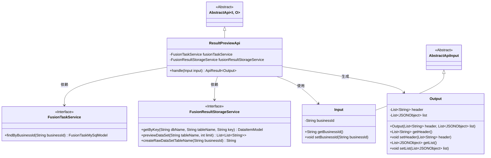
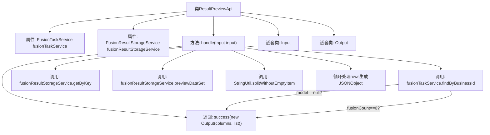
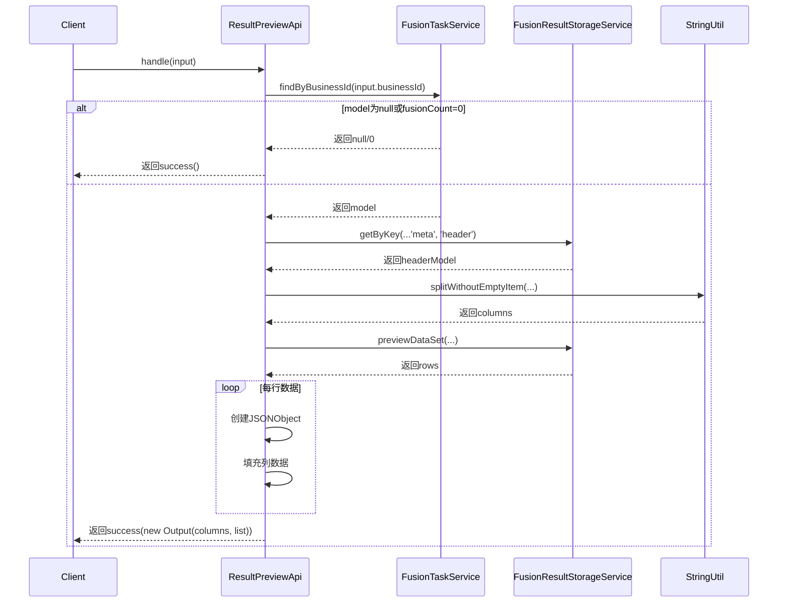

# 基础信息

|      |      |
|------|------|
| 名称 | ResultPreviewApi |
| 编码语言 | .java |
| 代码路径 | WeFe/board/board-service/src/main/java/com/welab/wefe/board/service/api/project/fusion/result/ResultPreviewApi.java |
| 包名 | com.welab.wefe.board.service.api.project.fusion.result |
| 依赖项 | ['com.alibaba.fastjson.JSONObject', 'com.welab.wefe.board.service.database.entity.fusion.FusionTaskMySqlModel', 'com.welab.wefe.board.service.service.fusion.FusionResultStorageService', 'com.welab.wefe.board.service.service.fusion.FusionTaskService', 'com.welab.wefe.common.data.storage.common.Constant', 'com.welab.wefe.common.data.storage.model.DataItemModel', 'com.welab.wefe.common.fieldvalidate.annotation.Check', 'com.welab.wefe.common.util.StringUtil', 'com.welab.wefe.common.web.api.base.AbstractApi', 'com.welab.wefe.common.web.api.base.Api', 'com.welab.wefe.common.web.dto.AbstractApiInput', 'com.welab.wefe.common.web.dto.ApiResult', 'org.springframework.beans.factory.annotation.Autowired', 'java.util.ArrayList', 'java.util.List'] |
| 概述说明 | 结果预览API类，处理业务ID输入，查询任务模型和数据表头，返回前10行数据预览，包含列名和行数据列表。 |

# 说明

该代码定义了一个名为ResultPreviewApi的API类，用于处理结果预览请求。API路径为fusion/result/preview，名称为结果预览。类继承自AbstractApi，使用Input和Output作为输入输出类型。主要逻辑在handle方法中实现：首先通过businessId查询FusionTaskMySqlModel，若不存在或fusionCount为0则返回空结果。否则从存储服务获取数据表头信息及前10行数据，将数据按列名组装成JSON对象列表返回。Input类包含必填字段businessId，Output类包含表头和数据列表两个属性。

# 类列表 Class Summary

| 名称   | 类型  | 说明 |
|-------|------|-------------|
| ResultPreviewApi | class | 结果预览API类，通过businessId查询任务数据，获取表头和前10行数据，返回列名和JSON格式的数据列表。 |

## 类 ResultPreviewApi

|      |      |
|------|------|
| 访问范围 | @Api(path = "fusion/result/preview", name = "结果预览", desc = "结果预览");public |
| 类型 | class |
| 名称 | ResultPreviewApi |
| 说明 | 结果预览API类，通过businessId查询任务数据，获取表头和前10行数据，返回列名和JSON格式的数据列表。 |

### UML类图

这段代码描述了一个结果预览API的实现，继承自抽象API基类，通过依赖注入的服务类获取数据并处理。主要包含输入参数类、输出结果类以及与两个服务接口的交互。输入类包含业务ID字段，输出类包含表头和数据列表。流程是通过业务ID查询任务信息，然后获取数据集的表头和预览数据，最后封装成JSON格式返回。

### 内部方法调用关系图

该流程图展示了ResultPreviewApi类的结构和主要方法调用关系，重点描述了handle方法的处理流程。时序图详细展示了从客户端请求到最终响应的完整调用链，包括条件分支处理和数据转换过程。核心逻辑是通过业务ID查询任务信息，获取数据表头信息，预览数据集并将结果封装成JSON格式返回。整个过程包含多个服务调用和数据转换步骤，最终生成包含表头和行数据的结构化输出。

### 字段列表 Field List

| 名称  | 类型  | 说明 |
|-------|-------|------|
| fusionResultStorageService | FusionResultStorageService | 自动注入FusionResultStorageService服务实例。 |
| fusionTaskService | FusionTaskService | 自动注入FusionTaskService服务实例。 |

### 方法列表

| 名称  | 类型  | 说明 |
|-------|-------|------|
| handle | ApiResult<ResultPreviewApi.Output> | 处理业务ID查询，若模型不存在或融合次数为0返回成功；否则获取数据集表头和数据行，组装成JSON对象列表后返回。 |

