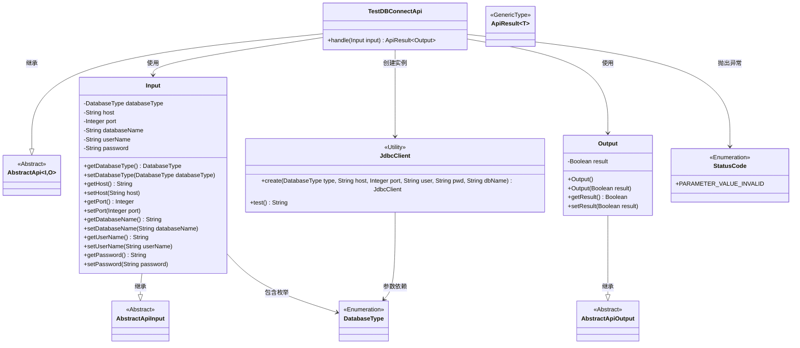

# 基础信息

|      |      |
|------|------|
| 名称 | TestDBConnectApi |
| 编码语言 | .java |
| 代码路径 | WeFe/board/board-service/src/main/java/com/welab/wefe/board/service/api/project/fusion/result/TestDBConnectApi.java |
| 包名 | com.welab.wefe.board.service.api.project.fusion.result |
| 依赖项 | ['com.welab.wefe.common.StatusCode', 'com.welab.wefe.common.fieldvalidate.annotation.Check', 'com.welab.wefe.common.jdbc.JdbcClient', 'com.welab.wefe.common.jdbc.base.DatabaseType', 'com.welab.wefe.common.web.api.base.AbstractApi', 'com.welab.wefe.common.web.api.base.Api', 'com.welab.wefe.common.web.dto.AbstractApiInput', 'com.welab.wefe.common.web.dto.AbstractApiOutput', 'com.welab.wefe.common.web.dto.ApiResult'] |
| 概述说明 | 测试数据库连接的API类，接收数据库类型、主机、端口等参数，验证连接并返回结果。 |

# 说明

该API类用于测试数据库连接，路径为"fusion/test_db_connect"。它继承自AbstractApi，输入参数包括数据库类型、主机、端口、数据库名、用户名和密码，其中前四项为必填项。处理逻辑是通过JdbcClient创建连接并测试，失败时抛出异常。成功时返回包含布尔结果true的输出。输入输出类均继承自抽象基类，包含相应的getter和setter方法。

# 类列表 Class Summary

| 名称   | 类型  | 说明 |
|-------|------|-------------|
| TestDBConnectApi | class | 测试数据库连接的API类，接收数据库类型、主机、端口等参数，验证连接并返回结果。 |

## 类 TestDBConnectApi

|      |      |
|------|------|
| 访问范围 | @Api(path = "fusion/test_db_connect", name = "测试数据库连接", desc = "测试数据库连接");public |
| 类型 | class |
| 名称 | TestDBConnectApi |
| 说明 | 测试数据库连接的API类，接收数据库类型、主机、端口等参数，验证连接并返回结果。 |

### UML类图

该代码实现了一个测试数据库连接的API，通过继承泛型抽象类AbstractApi处理输入输出。核心类TestDBConnectApi包含嵌套的Input/Output类，Input类通过JdbcClient验证连接参数，Output返回测试结果。类图展示了继承关系、参数校验枚举依赖和数据库客户端工具类的调用链路，体现了分层设计和参数校验机制。

### 内部方法调用关系图

```mermaid
graph TD
    A["TestDBConnectApi类"]
    B["继承: AbstractApi<Input, Output>"]
    C["注解: @Api"]
    D["方法: handle(Input input)"]
    E["创建: JdbcClient.create()"]
    F["调用: client.test()"]
    G["判断: message != null"]
    H["抛出异常: StatusCode.PARAMETER_VALUE_INVALID"]
    I["创建: Output对象"]
    J["设置: output.setResult(true)"]
    K["返回: success(output)"]
    L["内部类: Input"]
    M["继承: AbstractApiInput"]
    N["字段: databaseType, host, port等"]
    O["方法: getter/setter"]
    P["内部类: Output"]
    Q["继承: AbstractApiOutput"]
    R["字段: result"]
    S["方法: getter/setter"]

    A --> B
    A --> C
    A --> D
    D --> E
    E --> F
    F --> G
    G -->|是| H
    G -->|否| I
    I --> J
    J --> K
    A --> L
    L --> M
    L --> N
    L --> O
    A --> P
    P --> Q
    P --> R
    P --> S
```

流程图描述了TestDBConnectApi类的结构和处理流程。该类继承AbstractApi，包含handle方法用于测试数据库连接。首先创建JdbcClient实例并测试连接，若失败则抛出异常，成功则设置输出结果并返回。包含Input和Output两个内部类，分别继承AbstractApiInput和AbstractApiOutput，用于封装输入参数和输出结果。流程清晰展示了从参数验证到结果返回的完整处理链。

### 字段列表 Field List

| 名称  | 类型  | 说明 |
|-------|-------|------|

### 方法列表

| 名称  | 类型  | 说明 |
|-------|-------|------|
| handle | ApiResult<TestDBConnectApi.Output> | 该方法处理数据库连接测试，创建JDBC客户端并测试连接，失败时抛出异常，成功返回连接结果。 |

