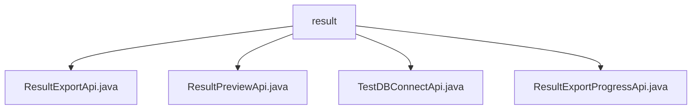

# 基础信息

|      |      |
|------|------|
| 名称 | result |
| 编码语言 | .java |
| 代码路径 | WeFe/board/board-service/src/main/java/com/welab/wefe/board/service/api/project/fusion/result |
| 包名 | docs.board.board-service.src.main.java.com.welab.wefe.board.service.api.project.fusion.result |
| 概述说明 | ResultExportApi处理结果导出，路径fusion/result/export，输入含必填项businessId等。ResultPreviewApi处理预览，路径fusion/result/preview，返回表头和数据。TestDBConnectApi测试数据库连接，路径fusion/test_db_connect。ResultExportProgressApi查询导出进度，路径fusion/result/export_progress。 |

# 说明

## 概述  
该模块核心职责是提供数据融合结果的全生命周期管理，包括结果预览、导出及进度查询，类似ETL工具的轻量级实现。接口规范统一采用RESTful风格，路径前缀为`fusion/result/`，输入输出均继承抽象基类，必填字段通过校验注解保障。关键数据结构包括包含`businessId`的Input类、表头数据结构的Output类以及导出进度对象。外部依赖项涉及FusionResultService、JdbcClient和存储服务。例如ResultExportApi通过`fusionResultService.export`实现数据导出，TestDBConnectApi依赖JdbcClient验证数据库连接。

## 主要业务场景  
模块支持典型数据融合结果处理流程：先预览数据（如ResultPreviewApi获取表头及样本），再触发导出（如ResultExportApi）并查询进度（如ResultExportProgressApi）。交互模式遵循请求-响应模型，集成案例包括数据库连接测试（TestDBConnectApi）和分阶段结果获取。例如预览阶段会校验businessId有效性，导出阶段通过ExportManager管理异步任务，形成端到端解决方案。所有API均采用标准化异常处理，确保流程完整性。

### 包内部结构视图

该流程图展示了项目路径中的层级关系，根节点为"result"文件夹，包含四个Java文件：ResultExportApi、ResultPreviewApi、TestDBConnectApi和ResultExportProgressApi。所有文件都直接位于result目录下，没有更深层次的嵌套结构，清晰地呈现了该模块的API文件组织方式。

# 文件列表

| 名称   | 类型  | 说明 |
|-------|------|-------------|
| [ResultExportApi.java](ResultExportApi.md) | file | 结果导出API类，继承AbstractApi，处理输入参数如businessId、数据库类型、主机、端口等，调用FusionResultService导出结果。输出包含表名。 |
| [ResultPreviewApi.java](ResultPreviewApi.md) | file | 结果预览API类，处理业务ID输入，查询任务模型和数据表头，返回前10行数据预览，包含列名和行数据列表。 |
| [TestDBConnectApi.java](TestDBConnectApi.md) | file | 测试数据库连接的API类，接收数据库类型、主机、端口等参数，验证连接并返回结果。 |
| [ResultExportProgressApi.java](ResultExportProgressApi.md) | file | Java类ResultExportProgressApi用于处理结果导出进度查询，接收businessId参数并返回导出进度信息。 |

