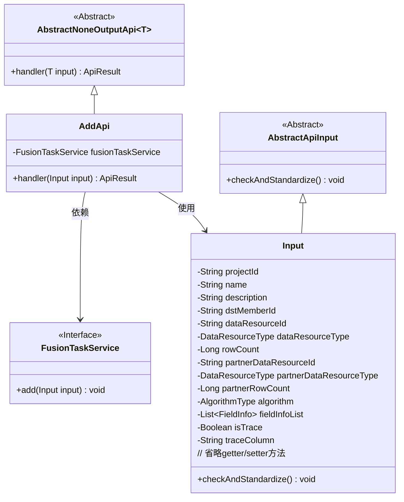
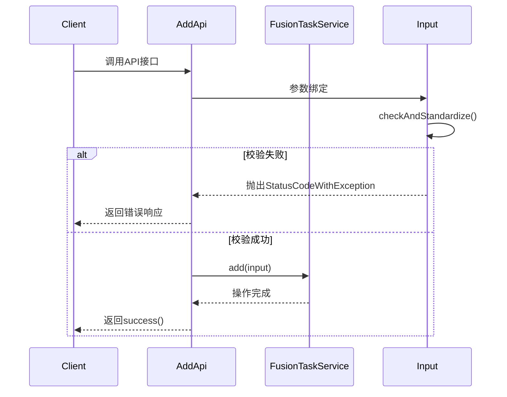

# 基础信息

|      |      |
|------|------|
| 名称 | AddApi |
| 编码语言 | .java |
| 代码路径 | WeFe/board/board-service/src/main/java/com/welab/wefe/board/service/api/project/fusion/task/AddApi.java |
| 包名 | com.welab.wefe.board.service.api.project.fusion.task |
| 依赖项 | ['com.welab.wefe.board.service.service.fusion.FusionTaskService', 'com.welab.wefe.board.service.util.primarykey.FieldInfo', 'com.welab.wefe.common.StatusCode', 'com.welab.wefe.common.exception.StatusCodeWithException', 'com.welab.wefe.common.fieldvalidate.annotation.Check', 'com.welab.wefe.common.util.StringUtil', 'com.welab.wefe.common.web.api.base.AbstractNoneOutputApi', 'com.welab.wefe.common.web.api.base.Api', 'com.welab.wefe.common.web.dto.AbstractApiInput', 'com.welab.wefe.common.web.dto.ApiResult', 'com.welab.wefe.common.wefe.enums.DataResourceType', 'com.welab.wefe.fusion.core.enums.AlgorithmType', 'org.apache.commons.collections4.CollectionUtils', 'org.springframework.beans.factory.annotation.Autowired', 'java.util.List'] |
| 概述说明 | 添加对齐任务的API接口，包含项目ID、任务名称、合作方ID、数据资源信息、算法类型等必填字段，支持主键处理和追溯功能，并进行输入参数校验。 |

# 说明

该代码定义了一个名为AddApi的API类，用于添加对齐任务。API路径为fusion/task/add，名称为添加对齐任务。类继承自AbstractNoneOutputApi，输入参数为内部类Input。Input类包含多个必填和选填字段，如项目ID、任务名称、描述、合作方ID、数据资源信息、算法类型等，并对字段进行了校验和标准化处理。校验逻辑包括字段非空检查、长度限制、算法类型与资源类型的匹配性检查等。处理逻辑通过调用FusionTaskService的add方法完成任务添加。

# 类列表 Class Summary

| 名称   | 类型  | 说明 |
|-------|------|-------------|
| AddApi | class | 添加对齐任务的API接口，包含项目ID、任务名称、描述、合作方ID、数据资源信息、算法类型等必填字段，并进行参数校验和标准化处理。 |

## 类 AddApi

|      |      |
|------|------|
| 访问范围 | @Api(path = "fusion/task/add", name = "添加对齐任务", desc = "添加对齐任务");public |
| 类型 | class |
| 名称 | AddApi |
| 说明 | 添加对齐任务的API接口，包含项目ID、任务名称、描述、合作方ID、数据资源信息、算法类型等必填字段，并进行参数校验和标准化处理。 |

### UML类图

这段代码描述了一个用于添加对齐任务的API实现。AddApi继承自AbstractNoneOutputApi，处理Input类型的输入参数，并通过FusionTaskService服务执行实际任务添加操作。Input类包含丰富的字段校验逻辑，涉及项目ID、任务名称、数据资源类型、算法选择等业务参数，并通过checkAndStandardize方法实现参数标准化和业务规则校验。整体设计体现了清晰的层次结构，其中抽象基类提供通用能力，具体实现类处理特定业务逻辑。

### 内部方法调用关系图

```mermaid
graph TD
    A["类AddApi"]
    B["继承: AbstractNoneOutputApi<Input>"]
    C["注解: @Api"]
    D["依赖注入: @Autowired FusionTaskService"]
    E["重写方法: handler(Input input)"]
    F["内部类: Input"]
    G["输入校验: checkAndStandardize()"]
    H["属性校验: @Check注解字段"]
    I["业务逻辑校验: 算法/追溯字段等规则"]
    J["Getter/Setter方法"]

    A --> B
    A --> C
    A --> D
    A --> E
    A --> F
    F --> G
    F --> H
    G --> I
    F --> J
```

这段代码实现了一个添加对齐任务的API接口，主要包含参数校验和业务处理两个核心流程。Input内部类通过@Check注解和自定义校验方法实现多层参数验证，包括字段必填性、格式正则、业务规则（如算法兼容性检查）等。流程图展示了类结构和校验逻辑的层级关系，时序图则描述了从客户端调用到服务处理的完整交互过程，特别突出了参数校验的分支逻辑。

### 字段列表 Field List

| 名称  | 类型  | 说明 |
|-------|-------|------|
| fusionTaskService | FusionTaskService | 自动注入FusionTaskService服务实例。 |

### 方法列表

| 名称  | 类型  | 说明 |
|-------|-------|------|
| handler | ApiResult | 覆盖方法处理输入，调用服务添加任务，成功返回结果。 |

