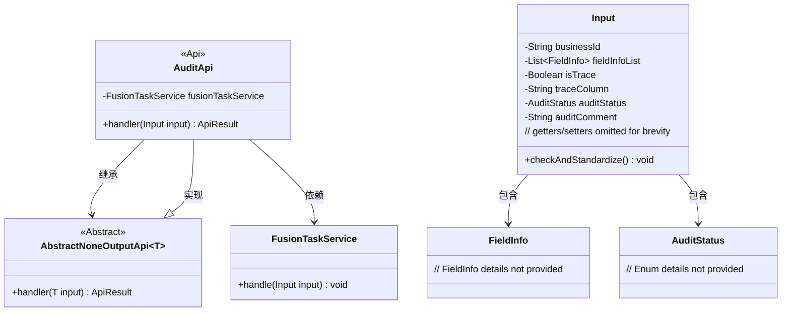

# 基础信息

|      |      |
|------|------|
| 名称 | AuditApi |
| 编码语言 | .java |
| 代码路径 | WeFe/board/board-service/src/main/java/com/welab/wefe/board/service/api/project/fusion/task/AuditApi.java |
| 包名 | com.welab.wefe.board.service.api.project.fusion.task |
| 依赖项 | ['com.welab.wefe.board.service.service.fusion.FusionTaskService', 'com.welab.wefe.board.service.util.primarykey.FieldInfo', 'com.welab.wefe.common.StatusCode', 'com.welab.wefe.common.exception.StatusCodeWithException', 'com.welab.wefe.common.fieldvalidate.annotation.Check', 'com.welab.wefe.common.util.StringUtil', 'com.welab.wefe.common.web.api.base.AbstractNoneOutputApi', 'com.welab.wefe.common.web.api.base.Api', 'com.welab.wefe.common.web.dto.AbstractApiInput', 'com.welab.wefe.common.web.dto.ApiResult', 'com.welab.wefe.common.wefe.enums.AuditStatus', 'org.springframework.beans.factory.annotation.Autowired', 'java.util.List'] |
| 概述说明 | AuditApi类处理任务审核，包含必填businessId、审核状态auditStatus等字段，可选追溯字段traceColumn和审核评论auditComment。输入参数校验逻辑确保必填项非空。 |

# 说明

该代码定义了一个名为AuditApi的任务处理API类，继承自AbstractNoneOutputApi，路径为fusion/task/audit。类中注入了FusionTaskService用于处理任务。输入参数Input类包含businessId、fieldInfoList、isTrace、traceColumn、auditStatus和auditComment等字段，并进行了非空校验。当isTrace为true时，traceColumn不能为空。提供了各字段的getter和setter方法。handler方法调用fusionTaskService处理输入并返回成功结果。

# 类列表 Class Summary

| 名称   | 类型  | 说明 |
|-------|------|-------------|
| AuditApi | class | 任务处理API，接收包含业务ID、主键、追溯字段、审核状态等参数的输入，调用服务处理任务并返回结果。输入参数需校验非空及合法性。 |

## 类 AuditApi

|      |      |
|------|------|
| 访问范围 | @Api(path = "fusion/task/audit", name = "任务处理", desc = "任务处理");public |
| 类型 | class |
| 名称 | AuditApi |
| 说明 | 任务处理API，接收包含业务ID、主键、追溯字段、审核状态等参数的输入，调用服务处理任务并返回结果。输入参数需校验非空及合法性。 |

### UML类图

类图描述：该图展示了审计API的核心结构，AuditApi继承自泛型抽象类AbstractNoneOutputApi<Input>，并依赖FusionTaskService进行任务处理。Input作为内部类包含多个校验字段和业务参数，与FieldInfo和AuditStatus存在关联关系。整体设计体现了参数校验与业务处理的分离，通过继承实现模板方法模式。

### 内部方法调用关系图

```mermaid
graph TD
    A["类AuditApi"]
    B["注解: @Api"]
    C["继承: AbstractNoneOutputApi<Input>"]
    D["依赖注入: @Autowired FusionTaskService"]
    E["重写方法: handler(Input input)"]
    F["内部类: Input"]
    G["属性: String businessId"]
    H["属性: List<FieldInfo> fieldInfoList"]
    I["属性: Boolean isTrace"]
    J["属性: String traceColumn"]
    K["属性: AuditStatus auditStatus"]
    L["属性: String auditComment"]
    M["方法: checkAndStandardize()"]
    N["getter/setter方法"]

    A --> B
    A --> C
    A --> D
    A --> E
    A --> F
    F --> G
    F --> H
    F --> I
    F --> J
    F --> K
    F --> L
    F --> M
    F --> N
    E --> D["调用fusionTaskService.handle(input)"]
    E --> A["返回success()"]
    M -->|条件检查| F
    M -->|抛出异常| F["StatusCodeWithException"]
```

这段代码描述了一个任务审核API的实现，包含主类AuditApi和其内部输入参数类Input。流程图展示了类结构关系，其中AuditApi通过注解定义API路径，继承抽象父类并注入服务依赖，主要处理逻辑在handler方法中调用服务层。Input类包含多个带校验注解的属性和参数标准化方法，当参数不符合条件时会抛出特定异常。整个设计体现了参数校验与业务逻辑分离的架构思想。

### 字段列表 Field List

| 名称  | 类型  | 说明 |
|-------|-------|------|
| fusionTaskService | FusionTaskService | 自动注入FusionTaskService服务实例。 |

### 方法列表

| 名称  | 类型  | 说明 |
|-------|-------|------|
| handler | ApiResult | Java方法重写，调用fusionTaskService处理输入并返回成功结果。 |

