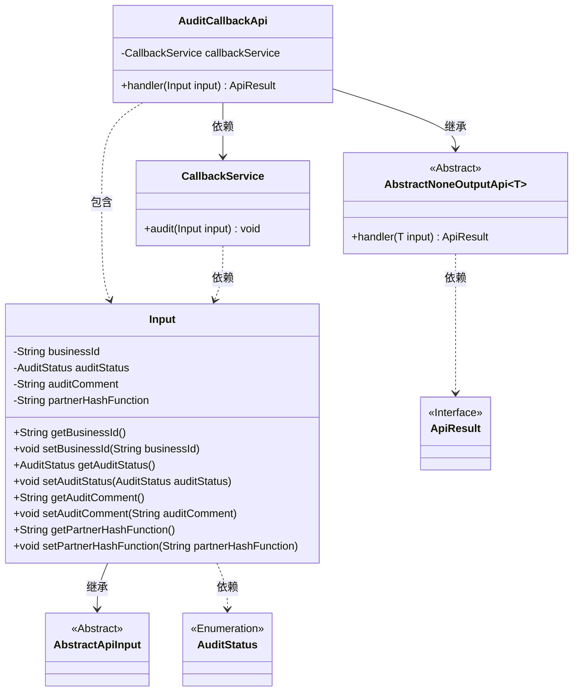
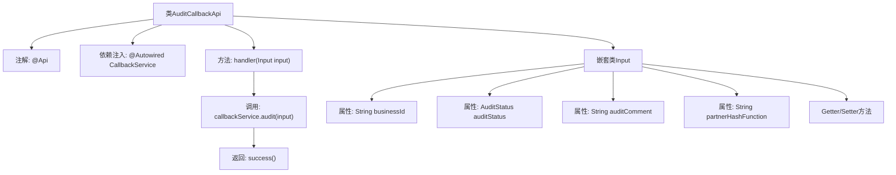

# 基础信息

|      |      |
|------|------|
| 名称 | AuditCallbackApi |
| 编码语言 | .java |
| 代码路径 | WeFe/board/board-service/src/main/java/com/welab/wefe/board/service/api/project/fusion/task/AuditCallbackApi.java |
| 包名 | com.welab.wefe.board.service.api.project.fusion.task |
| 依赖项 | ['com.welab.wefe.board.service.service.fusion.CallbackService', 'com.welab.wefe.common.exception.StatusCodeWithException', 'com.welab.wefe.common.fieldvalidate.annotation.Check', 'com.welab.wefe.common.web.api.base.AbstractNoneOutputApi', 'com.welab.wefe.common.web.api.base.Api', 'com.welab.wefe.common.web.dto.AbstractApiInput', 'com.welab.wefe.common.web.dto.ApiResult', 'com.welab.wefe.common.wefe.enums.AuditStatus', 'org.springframework.beans.factory.annotation.Autowired'] |
| 概述说明 | 审计回调接口，接收包含业务ID、审核状态、评论和哈希函数的输入，调用服务处理后返回成功结果。 |

# 说明

该代码定义了一个名为AuditCallbackApi的API类，用于接收审核回调消息。API路径为fusion/audit/callback，允许带签名访问。类继承自AbstractNoneOutputApi，泛型参数为内部类Input。Input类包含四个字段：必填的businessId和auditStatus，以及可选的auditComment和partnerHashFunction，均通过注解进行校验。handler方法调用callbackService的audit方法处理输入，并返回成功结果。整个API用于处理审核状态变更及相关信息的回调请求。

# 类列表 Class Summary

| 名称   | 类型  | 说明 |
|-------|------|-------------|
| AuditCallbackApi | class | 接收审核回调的API接口，需传入businessId、auditStatus等参数，调用callbackService处理审核结果。 |

## 类 AuditCallbackApi

|      |      |
|------|------|
| 访问范围 | @Api(path = "fusion/audit/callback", name = "接收消息接口", allowAccessWithSign = true);public |
| 类型 | class |
| 名称 | AuditCallbackApi |
| 说明 | 接收审核回调的API接口，需传入businessId、auditStatus等参数，调用callbackService处理审核结果。 |

### UML类图

这段代码展示了一个审计回调API的实现结构。AuditCallbackApi继承自泛型类AbstractNoneOutputApi，处理Input类型的输入数据，并通过CallbackService执行审计操作。Input类包含业务ID、审计状态、评论等字段，继承自AbstractApiInput。类图清晰地呈现了继承、依赖和组合关系，体现了API处理请求的核心流程和数据结构。

### 内部方法调用关系图

这段代码展示了一个审计回调API的实现，包含主类AuditCallbackApi和嵌套输入类Input。主类通过@Api注解定义接口路径，注入CallbackService处理核心业务逻辑，handler方法接收输入参数后调用服务层处理并返回成功结果。Input类定义了四个带校验注解的属性和对应的访问方法，用于封装审核相关的业务ID、状态、评论和哈希函数信息。流程图清晰呈现了类结构、依赖关系和方法调用链。

### 字段列表 Field List

| 名称  | 类型  | 说明 |
|-------|-------|------|
| callbackService | CallbackService | 自动注入回调服务实例。 |

### 方法列表

| 名称  | 类型  | 说明 |
|-------|-------|------|
| handler | ApiResult | 该方法重写父类handler，接收Input参数，调用callbackService的audit方法进行审核，成功时返回ApiResult。异常时抛出StatusCodeWithException。 |

