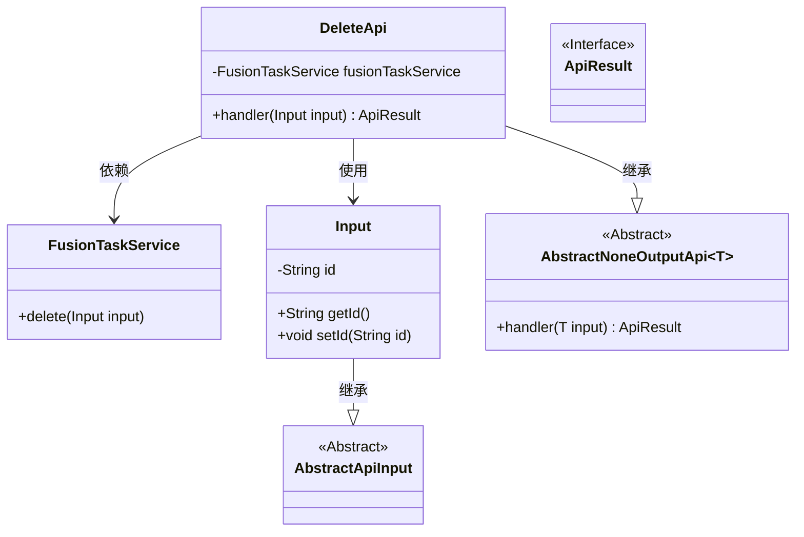
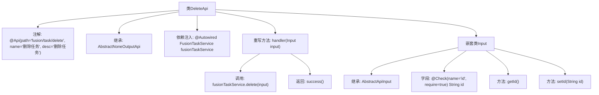

# 基础信息

|      |      |
|------|------|
| 名称 | DeleteApi |
| 编码语言 | .java |
| 代码路径 | WeFe/board/board-service/src/main/java/com/welab/wefe/board/service/api/project/fusion/task/DeleteApi.java |
| 包名 | com.welab.wefe.board.service.api.project.fusion.task |
| 依赖项 | ['com.welab.wefe.board.service.service.fusion.FusionTaskService', 'com.welab.wefe.common.exception.StatusCodeWithException', 'com.welab.wefe.common.fieldvalidate.annotation.Check', 'com.welab.wefe.common.web.api.base.AbstractNoneOutputApi', 'com.welab.wefe.common.web.api.base.Api', 'com.welab.wefe.common.web.dto.AbstractApiInput', 'com.welab.wefe.common.web.dto.ApiResult', 'org.springframework.beans.factory.annotation.Autowired'] |
| 概述说明 | 删除任务API，接收任务ID参数，调用FusionTaskService执行删除操作，返回成功结果。 |

# 说明

这是一个名为DeleteApi的Java类，用于实现删除任务的API接口。该类继承自AbstractNoneOutputApi，泛型参数为内部类Input。接口路径为fusion/task/delete，名称为删除任务。类中注入了FusionTaskService服务，通过handler方法调用服务的delete功能完成删除操作。Input内部类继承AbstractApiInput，包含一个必填字段id及其getter/setter方法。该API执行成功时返回空结果。

# 类列表 Class Summary

| 名称   | 类型  | 说明 |
|-------|------|-------------|
| DeleteApi | class | 删除任务API，接收任务ID参数，调用服务删除任务并返回成功结果。 |

## 类 DeleteApi

|      |      |
|------|------|
| 访问范围 | @Api(path = "fusion/task/delete", name = "删除任务", desc = "删除任务");public |
| 类型 | class |
| 名称 | DeleteApi |
| 说明 | 删除任务API，接收任务ID参数，调用服务删除任务并返回成功结果。 |

### UML类图

这段代码展示了一个删除任务的API实现类DeleteApi，它继承自泛型抽象类AbstractNoneOutputApi，并处理Input类型的输入参数。DeleteApi通过注入的FusionTaskService执行实际删除操作，Input类继承自AbstractApiInput并包含一个必填的id字段。整个结构体现了清晰的层级关系，其中DeleteApi作为核心类协调服务调用和输入验证，最终返回ApiResult接口类型的结果。

### 内部方法调用关系图

这段代码定义了一个删除任务的API类DeleteApi，继承自抽象类AbstractNoneOutputApi，通过注入的FusionTaskService执行删除操作。包含嵌套输入类Input，用于校验必填参数id。流程图展示了类结构、注解、继承关系、方法调用及输入参数校验逻辑，完整呈现了API从请求处理到业务调用的流程。

### 字段列表 Field List

| 名称  | 类型  | 说明 |
|-------|-------|------|
| fusionTaskService | FusionTaskService | 自动注入FusionTaskService服务实例。 |

### 方法列表

| 名称  | 类型  | 说明 |
|-------|-------|------|
| handler | ApiResult | 该方法处理输入并调用服务删除任务，成功后返回结果。 |

