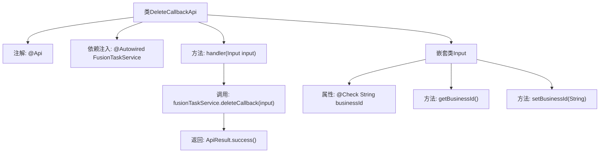

# 基础信息

|      |      |
|------|------|
| 名称 | DeleteCallbackApi |
| 编码语言 | .java |
| 代码路径 | WeFe/board/board-service/src/main/java/com/welab/wefe/board/service/api/project/fusion/task/DeleteCallbackApi.java |
| 包名 | com.welab.wefe.board.service.api.project.fusion.task |
| 依赖项 | ['com.welab.wefe.board.service.service.fusion.FusionTaskService', 'com.welab.wefe.common.exception.StatusCodeWithException', 'com.welab.wefe.common.fieldvalidate.annotation.Check', 'com.welab.wefe.common.web.api.base.AbstractNoneOutputApi', 'com.welab.wefe.common.web.api.base.Api', 'com.welab.wefe.common.web.dto.AbstractApiInput', 'com.welab.wefe.common.web.dto.ApiResult', 'org.springframework.beans.factory.annotation.Autowired'] |
| 概述说明 | 这是一个用于接收删除请求的API类，路径为"task/delete_callback"，需传入必填参数businessId，调用fusionTaskService处理删除回调，返回成功结果。 |

# 说明

这是一个名为DeleteCallbackApi的API类，用于接收删除请求。它继承自AbstractNoneOutputApi，泛型参数为内部类Input。API路径为task/delete_callback，允许带签名访问。主要功能是通过注入的FusionTaskService处理删除回调，输入参数Input包含必填字段businessId。处理成功后返回空结果。整个类实现了删除回调的业务逻辑封装。

# 类列表 Class Summary

| 名称   | 类型  | 说明 |
|-------|------|-------------|
| DeleteCallbackApi | class | 这是一个处理删除请求的API类，路径为"task/delete_callback"，需要签名访问。它接收包含必要参数businessId的输入，调用fusionTaskService处理删除回调，返回成功结果。 |


## 类 DeleteCallbackApi

|      |      |
|------|------|
| 访问范围 | @Api(path = "task/delete_callback", name = "接收删除请求", desc = "接收删除请求", allowAccessWithSign = true);public |
| 类型 | class |
| 名称 | DeleteCallbackApi |
| 说明 | 这是一个处理删除请求的API类，路径为"task/delete_callback"，需要签名访问。它接收包含必要参数businessId的输入，调用fusionTaskService处理删除回调，返回成功结果。 |


### UML类图

```mermaid
classDiagram
    class DeleteCallbackApi {
        -FusionTaskService fusionTaskService
        +handler(DeleteCallbackApi~Input~ input) ApiResult
    }
    DeleteCallbackApi --> FusionTaskService : 依赖
    DeleteCallbackApi ..|> AbstractNoneOutputApi~DeleteCallbackApi~Input~~ : 实现

    class AbstractNoneOutputApi~T~ {
        <<Abstract>>
        +handler(T input) ApiResult
    }

    class FusionTaskService {
        <<Service>>
        +deleteCallback(DeleteCallbackApi~Input~ input)
    }

    class DeleteCallbackApi~Input~ {
        -String businessId
        +String getBusinessId()
        +void setBusinessId(String businessId)
    }
    DeleteCallbackApi~Input~ --|> AbstractApiInput : 继承

    class AbstractApiInput {
        <<Abstract>>
    }
```

这段代码描述了一个处理删除回调请求的API类结构。DeleteCallbackApi继承自AbstractNoneOutputApi，使用泛型指定输入类型为内部类Input。Input类继承自AbstractApiInput，包含businessId字段及getter/setter。API通过注入的FusionTaskService处理业务逻辑，实现删除回调功能。类图清晰地展示了继承关系、依赖关系和泛型参数的使用，体现了Spring风格的API控制器设计模式。


### 内部方法调用关系图



该流程图展示了DeleteCallbackApi类的结构及其内部调用关系。顶部是带有@Api注解的主类，包含自动注入的FusionTaskService和核心handler方法。handler方法调用服务层的deleteCallback并返回成功结果。嵌套类Input包含带校验注解的businessId字段及其getter/setter方法。整个流程清晰地反映了API请求处理路径和参数验证机制。

### 字段列表 Field List

| 名称  | 类型  | 说明 |
|-------|-------|------|
| fusionTaskService | FusionTaskService | 使用@Autowired自动注入FusionTaskService实例。 |

### 方法列表

| 名称  | 类型  | 说明 |
|-------|-------|------|
| handler | ApiResult | 处理删除回调API请求，调用服务删除回调并返回成功结果。 |


