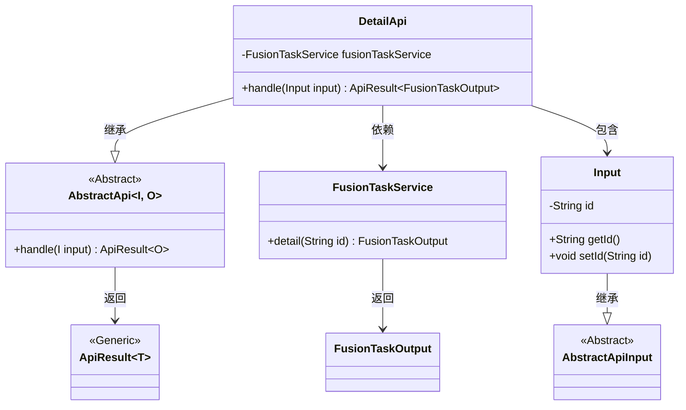

# 基础信息

|      |      |
|------|------|
| 名称 | DetailApi |
| 编码语言 | .java |
| 代码路径 | WeFe/board/board-service/src/main/java/com/welab/wefe/board/service/api/project/fusion/task/DetailApi.java |
| 包名 | com.welab.wefe.board.service.api.project.fusion.task |
| 依赖项 | ['com.welab.wefe.board.service.dto.fusion.FusionTaskOutput', 'com.welab.wefe.board.service.service.fusion.FusionTaskService', 'com.welab.wefe.common.exception.StatusCodeWithException', 'com.welab.wefe.common.fieldvalidate.annotation.Check', 'com.welab.wefe.common.web.api.base.AbstractApi', 'com.welab.wefe.common.web.api.base.Api', 'com.welab.wefe.common.web.dto.AbstractApiInput', 'com.welab.wefe.common.web.dto.ApiResult', 'com.welab.wefe.fusion.core.utils.CryptoUtils', 'org.bouncycastle.crypto.AsymmetricCipherKeyPair', 'org.bouncycastle.crypto.params.RSAKeyParameters', 'org.bouncycastle.crypto.params.RSAPrivateCrtKeyParameters', 'org.springframework.beans.factory.annotation.Autowired', 'java.math.BigInteger'] |
| 概述说明 | DetailApi类处理任务详情查询，调用FusionTaskService获取数据。main方法生成RSA密钥对并测试两种模幂运算性能。输入类Input包含必填taskId字段。 |

# 说明

该代码定义了一个名为DetailApi的API类，用于处理任务详情查询请求。类继承自AbstractApi，接收Input参数并返回FusionTaskOutput结果。主要功能是通过fusionTaskService查询指定ID的任务详情。Input类包含一个必填的taskId字段。代码中还包含一个main方法，演示了RSA密钥生成及两种模幂运算的性能比较，分别使用中国剩余定理优化和直接计算，并输出执行时间。整个类主要涉及API接口实现和密码学运算性能测试两部分功能。

# 类列表 Class Summary

| 名称   | 类型  | 说明 |
|-------|------|-------------|
| DetailApi | class | DetailApi类处理任务详情查询，使用RSA密钥对进行性能测试，比较两种模幂运算方法的耗时。输入参数为taskId，输出任务详情。 |

## 类 DetailApi

|      |      |
|------|------|
| 访问范围 | @Api(path = "fusion/task/detail", name = "任务列表", desc = "任务列表");public |
| 类型 | class |
| 名称 | DetailApi |
| 说明 | DetailApi类处理任务详情查询，使用RSA密钥对进行性能测试，比较两种模幂运算方法的耗时。输入参数为taskId，输出任务详情。 |

### UML类图

类图描述：
该图展示了一个基于抽象API框架的任务详情查询系统。DetailApi继承自泛型抽象类AbstractApi，处理Input输入并返回ApiResult<FusionTaskOutput>结果。其中Input是AbstractApiInput的子类，包含任务ID字段。DetailApi通过依赖注入的FusionTaskService获取任务详情，核心方法handle实现了业务逻辑。类图清晰地展现了继承、依赖和泛型关系，体现了基于Spring的API服务典型结构。

### 内部方法调用关系图

```mermaid
graph TD
    A["类DetailApi"]
    B["注解: @Api"]
    C["继承: AbstractApi<Input, FusionTaskOutput>"]
    D["依赖注入: @Autowired FusionTaskService"]
    E["重写方法: handle(Input input)"]
    F["调用: fusionTaskService.detail(input.id)"]
    G["返回: ApiResult.success()"]
    H["main方法: 生成RSA密钥对"]
    I["计算: 模逆元(tp/tq)和系数(cp/cq)"]
    J["循环: 中国剩余定理优化解密"]
    K["循环: 直接模幂运算解密"]
    L["输出: 两种解密方式的耗时对比"]

    A --> B
    A --> C
    A --> D
    A --> E
    E --> F
    F --> G
    A -.-> H
    H --> I
    I --> J
    H --> K
    J --> L
    K --> L
```

这段代码主要实现了一个任务详情API和RSA解密性能测试。API部分通过继承AbstractApi类实现具体业务逻辑，使用FusionTaskService获取任务详情。main方法则展示了两种RSA解密方式：一种使用中国剩余定理优化（预先计算模逆元和系数），另一种是直接模幂运算，通过20万次循环对比两者的执行效率。流程图清晰展示了类结构、方法调用关系以及性能测试的执行流程。

### 字段列表 Field List

| 名称  | 类型  | 说明 |
|-------|-------|------|
| fusionTaskService | FusionTaskService | 代码片段使用@Autowired自动注入FusionTaskService服务实例。 |

### 方法列表

| 名称  | 类型  | 说明 |
|-------|-------|------|
| handle | ApiResult<FusionTaskOutput> | 重写handle方法，调用fusionTaskService.detail获取输入ID的详情并返回成功结果。 |
| main | void | 生成RSA密钥对，使用中国剩余定理优化解密运算，比较优化前后耗时。优化方法通过分拆模幂运算并合并结果，提升性能。 |

