# 基础信息

|      |      |
|------|------|
| 名称 | InfoApi |
| 编码语言 | .java |
| 代码路径 | WeFe/board/board-service/src/main/java/com/welab/wefe/board/service/api/project/fusion/task/InfoApi.java |
| 包名 | com.welab.wefe.board.service.api.project.fusion.task |
| 依赖项 | ['com.welab.wefe.board.service.fusion.manager.ActuatorManager', 'com.welab.wefe.common.exception.StatusCodeWithException', 'com.welab.wefe.common.fieldvalidate.annotation.Check', 'com.welab.wefe.common.util.JObject', 'com.welab.wefe.common.web.api.base.AbstractApi', 'com.welab.wefe.common.web.api.base.Api', 'com.welab.wefe.common.web.dto.AbstractApiInput', 'com.welab.wefe.common.web.dto.ApiResult'] |
| 概述说明 | InfoApi类用于查询任务进度，接收businessId参数并返回任务信息。继承AbstractApi，输入为Input类，输出为JObject。 |

# 说明

这是一个名为InfoApi的Java类，用于查询任务进度。它继承自AbstractApi，泛型参数为Input和JObject。类注解定义了API路径为"fusion/task/info"，名称为"查询任务进度"。该类重写了handle方法，通过ActuatorManager获取任务信息并返回成功结果。内部类Input继承自AbstractApiInput，包含一个必填字段businessId，用于指定操作的taskId，并提供了该字段的getter和setter方法。整个API的功能是接收包含businessId的输入，返回对应任务进度的JSON对象。

# 类列表 Class Summary

| 名称   | 类型  | 说明 |
|-------|------|-------------|
| InfoApi | class | InfoApi类用于查询任务进度，接收businessId参数并返回任务信息，继承自AbstractApi，输入类Input包含必填字段businessId及其getter/setter方法。 |


## 类 InfoApi

|      |      |
|------|------|
| 访问范围 | @Api(path = "fusion/task/info", name = "查询任务进度", desc = "查询任务进度");public |
| 类型 | class |
| 名称 | InfoApi |
| 说明 | InfoApi类用于查询任务进度，接收businessId参数并返回任务信息，继承自AbstractApi，输入类Input包含必填字段businessId及其getter/setter方法。 |


### UML类图

```mermaid
classDiagram
    class AbstractApi~T, R~ {
        <<Abstract>>
        +handle(T input) ApiResult~R~
    }

    class InfoApi {
        +handle(Input input) ApiResult~JObject~
    }
    InfoApi --|> AbstractApi~Input, JObject~

    class AbstractApiInput {
        <<Abstract>>
    }

    class InfoApi$Input {
        -String businessId
        +String getBusinessId()
        +void setBusinessId(String businessId)
    }
    InfoApi$Input --|> AbstractApiInput

    class ActuatorManager {
        +getTaskInfo(String businessId) JObject
    }
    InfoApi ..> ActuatorManager : 调用

    class ApiResult~T~ {
        <<Generic>>
    }
    InfoApi --> ApiResult~JObject~

    class JObject {
    }
    InfoApi --> JObject
```

类图描述：该图展示了InfoApi继承自泛型类AbstractApi<Input, JObject>，其内部类Input继承自AbstractApiInput。InfoApi通过handle方法处理输入参数，并调用ActuatorManager的getTaskInfo方法获取任务信息，最终返回包含JObject的ApiResult结果。图中清晰呈现了类之间的继承、依赖关系以及泛型参数传递。


### 内部方法调用关系图

```mermaid
graph TD
    A["类InfoApi"]
    B["父类: AbstractApi<Input, JObject>"]
    C["注解: @Api(path='fusion/task/info', name='查询任务进度', desc='查询任务进度')"]
    D["方法: handle(Input input)"]
    E["调用: ActuatorManager.getTaskInfo"]
    F["返回: ApiResult<JObject>"]
    G["内部类Input"]
    H["属性: String businessId"]
    I["方法: getBusinessId()"]
    J["方法: setBusinessId(String)"]
    K["注解: @Check(name='指定操作的taskId', require=true)"]

    A --> B
    A --> C
    A --> D
    D --> E
    E --> F
    A --> G
    G --> H
    G --> I
    G --> J
    H --> K
```



这段代码定义了一个名为InfoApi的API类，用于查询任务进度。该类继承自AbstractApi，包含一个处理请求的handle方法，该方法通过ActuatorManager获取任务信息并返回结果。内部类Input定义了请求参数businessId及其getter/setter方法，并用@Check注解标记该参数为必填项。整体结构清晰，通过注解明确了API路径和功能描述，输入参数校验完备。

### 字段列表 Field List

| 名称  | 类型  | 说明 |
|-------|-------|------|

### 方法列表

| 名称  | 类型  | 说明 |
|-------|-------|------|
| handle | ApiResult<JObject> | Java方法重写，处理输入并返回任务信息，成功时调用ActuatorManager获取业务ID对应的任务详情。 |


