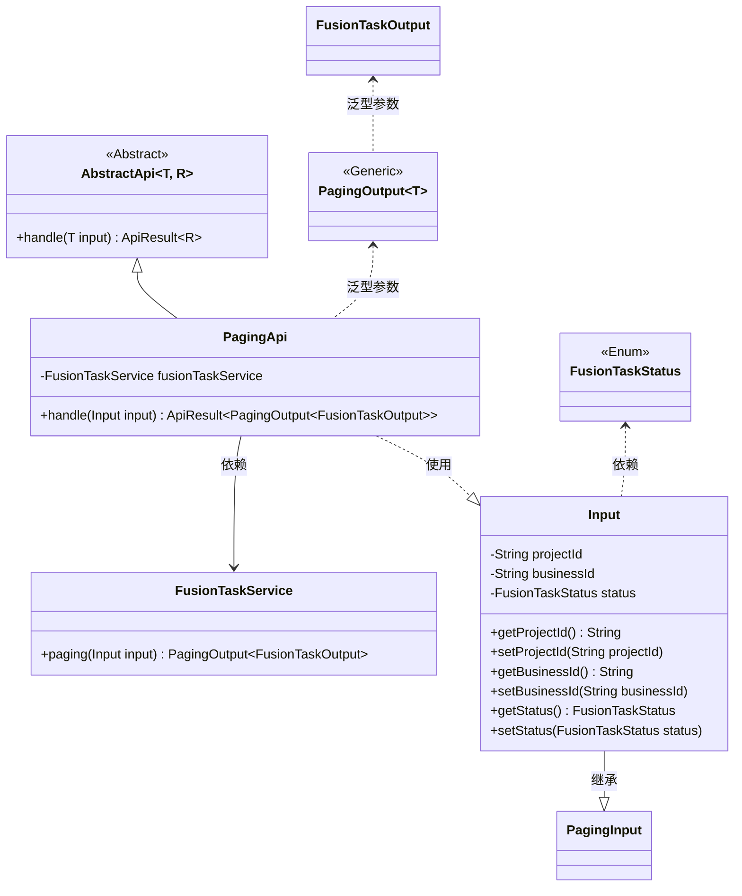

# 基础信息

|      |      |
|------|------|
| 名称 | PagingApi |
| 编码语言 | .java |
| 代码路径 | WeFe/board/board-service/src/main/java/com/welab/wefe/board/service/api/project/fusion/task/PagingApi.java |
| 包名 | com.welab.wefe.board.service.api.project.fusion.task |
| 依赖项 | ['com.welab.wefe.board.service.dto.base.PagingInput', 'com.welab.wefe.board.service.dto.base.PagingOutput', 'com.welab.wefe.board.service.dto.fusion.FusionTaskOutput', 'com.welab.wefe.board.service.service.fusion.FusionTaskService', 'com.welab.wefe.common.exception.StatusCodeWithException', 'com.welab.wefe.common.fieldvalidate.annotation.Check', 'com.welab.wefe.common.web.api.base.AbstractApi', 'com.welab.wefe.common.web.api.base.Api', 'com.welab.wefe.common.web.dto.ApiResult', 'com.welab.wefe.fusion.core.enums.FusionTaskStatus', 'org.springframework.beans.factory.annotation.Autowired'] |
| 概述说明 | 分页查询任务列表的API，输入包含项目ID、业务ID和任务状态，调用FusionTaskService分页查询并返回结果。 |

# 说明

该代码定义了一个名为PagingApi的API类，用于处理任务列表分页查询。API路径为"fusion/task/paging"，继承自AbstractApi，输入类型为内部类Input，输出为分页格式的FusionTaskOutput。Input类包含三个可校验字段：projectId、businessId和任务状态status，并提供了对应的getter和setter方法。处理逻辑调用fusionTaskService的paging方法，返回分页结果。

# 类列表 Class Summary

| 名称   | 类型  | 说明 |
|-------|------|-------------|
| PagingApi | class | 这是一个分页查询任务列表的API类，接收projectId、businessId和任务状态作为输入参数，调用fusionTaskService.paging方法返回分页结果。 |

## 类 PagingApi

|      |      |
|------|------|
| 访问范围 | @Api(path = "fusion/task/paging", name = "任务列表", desc = "任务列表");public |
| 类型 | class |
| 名称 | PagingApi |
| 说明 | 这是一个分页查询任务列表的API类，接收projectId、businessId和任务状态作为输入参数，调用fusionTaskService.paging方法返回分页结果。 |

### UML类图

这段代码描述了一个分页查询API的实现，核心是`PagingApi`类继承自泛型抽象类`AbstractApi`，处理`Input`参数并返回分页结果。类图展示了以下关系：1) PagingApi通过组合使用FusionTaskService执行分页查询；2) Input作为内部类继承自PagingInput并包含三个校验字段；3) 泛型结构通过PagingOutput包装FusionTaskOutput实现类型安全的数据返回。整个设计体现了清晰的层级关系和职责分离，Input类封装请求参数，Service处理业务逻辑，抽象父类规范API处理流程。

### 内部方法调用关系图

```mermaid
graph TD
    A["类PagingApi"]
    B["注解: @Api"]
    C["继承: AbstractApi<Input, PagingOutput<FusionTaskOutput>>"]
    D["依赖注入: @Autowired FusionTaskService"]
    E["重写方法: handle(Input input)"]
    F["内部类: Input"]
    G["继承: PagingInput"]
    H["属性: String projectId"]
    I["属性: String businessId"]
    J["属性: FusionTaskStatus status"]
    K["方法: getProjectId/setProjectId"]
    L["方法: getBusinessId/setBusinessId"]
    M["方法: getStatus/setStatus"]
    N["调用: fusionTaskService.paging(input)"]
    O["返回: ApiResult.success"]

    A --> B
    A --> C
    A --> D
    A --> E
    A --> F
    F --> G
    F --> H
    F --> I
    F --> J
    F --> K
    F --> L
    F --> M
    E --> N
    N --> O
```

该流程图展示了PagingApi类的完整结构，从类注解、继承关系、依赖注入到内部类Input的组成。核心流程是handle方法通过fusionTaskService.paging处理分页请求，最终返回封装成功的ApiResult。内部类Input继承PagingInput并包含三个带校验注解的属性和对应的getter/setter方法，用于接收前端的分页查询参数。整个设计体现了清晰的层级结构和职责划分。

### 字段列表 Field List

| 名称  | 类型  | 说明 |
|-------|-------|------|
| fusionTaskService | FusionTaskService | 使用@Autowired自动注入FusionTaskService服务实例。 |

### 方法列表

| 名称  | 类型  | 说明 |
|-------|-------|------|
| handle | ApiResult<PagingOutput<FusionTaskOutput>> | 处理输入并返回分页查询结果，成功时调用服务方法。 |

