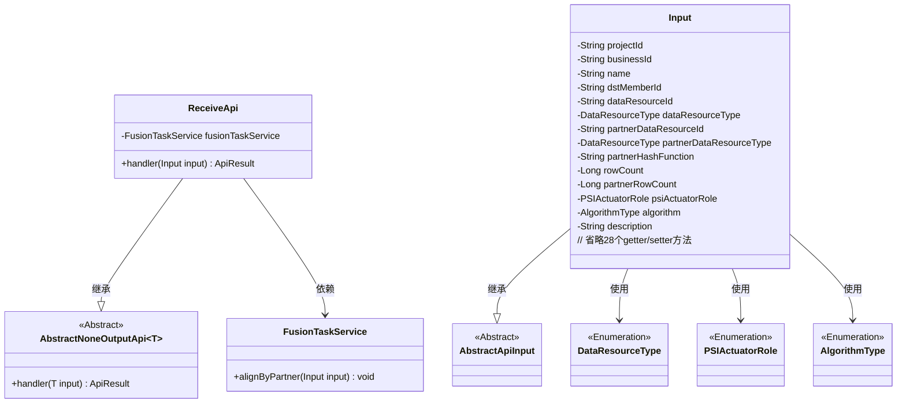
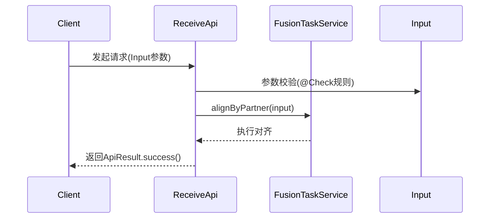

# 基础信息

|      |      |
|------|------|
| 名称 | ReceiveApi |
| 编码语言 | .java |
| 代码路径 | WeFe/board/board-service/src/main/java/com/welab/wefe/board/service/api/project/fusion/task/ReceiveApi.java |
| 包名 | com.welab.wefe.board.service.api.project.fusion.task |
| 依赖项 | ['com.welab.wefe.board.service.service.fusion.FusionTaskService', 'com.welab.wefe.common.exception.StatusCodeWithException', 'com.welab.wefe.common.fieldvalidate.annotation.Check', 'com.welab.wefe.common.web.api.base.AbstractNoneOutputApi', 'com.welab.wefe.common.web.api.base.Api', 'com.welab.wefe.common.web.dto.AbstractApiInput', 'com.welab.wefe.common.web.dto.ApiResult', 'com.welab.wefe.common.wefe.enums.DataResourceType', 'com.welab.wefe.fusion.core.enums.AlgorithmType', 'com.welab.wefe.fusion.core.enums.PSIActuatorRole', 'org.springframework.beans.factory.annotation.Autowired'] |
| 概述说明 | 接收对齐请求API，需提供项目ID、业务ID、任务名称、合作方ID、数据资源信息、算法类型等必填参数，调用FusionTaskService进行对齐处理。 |

# 说明

ReceiveApi是一个用于接收对齐请求的API类，路径为task/receive，允许签名访问。它继承自AbstractNoneOutputApi，输入参数为Input类。主要功能是通过FusionTaskService的alignByPartner方法处理对齐请求。Input类包含多个必填字段：projectId、businessId、name、dstMemberId、dataResourceId及其类型、partnerDataResourceId及其类型、partnerHashFunction、psiActuatorRole、algorithm等。可选字段包括rowCount、partnerRowCount和description（限制1024字符）。所有字段均有getter和setter方法。处理成功后返回ApiResult。

# 类列表 Class Summary

| 名称   | 类型  | 说明 |
|-------|------|-------------|
| ReceiveApi | class | 接收对齐请求API，需提供项目ID、业务ID、任务名称、合作方ID、数据资源信息、算法等必填参数，调用FusionTaskService处理对齐请求。 |

## 类 ReceiveApi

|      |      |
|------|------|
| 访问范围 | @Api(path = "task/receive", name = "接收对齐请求", desc = "接收对齐请求", allowAccessWithSign = true);public |
| 类型 | class |
| 名称 | ReceiveApi |
| 说明 | 接收对齐请求API，需提供项目ID、业务ID、任务名称、合作方ID、数据资源信息、算法等必填参数，调用FusionTaskService处理对齐请求。 |

### UML类图

该类图展示了接收对齐请求的API实现结构。ReceiveApi继承自泛型抽象类AbstractNoneOutputApi，处理包含复杂校验规则的Input参数类，并通过FusionTaskService执行核心业务逻辑。Input类继承AbstractApiInput，包含15个校验字段和对应的访问方法，涉及4个枚举类型。整体设计体现了清晰的层次结构和职责分离，输入参数校验与业务处理解耦。

### 内部方法调用关系图

```mermaid
graph TD
    A["类ReceiveApi"]
    B["注解: @Api"]
    C["继承: AbstractNoneOutputApi<Input>"]
    D["依赖注入: FusionTaskService"]
    E["重写方法: handler(Input input)"]
    F["内部类Input"]
    G["属性: 15个校验字段"]
    H["方法: 各字段getter/setter"]

    A --> B
    A --> C
    A --> D
    A --> E
    A --> F
    F --> G
    F --> H
    E --> D["调用fusionTaskService.alignByPartner"]
```

该流程图展示了ReceiveApi类的结构，包含API注解、服务注入和输入参数处理逻辑。时序图描述了请求处理流程：客户端提交Input参数后，先进行字段校验，然后调用融合任务服务执行对齐操作，最后返回成功结果。内部类Input包含15个带校验规则的字段及其访问方法，用于严格约束输入参数。

### 字段列表 Field List

| 名称  | 类型  | 说明 |
|-------|-------|------|
| fusionTaskService | FusionTaskService | 代码片段使用@Autowired注解自动注入FusionTaskService服务实例。 |

### 方法列表

| 名称  | 类型  | 说明 |
|-------|-------|------|
| handler | ApiResult | 该方法重写父类handler，调用fusionTaskService的alignByPartner处理输入参数input，成功返回ApiResult。异常时抛出StatusCodeWithException。 |

