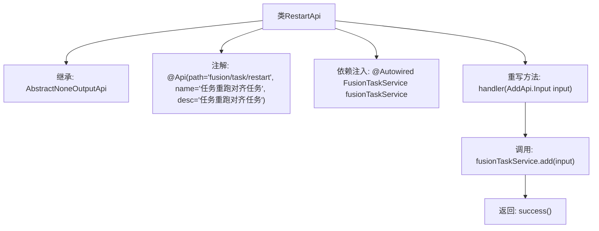

# 基础信息

|      |      |
|------|------|
| 名称 | RestartApi |
| 编码语言 | .java |
| 代码路径 | WeFe/board/board-service/src/main/java/com/welab/wefe/board/service/api/project/fusion/task/RestartApi.java |
| 包名 | com.welab.wefe.board.service.api.project.fusion.task |
| 依赖项 | ['com.welab.wefe.board.service.service.fusion.FusionTaskService', 'com.welab.wefe.common.exception.StatusCodeWithException', 'com.welab.wefe.common.web.api.base.AbstractNoneOutputApi', 'com.welab.wefe.common.web.api.base.Api', 'com.welab.wefe.common.web.dto.ApiResult', 'org.springframework.beans.factory.annotation.Autowired'] |
| 概述说明 | 这是一个名为"任务重跑对齐任务"的API类，路径为"fusion/task/restart"，继承自AbstractNoneOutputApi，使用FusionTaskService处理输入并返回成功结果。 |

# 说明

该内容描述了一个名为RestartApi的Java类，继承自AbstractNoneOutputApi，用于处理任务重跑对齐任务。类注解@Api定义了路径为fusion/task/restart，名称为任务重跑对齐任务。类中注入了FusionTaskService服务，并重写了handler方法，调用fusionTaskService.add方法处理输入参数后返回成功结果。

# 类列表 Class Summary

| 名称   | 类型  | 说明 |
|-------|------|-------------|
| RestartApi | class | 这是一个任务重跑对齐的API类，继承自无输出抽象类，通过FusionTaskService处理输入并返回成功结果。 |


## 类 RestartApi

|      |      |
|------|------|
| 访问范围 | @Api(path = "fusion/task/restart", name = "任务重跑对齐任务", desc = "任务重跑对齐任务");public |
| 类型 | class |
| 名称 | RestartApi |
| 说明 | 这是一个任务重跑对齐的API类，继承自无输出抽象类，通过FusionTaskService处理输入并返回成功结果。 |


### UML类图

```mermaid
classDiagram
    class RestartApi {
        -FusionTaskService fusionTaskService
        +handler(AddApi~Input~ input) ApiResult
    }
    <<Interface>> AbstractNoneOutputApi~T~
    AbstractNoneOutputApi~T~ <|-- RestartApi : 继承
    RestartApi --> FusionTaskService : 依赖

    class FusionTaskService {
        +add(AddApi~Input~ input) void
    }
```

类图描述：该图展示了RestartApi类继承自泛型接口AbstractNoneOutputApi<AddApi.Input>，并依赖FusionTaskService服务类。RestartApi实现了handler方法，通过调用fusionTaskService的add方法处理输入参数。AbstractNoneOutputApi作为泛型接口，其具体实现由RestartApi完成，形成清晰的层级关系。


### 内部方法调用关系图



该流程图展示了RestartApi类的结构和执行流程。该类继承自AbstractNoneOutputApi，通过@Api注解定义API路径和描述，并注入FusionTaskService服务。核心逻辑在handler方法中，先调用fusionTaskService.add处理输入参数，最后返回成功结果。整个流程简洁清晰地反映了API的请求处理过程。

### 字段列表 Field List

| 名称  | 类型  | 说明 |
|-------|-------|------|
| fusionTaskService | FusionTaskService | 使用@Autowired自动注入FusionTaskService实例。 |

### 方法列表

| 名称  | 类型  | 说明 |
|-------|-------|------|
| handler | ApiResult | Java方法重写，调用服务添加任务并返回成功结果。 |


